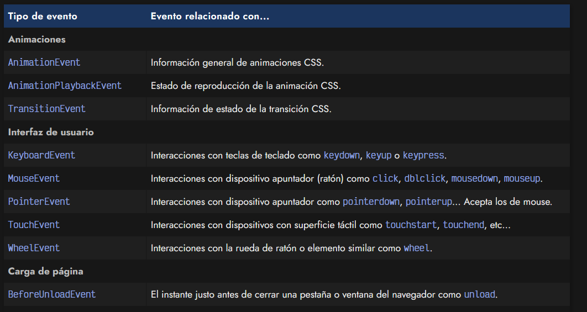
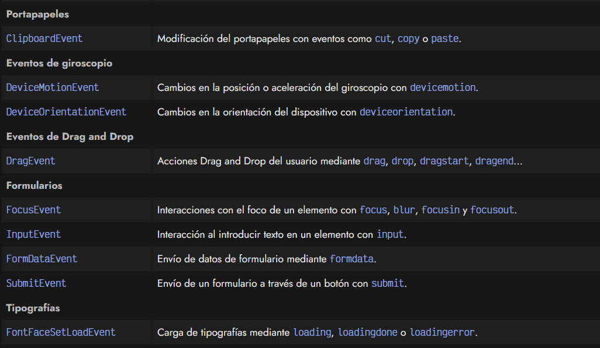
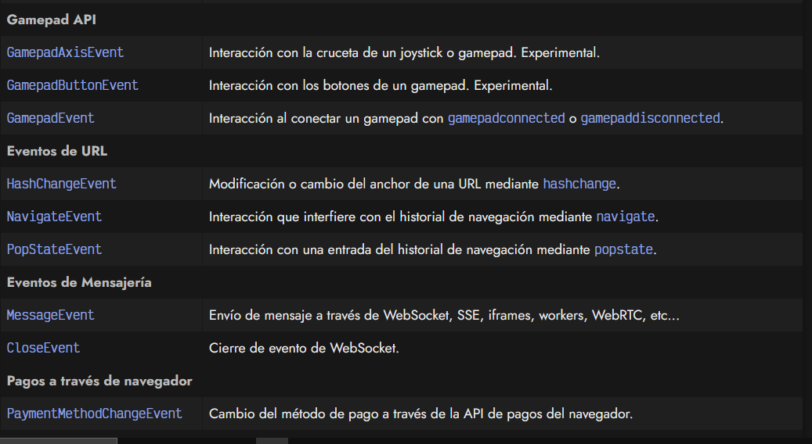
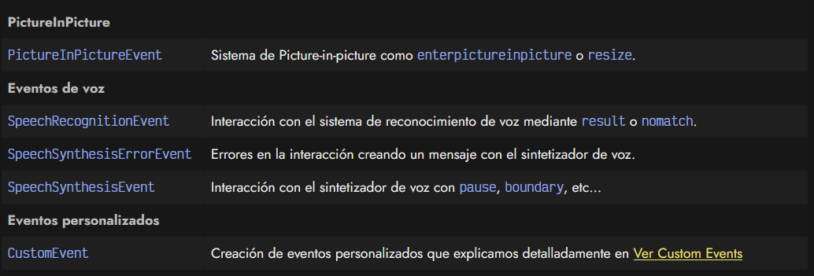
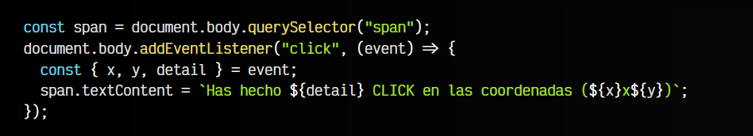

# 
Eventos de navegador.

Generalmente, cuando ocurre un evento debido a una acción del usuario, se dispara un evento de navegador. Son eventos nativos específicos que realizan una cierta tarea y donde su objeto de evento tiene propiedades o métodos especiales para dicha tarea.

## Tipos de eventos.
Normalmente, el evento que se dispara es de tipo Event, sin embargo, existe una amplia lista de eventos más específicos. Existen muchos y muy variados.

Veamos una lista de algunos de los eventos de navegador disponibles (no están todos):

Recuerda que esto es sólo una pequeña lista de todos los eventos de navegador que existen.

## Ejemplo: PointerEvent.
Vamos a realizar un ejemplo con el evento click. Nuestro código nos permitirá hacer click con el ratón en cualquier parte de la pantalla. Nos mostrará los siguientes datos:

   - El número de veces consecutivas que hemos hecho click: event.detail
   - Las coordenadas de X donde has hecho click en la pantalla: event.x
   - Las coordenadas de Y donde has hecho click en la pantalla: event.y

En la función action realizamos una [desestructuración](https://lenguajejs.com/javascript/objetos/desestructuracion-objetos/) para simplificar el código y modificamos el contenido de texto del elemento  cada vez que hacemos click.
