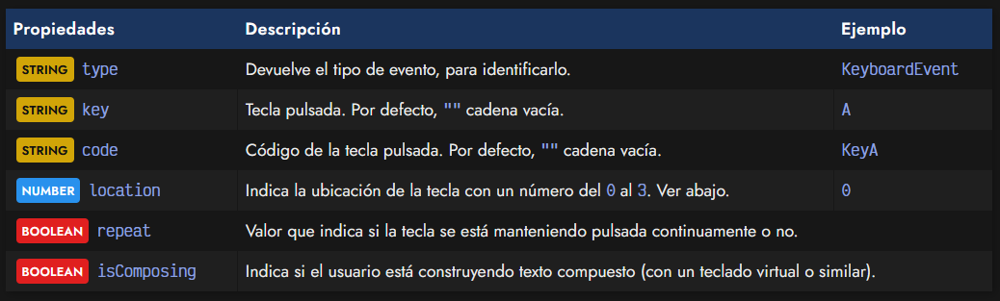
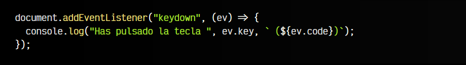
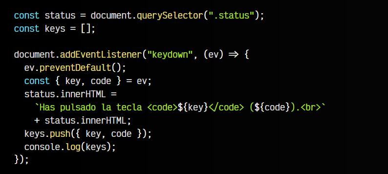
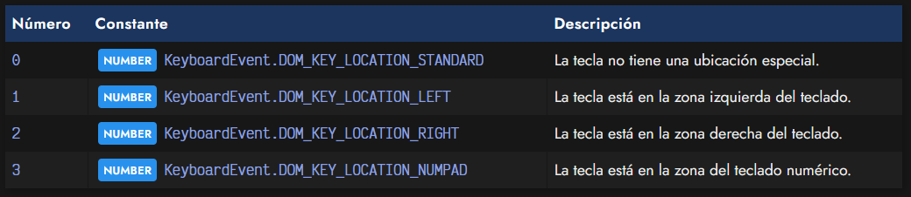
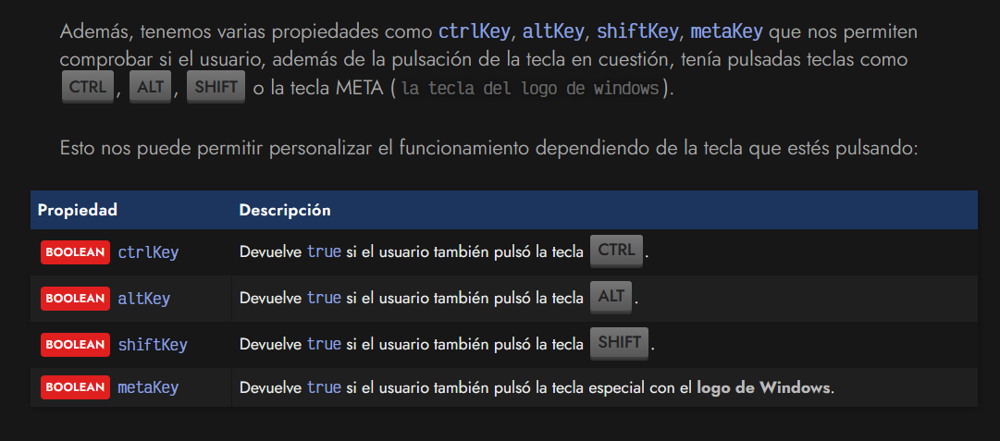

# 
Eventos de teclado.

En Javascript disponemos del objeto KeyboardEvent, que es el que se nos porporciona por parámetro cuando ocurre un evento de teclado. Estos eventos ocurren cuando el usuario pulsa o suelta una tecla y estamos escuchando dichos eventos.

## El objeto KeyboardEvent.
Para empezar, primero debemos conocer cuales son las propiedades principales que podemos utilizar:

En principio, si queremos saber cuál es la tecla pulsada por el usuario, tendríamos que consultar key, que devuelve un texto aproximado a la tecla pulsada, y code, que devuelve el código de la tecla.

Veamos un ejemplo sencillo con el evento keydown:

Antiguamente, se utilizaba keycode, que devolvía un código numérico. Actualmente este valor está marcado como obsoleto y no se devuelven códigos numéricos. Debería utilizarse key o code en su lugar, dependiendo del que más nos interese.

# Eventos.
Para trabajar con el teclado, podemos utilizar dos tipos de eventos. Uno de ellos es keydown que tiene que ver con el momento en el que pulsas una tecla, y el otro es keyup que tiene que ver con el momento en el que sueltas una tecla.

## Evento keydown.
Para trabajar con estas pulsaciones de teclado, podemos utilizar dos eventos. El primero de ellos, como hemos visto en el ejemplo anterior, es keydown. Este evento se dispara cuando se detecta que el usuario ha pulsado una tecla.

Recuerda que al activarse este evento, tenemos un objeto especial que hemos identificado con el nombre ev, del cuál podemos sacar información sobre el evento.

Veamos un ejemplo para entender como funciona:

Antiguamente, existía un evento llamado keypress para detectar cuando se pulsa una tecla, pero actualmente está marcado como obsoleto, por lo que no debería usarse. En su lugar, se debería utilizar keydown.

Veamos ahora otro evento para detectar cuando se suelta la pulsación de la tecla.

## Evento keyup.
El evento keyup se activa cuando una tecla pulsada se suelta y deja de soltarse. Veamos el siguiente ejemplo, donde utilizamos el evento keydown seguido del evento keyup:

## La propiedad location.
Mediante la propiedad location podemos obtener en que zona está la tecla pulsada. Esta propiedad devuelve un número, que representa la zona de la tecla. Esto es especialmente útil cuando tenemos teclas que pueden aparecer en varias partes del teclado:

## La propiedad repeat.
Junto a las propiedades que tenemos a nuestra disposición, también habremos comprobado que existe ev.repeat. Esta propiedad nos devuelve un valor BOOLEAN que nos indica si la tecla se está manteniendo pulsada y se está repitiendo varias veces.

Esto puede ser muy útil para lógica Javascript donde no queremos detectar cuando se pulsa una tecla de forma atómica, sino que queremos activar algo mientras la tecla se esté pulsando y desactivarla cuando se deje de pulsar.

