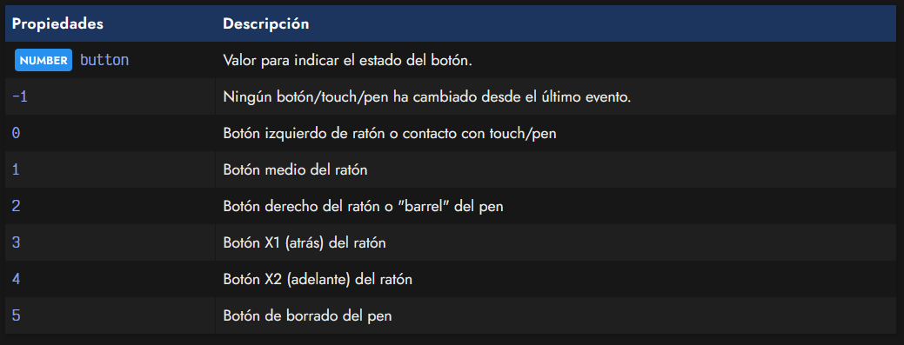

# 
Eventos de puntero.

Si necesitamos trabajar con acciones realizadas por el usuario con el ratón, generalmente optamos por MouseEvent. Sin embargo, esta API es más antigua y quizás nos pueda venir mejor otra API como TouchEvent o PointerEvent, esta última la que trataremos en este artículo.

Aunque solemos generalizar y cuando trabajamos con Javascript hablamos de ratón, generalmente existen muchos tipos de dispositivos apuntadores: ratones, trackballs, lapiz óptico, touchpad, multitouch, etc...

    A partir de ahora, en este artículo, hablaremos de puntero o apuntador para simplificar y referirnos a dichos dispositivos de forma generalizada.

## El objeto PointerEvent.
Veamos las propiedades principales que podemos tratar cuando estamos escuchando un evento de dispositivos apuntadores:

En el siguiente apartado veremos un pequeño ejemplo utilizando alguna información de esta tabla.

## Eventos genéricos.
Eventos genéricos que hoy en día devuelven un PointerEvent serían los eventos click, auxclick y contextmenu. Aunque más adelante veremos otros eventos mucho más específicos para acciones del dispositivo apuntador, estos suelen ser bastante frecuentes para acciones sobre elementos de la UI de una página:

Veamos un ejemplo simple:

## Valores especiales.
La siguiente tabla de propiedades son valores NUMBER numéricos que tienen relación con las inclinación o posición del apuntador (pen, stylus, etc...) o la presión con la que se pulsa:

## ¿Qué botón se ha pulsado?.
Una de las cosas que nos podría interesar saber es saber que botón ha sido pulsado. Esto se puede conocer facilmente con la propiedad button, que nos devuelve un valor numérico con el botón concreto con el que se ha pulsado y disparado el evento (por ejemplo, el evento pointerdown):

Puedes comprobarlo en acción en este ejemplo. Prueba a pulsar sobre el área de color y te mostrará los valores de la propiedad button y la propiedad buttons:

Por otro lado, la propiedad buttons nos devuelve una máscara de bits. Esto puede ser más interesante si queremos saber si se han pulsado varios botones a la vez. Para ello, podemos hacer uso simplemento de operaciones de tipo ev.buttons & 4, para saber si se ha pulsado el botón del medio del apuntador de tipo ratón.

Los valores de la máscara son los siguientes:

La propiedad which que se usaba en el pasado para saber que botón ha sido pulsado ya es obsoleta y no debe utilizarse. En su lugar, lo recomendable es usar button o buttons.

## Propiedades de posición.
En algún caso, nos podría interesar obtener las posiciones o hacer cálculos con las distancias del apuntador respecto a otros elementos. Para ello, podemos utilizar las siguientes propiedades, que nos dan la posición donde se ha hecho click, touch o contacto.

Por ejemplo, clientX nos devuelve la posición horizontal en la parte visible del navegador, mientras que screenX nos devuelve la posición horizontal en el tamaño completo de pantalla. Así pues, tenemos algunas otras variaciones que podemos utilizar:

## Eventos de puntero.
En el caso que necesitemos operaciones mucho más específicas del dispositivo apuntador, podemos utilizar los siguientes eventos:

## Eventos de captura de puntero.
Existen algunos eventos muy interesantes mediante los cuales podemos capturar un puntero para realizar operaciones especiales. Por ejemplo, arrastrar un elemento de un lugar a otro:

Para ello, podemos utilizar los métodos .setPointerCapture() y .releasePointerCapture() sobre un elemento del DOM en cuestión y escuchar los siguientes eventos de la tabla anterior.

