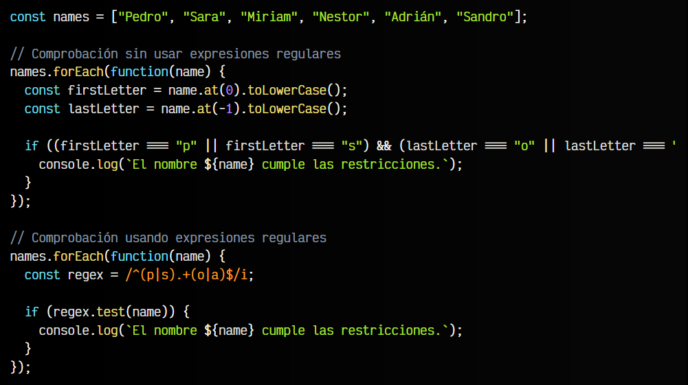
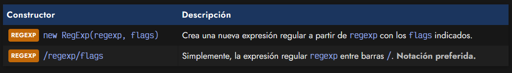
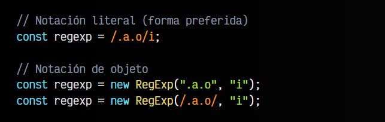
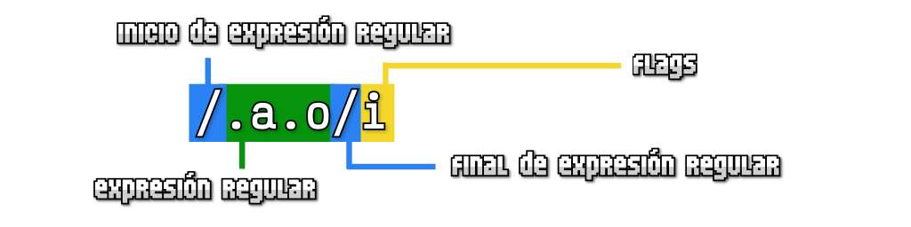

# 
¿Qué es una expresión regular?.

En muchas ocasiones nos encontraremos en la situación de querer realizar una o varias acciones si se cumple un determinado caso. Pero muchas veces, esos casos no son tan simples, sino que existe un número muy alto de situaciones diferentes que no podemos cubrir de formas tradicionales. En esas situaciones es donde las expresiones regulares quizás nos puedan ser de ayuda.

Las expresiones regulares (a menudo llamadas RegExp o RegEx) son un sistema para buscar, capturar o reemplazar texto utilizando patrones. Estos patrones permiten realizar una búsqueda de texto de una forma relativamente sencilla y abstracta, de forma que abarca una gran cantidad de posibilidades que de otra forma sería imposible o muy extensa y compleja.

Estos patrones se representan mediante una cadena de texto, donde ciertos símbolos tienen un significado especial. Antes de explicar el significado de esos símbolos especiales, vamos a convertirlo en un ejercicio para verlo mejor.

Necesitamos detectar si un nombre empieza con las letras «p» o «s» y además termina con las letras «o» o «a». Es decir, necesitamos comprobar si se cumplen dos restricciones con dos posibilidades cada una.

Esto podríamos hacerlo de varias formas, por ejemplo:

   - Extraer la primera y última letra y detectar los nombres que coinciden.
   - Escribir una expresión regular que detecte los nombres que coinciden.

Vamos a plantear esto con código:

Aunque aquí se puede apreciar un poco, imagina que ahora añadimos más restricciones: que los nombres puedan empezar por «r» y «t», que el nombre sea de longitud entre 5 y 8 carácteres, etc.... Si son demasiados casos, probablemente, la forma sin expresiones regulares se volverá mucho más extensa y larga, mientras que con expresiones regulares se mantendrá más o menos igual de corta.

## Cuando no utilizar una RegExp.
Que un problema se pueda resolver con expresiones regulares en menos líneas, no implica que sea más sencillo, fácil de leer o eficiente. Toda expresión regular conlleva una gran responsabilidad. Las expresiones regulares pueden parecer ideales en muchos casos, pero es muy fácil crear expresiones regulares que dejen pasar casos que no son deseables. Esto requiere una cierta práctica y experiencia que hay que adquirir.

Por norma general, siempre se debería intentar resolver los problemas sin utilizar expresiones regulares, salvo en casos particulares donde el uso de la expresión regular nos proporcione una ventaja muy clara. Por ejemplo, situaciones donde hay que controlar tantos casos, que sin expresión regular el código sería exageradamente extenso.

Por contrapartida, hay ciertas situaciones donde nunca se deberían utilizar expresiones regulares. Probablemente, una de las más conocidas, es [nunca parsear HTML con expresiones regulares](https://stackoverflow.com/questions/1732348/regex-match-open-tags-except-xhtml-self-contained-tags/1732454#1732454).

## ¿Cómo crear una RegExp?.
En Javascript podemos crear una expresión regular de varias formas:

Así pues, podríamos crear expresiones regulares de estas dos formas:

En Javascript, se prefiere utilizar las barras / para delimitar una expresión regular en una variable. Se trata de una forma más corta y compacta que evita tener que escribir el new del objeto REGEXP.

## Partes de una RegExp.
En ambos ejemplos, estamos creando una expresión regular con el texto ".a.o". Observa que en algunos casos se define la regexp como un STRING y en otros casos se separa con el símbolo /. Además, como veremos a continuación, en las expresiones regulares existen ciertos carácteres o símbolos que tienen un significado especial.

Volvamos a nuestro ejemplo:

   - Los slash / (azul) son los delimitadores de las partes de una expresión regular.
   - La definición de la expresión regular (verde) es un texto con símbolos especiales que indica que textos va a incluir.
   - Los flags (amarillo), son una serie de carácteres que indican como funcionará la expresión regular.

En nuestro ejemplo concreto, el texto ".a.o" es una expresión regular muy sencilla que usa el carácter especial punto (.) que simboliza un comodín (cualquier carácter). Por otro lado, la a y la o son carácteres normales. Por lo tanto:

   - La palabra "caso" se aceptaría ✅ (la c y la s encajan donde el .)
   - La palabra "cosa" no se aceptaría ❌ (la o y la a no tienen el orden correcto)
   - La palabra "saco" se aceptaría ✅ (la s y la c encajan donde el .)
   - La palabra "marco" no se aceptaría ❌ (el segundo . es un comodín para un carácter, rc son dos)
   - La palabra " amo" se aceptaría ✅ (el carácter espacio en blanco también es un carácter)
   - La palabra "amo" no se aceptaría ❌ (no hay un carácter antes de la a)

Además, tenemos el flag i activado, que significa que no diferencia mayúsculas de minúsculas, por lo tanto:

   - La palabra "cAsO" se aceptaría ✅
   - La palabra "casO" se aceptaría ✅
   - La palabra "cAso" se aceptaría ✅

Sin embargo, sin el flag i en nuestra expresión regular, estas tres últimas palabras no se aceptarían, ya que en la expresión regular se indicó en minúsculas.