# 
Propiedades y flags.

Ahora que sabemos lo que son las expresiones regulares, vamos a profundizar en las propiedades o flags que puede tener un objeto REGEXP de Javascript y que significa cada una. Recordemos primero como se define una expresión regular:

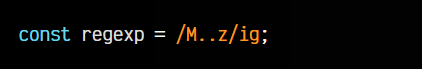

Esta es una expresión regular que busca cualquier texto que contenga una "M" seguida de dos carácteres cualquiera, seguida de una "z". Ahora que tenemos una expresión regular en la constante regexp, un buen punto de partida sería analizar las diferentes propiedades.

## Propiedades de una RegExp.
Cada expresión regular creada, tiene unas propiedades definidas, donde podemos consultar ciertas características de la expresión regular en cuestión. Además, también tiene unas propiedades de comprobación para saber si un flag determinado está activo o no (que veremos más adelante):

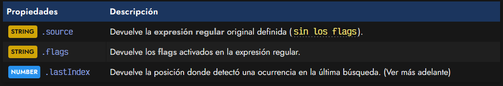

Las dos primeras propiedades nos dan toda la información sobre la expresión regular definida:

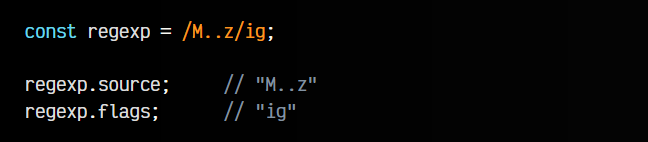

Observa que también tenemos una propiedad denominada .lastIndex. Esta propiedad se utiliza para lanzar búsquedas sucesivas y comprobar coincidencias (necesita tener el flag g activado). Lo explicaremos un poco más adelante.

## Flags de una expresión regular.
Los flags son uno o varios carácteres especiales que se escriben en un STRING tras la segunda barra / delimitadora de una expresión regular, o en el segundo parámetro del new RegExp():

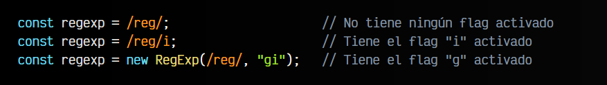

Se trata de una serie de carácteres que indican ciertos comportamientos especiales que se encuentran activos en la expresión regular definida:

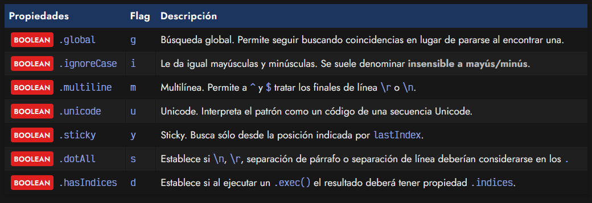

Cada uno de estos flags se pueden comprobar si se encuentran activos desde Javascript con su booleano asociado, una propiedad de la expresión regular:

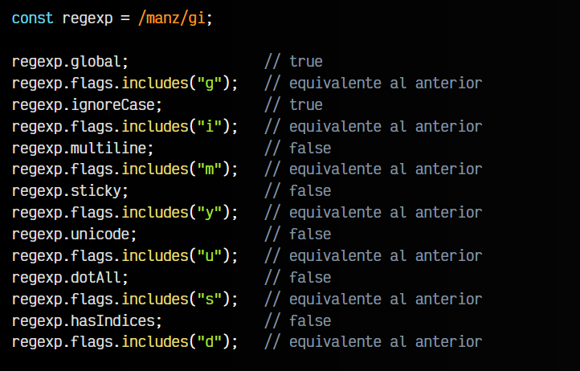

Vamos ahora a analizar cada uno de estos flags y a poner un ejemplo para comprenderlo mejor.

## Búsqueda global (flag g).
Empecemos por la propiedad .global (flag g). Partamos del siguiente ejemplo, donde definimos una expresión regular sin el flag global. Observa que al ejecutar el método .test() para buscar coincidencias, encuentra la primera y no continua buscando. La propiedad .lastIndex siempre devuelve 0:

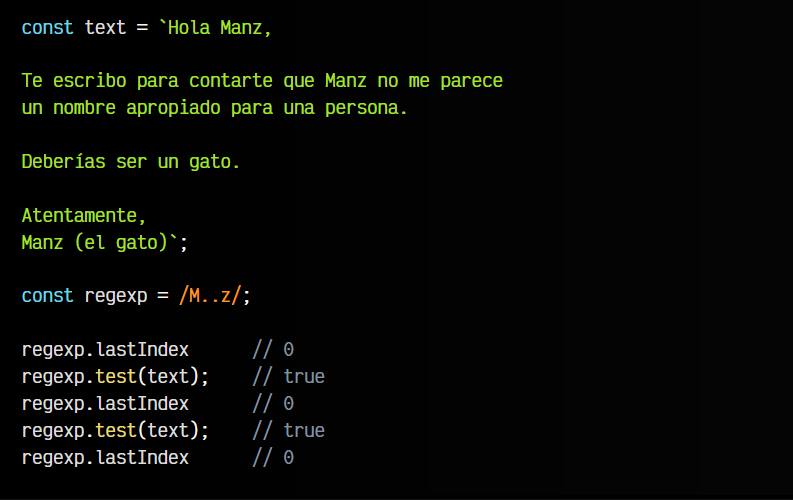

Sin embargo, vamos a hacer lo mismo con el flag de la búsqueda global activado. Comprobarás que en este caso, el método .test() va buscando las coincidencias sucesivas y va devolviendo en .lastIndex la posición donde las ha encontrado:

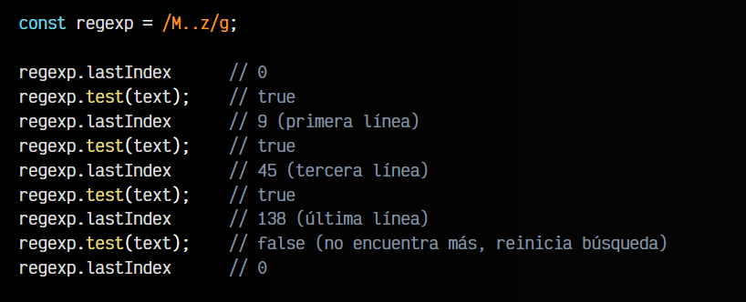

Ten en cuenta que una vez .test() devuelve false, la búsqueda se reinicia y comenzarías a buscar desde el principio nuevamente.

## Case sensitive (flag i).
La propiedad .ignoreCase (flag i) establece un flag que indica que no debe fijarse en la diferencia de mayúsculas y minúsculas, sino considerarlas lo mismo. Como siempre, veámoslo con un ejemplo:

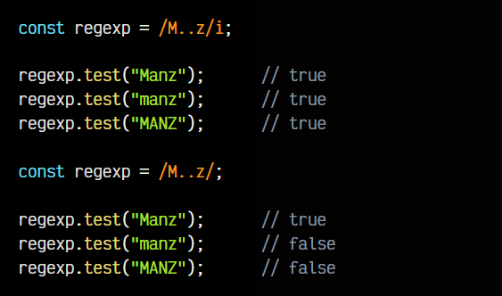

Como se puede ver en el segundo caso, no tenemos flag i, y por lo tanto, si tiene en cuenta la diferencia de mayúsculas y minúsculas.

## Soporte multilínea (flag m).
La propiedad .multiline (flag m), permite considerar el texto como un texto multilinea, es decir, si en la expresión regular se utilizan anclas de inicio ^ o final $ de línea (las veremos más adelante), la expresión regular tendrá en cuenta esos inicios para evaluarlos. Veamos el ejemplo, donde se comprenderá a la perfección:

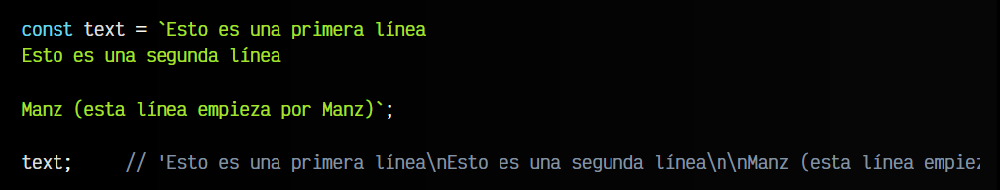

Si observamos esta constante de texto STRING y escribimos text en la consola, veremos que nos sale algo similar a lo anterior. El carácter \n simboliza que hay una nueva línea. Bien, si intentamos detectar con una expresión regular sin flag m la palabra "Manz" utilizando el ancla ^ para indicar que Manz está al comienzo, comprobaremos que no funciona:

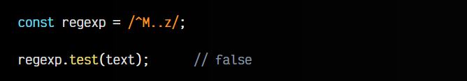

sto ocurre porque la expresión regular considera que la aparición Manz no está al principio del STRING, sino que está tras un carácter \n. Sin embargo, al utilizar el flag m, considerará los \n como si fuera empezar una nueva línea:

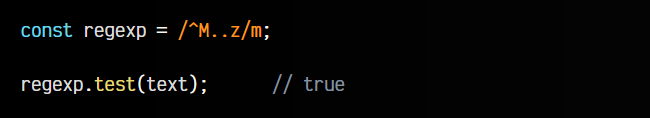

## Soporte unicode (flag u).
La propiedad .unicode (flag u) nos permite activar características relacionadas con Unicode, es decir, con una codificación extendida de carácteres específicos. Puede ser útil en algunos casos. Por ejemplo, el emoji 🤡 es un carácter unicode representado por U+1F921, por lo que podríamos querer buscarlo indicando su código:

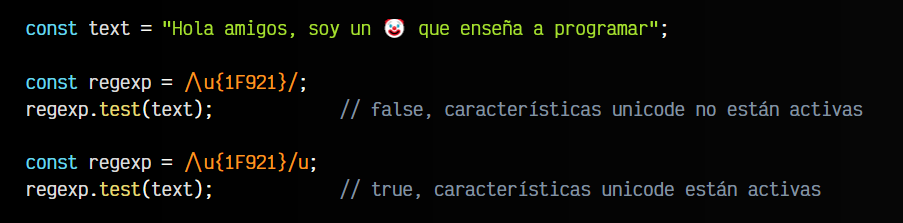

Observa que podemos escribir el emoji en HTML utilizando su código 🤡, simplemente escribiendo &#x1F921;.

## Soporte unicode (flag u).
La propiedad .sticky (flag y), cuando está activada, nos permite realizar una búsqueda con la expresión regular, pero sólo lo hace en la posición que marca la propiedad .lastIndex. No intentará buscar en posiciones posteriores o anteriores, sólo aplica a la posición actual de .lastIndex, por lo que también podría ser útil modificarla:

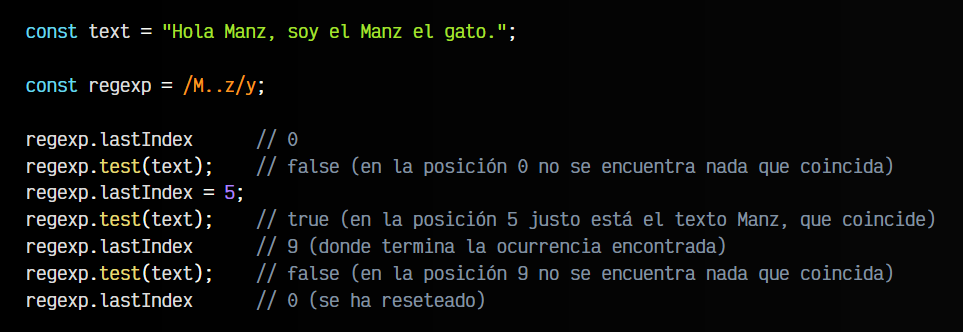

Así pues, el nombre sticky (pegajoso) hace referencia a que la búsqueda mediante la expresión regular se queda «pegada» o atascada y no continúa buscando.

## Soporte separadores (flag s).
La propiedad .dotAll (flag s) activa la posibilidad de que carácteres como \n (nueva línea), \r (retorno de carro), \u{2028} (separador de línea) o \u{2029} (separador de párrafo) se consideren dentro de los carácteres comodín con el ., algo que no sucede por defecto. Veamos un ejemplo:

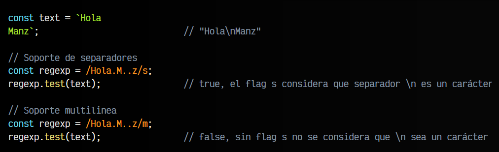

Recuerda que si vas a usar el formato \u{número} necesitas tener también el flag u activado.

## Activa indices (flag d).
La propiedad .hasIndices (flag d) activa la característica especial que hace que cuando utilicemos el método .exec(), el resultado incorpore una propiedad especial llamada .indices, que explicaremos más adelante:

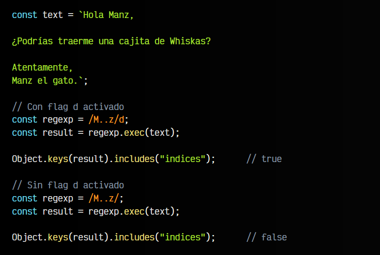

Más adelante veremos para que sirve esta propiedad .indices y el método .exec(), ya que lo explicaremos en uno de los temas posteriores.