# 
Buscar y capturar textos.

Hasta ahora hemos visto como crear expresiones regulares en Javascript, creando objetos REGEXP mediante los cuales podemos detectar textos con múltiples y variadas restricciones de una forma compacta.

Para ello, hemos utilizado métodos como .test() o .exec(), pero sin saber demasiado como funcionan. En esta sección vamos a analizarlos y ver sus características y detalles.

## Métodos de un objeto RegExp.
Cualquier objeto REGEXP tiene los siguientes métodos que podemos ejecutar para realizar una búsqueda:

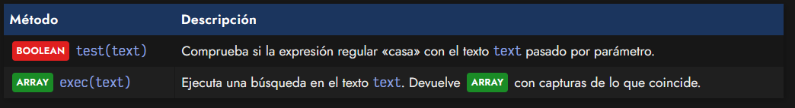

Mientras que el primero, el método .test() se suele utilizar simplemente para comprobar si la expresión regular detecta algún texto que encaje con el STRING proporcionado, el método .exec() es un poco más avanzado, y podemos utilizarlo para capturar coincidencias.

## Detectando coincidencias (test).
Veamos, por ejemplo, como utilizar la expresión regular siguiente con el método .test() para comprobar si encaja con alguna ocurrencia en un texto determinado:

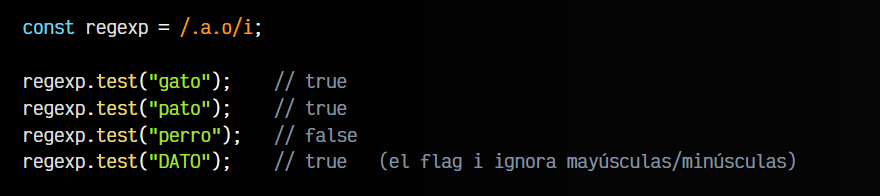

El método .test() siempre te devolverá un BOOLEAN para indicar si la expresión regular ha encontrado un texto que encaja con el patrón definido.

Recuerda que aunque test() espera un STRING por parámetro, en caso de enviarle otro objeto, lo pasará a STRING mediante el método .toString() que existe en todos los objetos de Javascript:

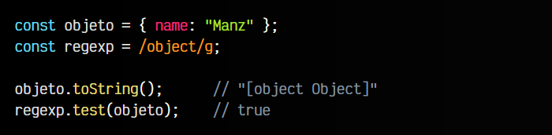

Mucho cuidado con esto, ya que de pasar un tipo de dato que no sea STRING podrías tener resultados no esperados o previstos.

## Captura de patrones (exec).
Pero con las expresiones regulares, además de poder realizar búsquedas de patrones, también se puede capturar coincidencias. De hecho, es una de sus características más potentes y versátiles.

Toda expresión regular que utilice la parentización (englobar con paréntesis fragmentos de texto) está realizando implícitamente una captura de texto, con la que es muy útil obtener rápidamente información. Para ello, en lugar de utilizar el método test(), vamos a utilizar el método exec(). Funciona exactamente igual, sólo que devuelve un ARRAY con las capturas realizadas.

Antes de empezar a utilizarlo, necesitamos saber detalles sobre la parentización:

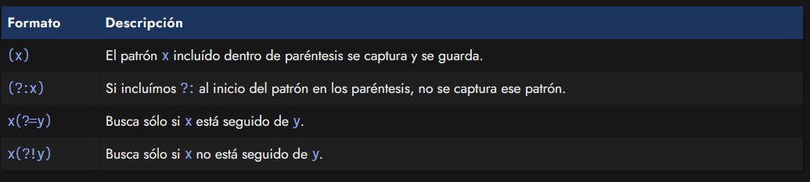

Así pues, veamos algunos ejemplos para entenderlo bien. Observa que hemos creado una expresión regular que parentiza el texto .a.o, sin embargo, tiene un . (cualquier carácter, recuerda) fuera del paréntesis, por lo que ese carácter no se capturará (solo se captura el interior del paréntesis):

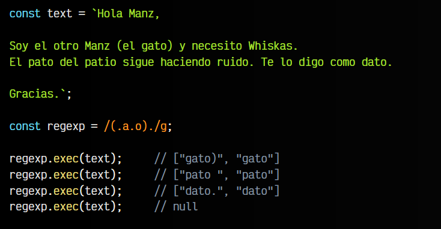

Observa que en cada ejecución del método .exec() se nos devuelve un resultado diferente. Esto ocurre por usar el flag g (búsqueda global) y nos devuelve un ARRAY . El primer elemento del array es la coincidencia con toda la expresión regular, mientras que el segundo elemento del array es la coincidencia con lo incluido en paréntesis.

Ten en cuenta que también podemos hacer múltiples capturas. Al definir la expresión regular, he incluído varios paréntesis para realizar varias capturas:

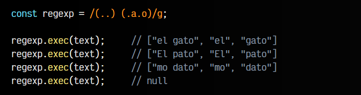

En esta ocasión, el ARRAY devuelto tiene 3 elementos, el primero de ellos la coincidencia completa, el segundo la primera captura con parentización, y el tercer elemento la segunda captura con parentización.

## El array devuelto por exec.
Ten en cuenta que el ARRAY devuelto por .exec() es un array especial que, a parte de funcionar como un array normal, tiene algunas propiedades extra que nos pueden ser de ayuda:

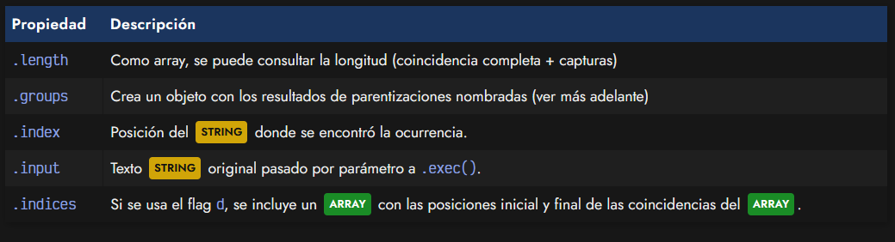

Veamos el ARRAY resultante de la ejecución del método .exec() en esta ocasión:

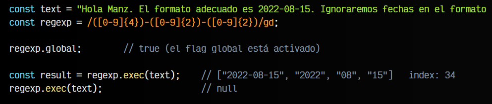

Observa que la segunda fecha del texto no tiene el mismo formato en el mismo orden, por lo que no es capturada. Si analizamos el ARRAY obtenido en la primera ejecución de .exec() y guardado en result, tendremos algo así:

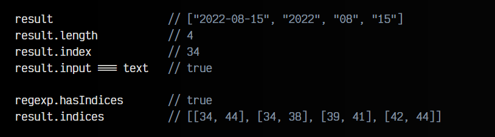

El ARRAY contenido en result.indices contiene varios ARRAY, uno por cada elemento del array result. Así pues, 34 es la posición inicial de result[0], mientras que 44 es la posición final. En el siguiente array, 34 es la posición inicial de result[1], mientras que 38 es la posición final. Y así sucesivamente.

Recuerda que para tener esta propiedad .indices necesitas tener activado el flag d.

Recuerda que para tener esta propiedad .indices necesitas tener activado el flag d.

    El array .result.indices también tiene una propiedad .groups similar a la que posee .result y que explicaremos en el siguiente apartado de Parentización nombrada.

## Parentizaciones nombradas.
Es posible asignarle un nombre a cada parentización realizada, de modo que sea más «humana» la forma de capturar elementos y gestionarlos después. Para ello, solo tenemos que añadir ?<nombre> al inicio de la parentización, como se puede ver en el siguiente ejemplo:

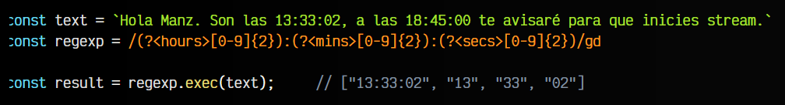

En este caso, podremos ver que la propiedad .groups no es undefined, sino que tiene los textos de las parentizaciones capturadas:

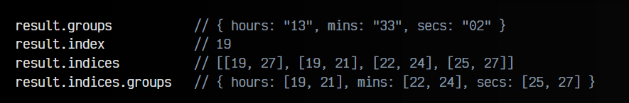

