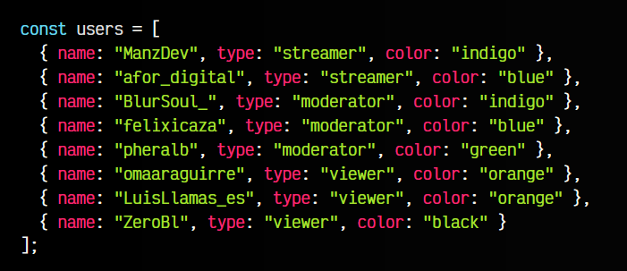
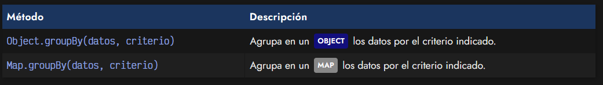
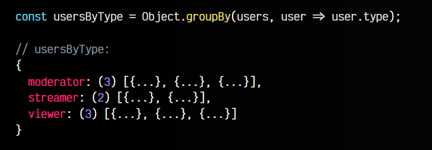
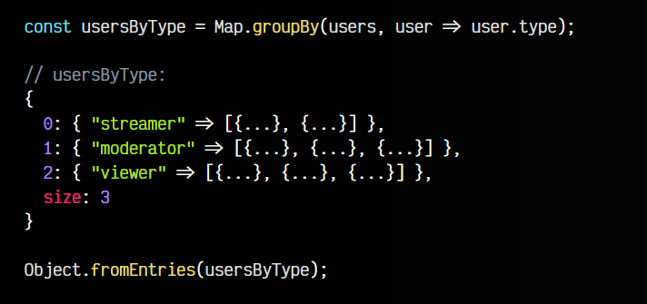
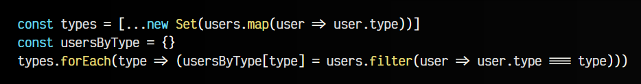

# 
Agrupar datos por criterio.

Cuando comenzamos a trabajar con estructuras de datos un poco más allá de las básicas, es muy posible que necesitemos crear estructuras de datos organizadas bajo unos criterios diferentes a como están organizadas inicialmente.

Por ejemplo, observemos la siguiente estructura de datos, donde tenemos varios usuarios, y cada uno de ellos tiene un tipo diferente.

Imaginemos que queremos crear una nueva estructura de datos donde tengamos los usuarios separados por un criterio concreto. Esto puede ser una tarea complicada de realizar, sin embargo, Javascript incorpora nuevas funciones para hacerlo de forma muy sencilla.

## Agrupar por criterio.
En principio, tenemos dos métodos apropiados para esta tarea. Ambos son idénticos, la diferencia es que uno crea un Objeto y otro crea un Map:

Por parámetro, pasaremos la estructura de datos ARRAY y en el segundo parámetros una FUNCTION que hará de callback para definir cuál es el criterio que vamos a escoger. Veamos algunos ejemplos.

## El método Object.groupBy().
Mediante el método Object.groupBy() podemos crear un objeto, donde las propiedades serán los valores de los criterios indicados. Por ejemplo, tomemos la estructura de usuarios que definimos al principio del artículo:

Observa que en el primer ejemplo hemos separado por tipo, mientras que en el segundo ejemplo hemos separado por color. Los objetos resultantes tienen propiedades con los valores de tipo o color, los cuales son ARRAY con los elementos filtrados por ese criterio.

## El método Map.groupBy().
Hay que tener presente que aunque hemos creado objetos a partir de la agrupación, también podemos hacerlo con una estructura de datos similar llamada Map. Para ello, en lugar de Object usamos Map:

De hecho, observa que utilizando el método Object.fromEntries() puedes convertir el Map resultante en un Object como el obtenido con Object.groupBy().

## Agrupar por criterio (legacy).
En el caso de no poder utilizar estos nuevos métodos, o simplemente tener curiosidad como sería hacerlo sin ellos, puedes observar el siguiente ejemplo, donde agrupamos sin necesidad de los métodos .groupBy():

Como puedes ver, se trata de una forma un poco más tediosa e imperativa, pero conseguimos el mismo resultado:

   - 1️⃣ Primero obtenemos los tipos de los usuarios en un Set para que no se repitan
   - 2️⃣ Luego, desestructuramos para convertirlo en un ARRAY
   - 3️⃣ Creamos un objeto vacío usersByType
   - 4️⃣ Por cada uno de los tipos, filtramos los usuarios
   - 5️⃣ Y los metemos en el objeto, indexado por dicho tipo

