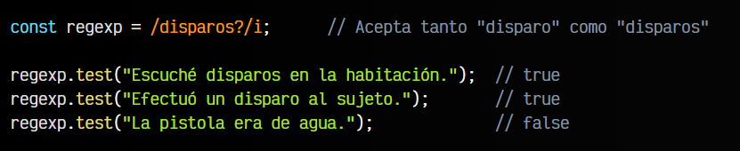

# 
Crear expresiones regulares.

Crear expresiones regulares puede parecer fácil al principio, sin embargo, es muy fácil crear expresiones regulares que tengan resultados no previstos, por lo que hay que practicar mucho y tener cierta experiencia con ellas.

Antes de comenzar a crear expresiones regulares hay que aprender bien quizás la parte más compleja: los carácteres o símbolos especiales que poseen. Ciertos carácteres tienen un significado especial dentro de las expresiones regulares, e incluso, muchos de ellos dependen de donde se encuentren para tener ese significado especial.

## Clases básicas.
Empecemos con algunos de los más sencillos:

En esta pequeña tabla vemos los caracteres especiales más básicos por lo que podemos partir para aprender expresiones regulares. Veamos algunos ejemplos aplicándolos:

Como puedes ver, el . se utiliza como símbolo o carácter especial y significa «cualquier carácter». No obstante, podríamos añadir un \ antes del ., y así escapar el punto y que en lugar de tener un significado especial (cualquier carácter) tenga el significado literalmente un punto:

El escapado de carácteres es esencial en las expresiones regulares, ya que es frecuente necesitar utilizarlo.

## Conjunto de carácteres.
Dentro de las expresiones regulares, los corchetes [] tienen un significado especial. Se trata de un mecanismo para englobar un conjunto de carácteres personalizado o alternativas. Pero por otro lado, si incluimos un circunflejo ^ en el interior de los corchetes, invertimos el significado, pasando a significar que no exista el conjunto de carácteres personalizado:

Por último, tenemos el «pipe» |, con el que podemos establecer alternativas. Veamos un ejemplo aplicado a esto, para que se verá más claro:

Como se puede ver, con los paréntesis () puedes agrupar una parte más específica para indicar alternativas, aunque recuerda que con los paréntesis estás haciendo [capturas de textos con Expresiones regulares.](https://lenguajejs.com/javascript/regexp/buscar-capturar/)

## Rangos de carácteres.
En el interior de los corchetes [], si establecemos dos carácteres separados por guión, por ejemplo [0-9], se entiende que indicamos el rango de carácteres entre 0 y 9, sin tener que escribirlos todos explícitamente.

De esta forma podemos crear rangos como [A-Z] (una letra mayúscula) o [a-z] (una letra minúscula), o incluso varios rangos como [A-Za-z0-9] (una letra mayúscula, minúscula o un dígito del 0 al 9):

En las expresiones regulares podemos tanto escribir el caracter especial como la notación alternativa, que son equivalentes y significan lo mismo. Por ejemplo, es lo mismo escribir [0-9] que \d. Algunos programadores encuentran más explicativa la primera forma y otros más cómoda la segunda.

## Anclas.
Hay algo importante que hemos omitido hasta ahora. Dentro de las expresiones regulares, las anclas son un recurso muy importante, ya que permiten delimitar los patrones de búsqueda e indicar si empiezan o terminan por carácteres concretos, siendo mucho más específicos al realizar la búsqueda:

Para entender esto bien, veamos varios ejemplos. En los primeros ejemplos vamos a aplicar las anclas ^ y $ en la expresión regular para delimitar el inicio y el final de un texto:

Por otro lado, si utilizamos \b se nos permite indicar si el texto adyacente está seguido (o precedido) de un límite de palabra (espacio), puntuación (comas o puntos) o inicio o final del STRING:

Por último, \B es la operación opuesta a \b, por lo que podemos utilizarla cuando nos interesa que el texto no esté delimitado por una palabra, puntuación o string en sí.

## Cuantificadores.
En las expresiones regulares los cuantificadores permiten indicar cuántas veces se puede repetir el carácter inmediatamente anterior. Existen varios tipos de cuantificadores:

Veamos algunos ejemplos para aprender a aplicarlos. Comencemos con el primero, el caracter especial * (0 o más veces):

El cuantificador + es muy parecido al cuantificador * anterior, sólo que con el cuentificador + es necesario que el carácter anterior aparezca al menos una vez, al contrario que con * que permitía que no apareciera:

Por otro lado, el cuantificador ? se suele utilizar para indicar que el carácter anterior es opcional (puede aparecer o puede no aparecer). Normalmente se utiliza cuando quieres indicar que no importa que aparezca un carácter opcional:

Esto nos permite establecer carácteres opcionales de forma muy sencilla y cómoda.

## Cuantificadores numéricos.
Los tres cuantificadores siguientes, se utilizan cuando necesitamos concretar más el número de repeticiones del caracter anterior. Por ejemplo, {n} indica un número exacto, {n,} indica al menos n veces y {n,m} establece que se puede repetir de n a m veces:

Observa que el último aparece como true. Esto ocurre porque en la expresión regular no se han establecido anclas que delimiten el inicio y/o el final del texto. Si las añadimos, es más estricto con las comprobaciones:

Si quieres profundizar con las expresiones regulares, puedes jugar a RegEx People, un pequeño y básico juego para aprender a utilizar las expresiones regulares y buscar patrones, con su código fuente disponible en [GitHub](https://github.com/ManzDev/regex-people).
