# 
El tipo Date.

En muchas ocasiones necesitaremos guardar o trabajar con fechas en nuestros programas. Una fecha tiene datos mixtos: día, mes y año, pero también puede ser más precisa y tener hora, minutos y/o segundos. Además, la hora puede estar en varios y múltiples formatos.

En principio, toda esta información no sería cómodo guardarla en formato de texto, ya que posteriormente nos gustaría trabajar y realizar operaciones con ellas (sumarle días, obtener el mes, obtener la hora, etc...). Así pues, tenemos un objeto llamado Date que nos vendrá muy bien para operaciones relacionadas con fechas.

## ¿Qué es el tipo de dato Date?.
avascript nos provee de un tipo de dato llamado Date, con el que podemos trabajar de forma fácil y práctica con fechas. Sin embargo, trabajar con fechas no es fácil y la primera vez que tenemos que hacerlo es muy sencillo equivocarse si no tenemos claros ciertos conceptos.

## Crear fechas con Date.
Lo primero, vamos a ver los constructores para saber como podemos construir una variable de tipo Date:

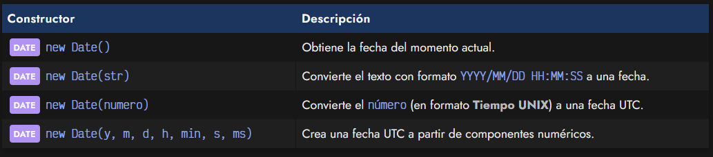

Podemos utilizar estas cuatro formas para crear fechas en Javascript. Observa que en algunos casos se menciona fecha UTC. De momento, vamos a obviar esta parte y más adelante profundizaremos en ella. Veamos algunos ejemplos para crear fechas con estos 4 constructores:

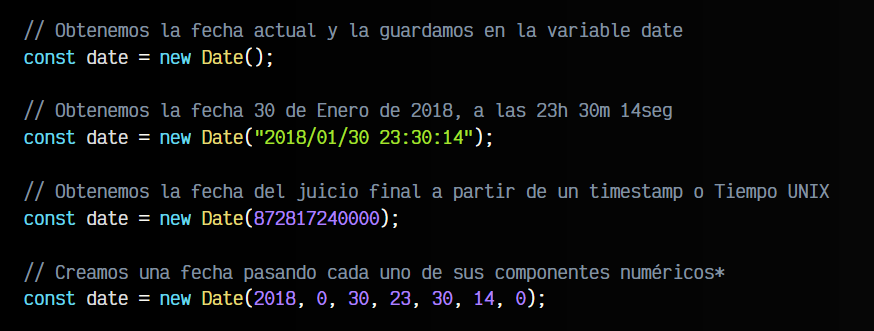

OJO: Mucho cuidado con los «componentes numéricos» mencionados en el último ejemplo. Si utilizamos el formato new Date(y, m, d, h, min, s, ms), hay que saber que, como mínimo, los parámetros y (año) y m (mes) son obligatorios, el resto son parámetros opcionales.

Además, si utilizamos este esquema, hay que tener en cuenta que hay ciertas características especiales:

   - El parámetro m (mes) se proporciona con valores no reales que se recalcularán. Es decir, si indicamos un 1 nos referimos a febrero y no a enero. Si queremos referirnos a enero tenemos que indicar un 0.

   - Si indicamos valores negativos contabilizamos hacia atrás. Por ejemplo, con 2018, -1 estaríamos indicando diciembre de 2017. De la misma forma, 2018, 12 haría referencia a enero de 2019. Lo mismo ocurre con otros parámetros; 2018, 0, 32 haría referencia al 1 de febrero de 2018.
  
## Fechas con UNIX Timestamp.
El Tiempo UNIX (o UNIX timestamp) es un formato numérico utilizado para calcular una fecha en UNIX. Es una forma poco práctica y legible para humanos, pero muy eficiente en términos informáticos. Se trata de un número que representa la cantidad de segundos transcurridos desde la fecha 1/1/1970, a las 00:00:00.

Así pues, siendo números, resulta muy fácil trabajar y operar con ellos. Teniendo una fecha A y una fecha posterior B, si hacemos la operación B - A nos devuelve el número de segundos transcurridos entre ambas fechas, con lo que se podría sacar la diferencia de tiempo.

No obstante, ten en cuenta que el Tiempo UNIX sirve para trabajar con fechas a bajo nivel. Si lo deseas, al final del tema encontrarás una tabla con librerías más cómodas y prácticas para trabajar con fechas en Javascript.

Existen dos métodos que se pueden utilizar para crear fechas, al margen de los constructores anteriores, sólo que estos devuelven directamente el Tiempo UNIX de la fecha especificada:

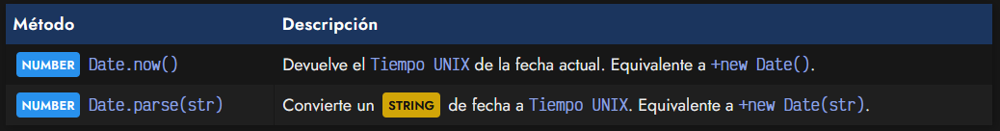

Veamos algunos ejemplos aplicados para entenderlos:

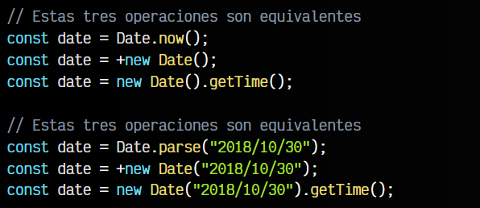

   - En el primer caso, utilizamos directamente los métodos estáticos now() y parse() para obtener el número con el tiempo Unix.

   - En el segundo caso, creamos un objeto Date con new Date(), lo que devuelve una fecha. Sin embargo, en Javascript, podemos preceder a esa fecha con el símbolo +, obligándolo a evaluarlo de forma numérica, lo que hace que obtenga el tiempo Unix a partir de la fecha.

   - En el tercer caso, escribimos en una línea dos acciones: crear la variable de fecha con new Date() y posteriormente, sobre esa fecha, hacemos un getTime(), que nos devuelve el tiempo Unix de un Date, como veremos más adelante.

## Getters: Obtener fechas.
Una vez hemos creado una fecha y tenemos el objeto DATE, podemos trabajar muy facilmente con estas variables a través de sus sencillos métodos. Los siguientes son una lista de getters, funciones para obtener información, sobre la fecha almacenada:

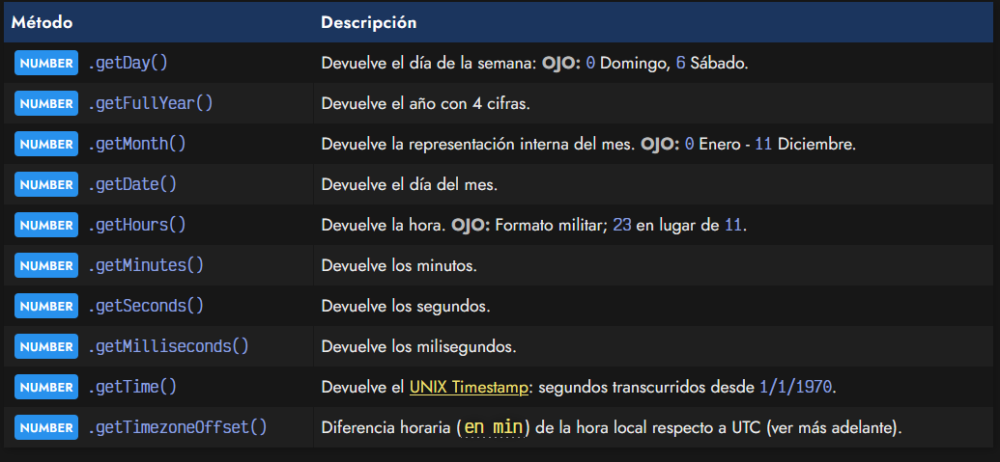

Algunos ejemplos del uso de estos métodos serían los siguientes:

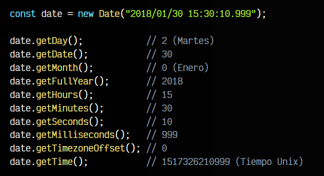

Observa que Javascript no tiene forma de devolver, por ejemplo, el día de la semana o el mes en formato de texto. Sin embargo, ello se puede hacer de forma muy sencilla utilizando un array:

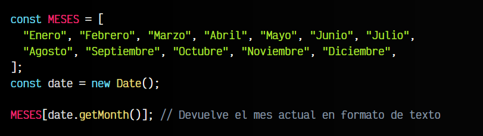

Curiosidad: El método getYear() se utilizaba para devolver la fecha con formato de 2 cifras. Se dejó de usar debido a la llegada del efecto 2000, reemplazándose por el método getFullYear() que usa el formato de 4 cifras.

## Setters: Cambiar fechas.
De la misma forma que en el apartado anterior podemos obtener fechas específicas, con los setters podemos modificarlas o alterarlas.

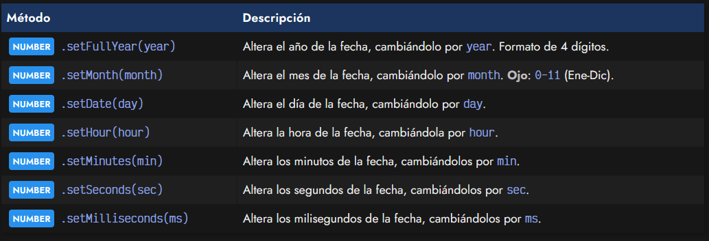

Nota: Además de cambiar la fecha del objeto en cuestión, estos métodos devuelven un en tiempo Unix de la fecha modificada.

De la misma forma que mencionamos anteriormente, hay que tener en cuenta que los valores pasados a estos métodos pueden recalcular fechas: setMonth(0) implica Enero, setDate(0) implica último día del mes anterior, setDate(-1) implica penúltimo día del mes anterior, etc...

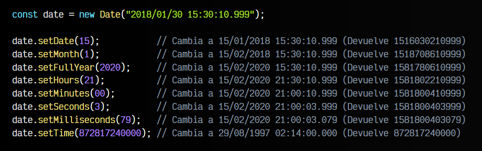

Ten en cuenta que los mismos métodos anteriores, soportan varios parámetros, para hacer más cómodo su utilización y no tener que estar usándolos uno por uno. Así por ejemplo, se puede usar setFullYear() para cambiar año, año y mes, o año, mes y día:

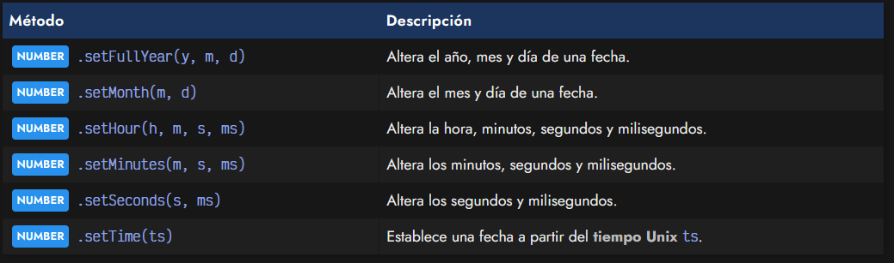

Por último, también tenemos a nuestra disposición el método setter setTime(ts), que nos permite establecer una fecha a partir de un tiempo Unix ts. Es el equivalente a hacer un new Date(ts).

## Representación de fechas.
Otro detalle más delicado dentro del trabajo con fechas es a la hora de mostrar una fecha en un formato específico. Podemos utilizar el formato por defecto que nos ofrece Javascript, pero lo más habitual es que queramos hacerlo en otro diferente, utilizando nuestra configuración horaria, abreviaturas u otros detalles. En Javascript tenemos varios métodos (muy limitados, eso sí) para representar las fechas:

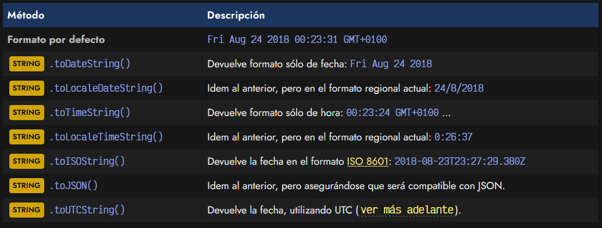

El método toISOString() devuelve un formato que intenta ser el estándar a la hora de manejar fechas en Internet o documentos en general. Básicamente, una regla mnemotécnica es pensar que se escriben desde magnitudes más altas (año) hasta las magnitudes más bajas (milisegundos). La fecha y la hora se separa con una T y cada componente con un - o un : dependiendo de si es fecha o es hora. Los milisegundos se separan siempre con .. La Z del final indica que es una fecha UTC.

Existen algunas librerías interesantes que permiten trabajar muy fácilmente con la representación de fechas o incluso otros detalles. Lo comentaremos un poco más adelante.

## UTC y zonas horarias.
Para facilitar las cosas, hasta ahora hemos obviado un tema bastante importante: las zonas horarias. Probablemente te habrás percatado de que podría ser necesario trabajar y manejar diferencias horarias, porque por ejemplo necesitamos utilizar diferentes horas locales de distintos lugares del planeta. Para manejar esto, Javascript permite indicar también la diferencia horaria respecto al [meridiano Greenwich](https://es.wikipedia.org/wiki/Meridiano_de_Greenwich), indicada como GMT.

Por ejemplo, podemos tener una fecha A 2018/01/01 15:30:00 GMT+0000, y una fecha B 2018/01/02 18:30:00 GMT+0200. La fecha A no tiene diferencia horaria (GMT+0000), sin embargo, la fecha B si la tiene (GMT+0200), por lo que en Javascript al hacer un new Date(str) de dicha fecha, se recalcula automáticamente y se guarda la fecha modificada y sin diferencia horaria. En este caso, se le restan 2 horas a la fecha B.

Es importante darse cuenta que, en Javascript, cuando usamos new Date() sin parámetros, obtendremos una fecha que puede incluir diferencias horarias:

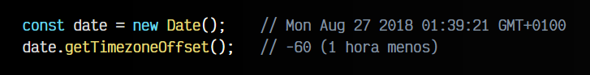

Sin embargo, si hacemos uso de new Date(str), pasándole una fecha como parámetro de texto, automáticamente se recalcula la diferencia horaria, sumando/restando las horas, y se obtiene finalmente la fecha con diferencia horaria cero:

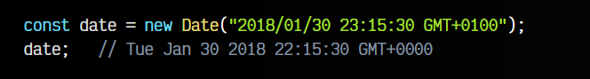

En este caso, al recalcular y guardar la fecha/hora sin diferencias horarias, decimos que estamos utilizando el Tiempo Universal Coordinado o UTC. También podemos utilizar el método estático Date.UTC() donde le podemos pasar los parámetros de los componentes numéricos de la fecha, tal cómo lo hacemos en el constructor new Date(y, m, d, h, min, s, ms) anteriormente mencionado.

    Además de lo anterior, recuerda que también tenemos todos los métodos Getters y Setters mencionados en su versión UTC. Por ejemplo, en el caso de getHours() tenemos una versión getUTCHours() que devuelve las horas de acuerdo al UTC (Tiempo Universal Coordinado).

## Librerías para fechas.
En muchos casos, el objeto DATE de Javascript puede quedarse corto para el usuario, que echa mucho de menos algunas funciones específicas, mayor comodidad al trabajar con fechas, o que simplemente necesita un mayor control.

Existen múltiples librerías alternativas para trabajar con fechas, citamos algunas de ellas:

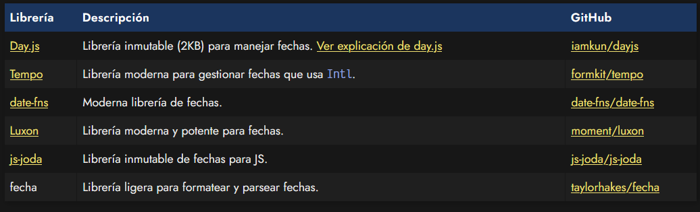

Con ellas, podrás trabajar con mayor comodidad o profundidad con fechas y horas en Javascript.

   OJO: Ten en cuenta que la librería [Moment.js](https://momentjs.com/) está actualmente desaconsejada por los desarrolladores, ya que no va a seguir manteniéndose. Recomiendan utilizar una librería más moderna como Luxon.

