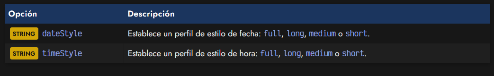

# 
Formatear fechas

Una de las partes más complejas de trabajar con fechas es formatear una fecha para mostrarla de forma adecuada (o de la forma que nos interesa). Una fecha tiene múltiples representaciones posibles: numéricas, alfabéticas, abreviaciones, con diferentes idiomas, estilo, orden, combinaciones entre sí, etc...

   - Numéricas: 25/1/2021, 25/01/2021, 1/25/2021, 01/25/2021, 2021/01/25, 25-1-2021...
   - Idiomáticas: 25 de Enero de 2021, 25 de Ene. de 2021, 25 January, 2021, 25 Jan 2021...
   - Orden/combinaciones: Jan/25/2021, 25/Febrero/2021, 25-Febrero-2021...

Es muy habitual, que queramos formatear esa fecha con la representación de la región a la que pertenecemos (o a la que pertenece el usuario), por lo que la cosa se puede complicar bastante.

Por suerte, el objeto Intl posee DateTimeFormat, un sistema que unido a lo que ya sabemos sobre fechas del [objeto Date nativo](https://lenguajejs.com/javascript/fechas/date-fechas-nativas/), pueden hacernos la vida más fácil para dar formato a fechas:

Dicho objeto, tiene una serie de métodos interesantes, como por ejemplo .format(), en el cuál nos centraremos para saber como formatear una fecha. Los métodos de los que dispone son los siguientes:

Observa que tanto .format() como .formatRange() tienen una versión *ToParts() que hace exactamente lo mismo, sólo que en lugar de devolver un STRING, devuelven un ARRAY de OBJECT con cada parte diferenciada.

## Crear una fecha.
Cuando trabajamos con el objeto Date nativo de Javascript, tenemos opciones (aunque limitadas) para personalizar las fechas con las que trabajamos. Métodos como .toString(), .toDateString(), .toGMTString() o .toISOString() se pueden utilizar para personalizar el modo de representación de una fecha. Incluso podemos utilizar .toLocaleDateString() para formatearla dependiendo de la configuración regional del sistema del usuario:

En caso de querer un tipo de representación diferente a las anteriores, tendríamos que optar por usar librerías externas o por crear una función personalizada que devuelva el tipo de representación buscada utilizando getters nativos, lo que puede llegar a ser una tarea tediosa.

## Formatear una fecha.
En su lugar, podemos utilizar el objeto Intl, creando una nueva instancia de DateTimeFormat(). Se trata de un objeto que nos permitirá formatear fechas, indicando la configuración regional a seguir, e indepedientemente de la que tenga el usuario en su sistema. Observa el siguiente ejemplo, donde se muestra la fecha del ejemplo anterior, formateada en localización de España (es), Estados Unidos (en-US), Alemania (de), Azerbaiyán (az) o Mauritania (mr):

Si al instanciar new Intl.DateTimeFormat() no indicamos ningún parámetro, se indicará por defecto el código del país del sistema, por lo que si tenemos un navegador con el sistema en Español, sería como si se hiciera un new Intl.DateTimeFormat("es-ES").

Realmente, new Intl.DateTimeFormat(country, options) tiene dos parámetros opcionales:

Podemos observar los parámetros por defecto si ejecutamos el método .resolvedOptions(), que en mi caso me muestra la siguiente salida (pueden variar dependiendo de tu región):

Ten en cuenta que el campo indicado en locale es el primer parámetro, el código de país para indicar la localización. El resto de parámetros son los que se pasan en el OBJECT options de Intl.DateTimeFormat() y que nosotros podemos personalizar a nuestro gusto, dependiendo de la salida que busquemos. Por ejemplo:

Este objeto de opciones puede ser muy variado y con diferentes parámetros. Vamos a unirlos en diferentes grupos para ver como funcionan.

## Estilos predefinidos de fecha.
En primer lugar tenemos un primer gran bloque de opciones, donde tenemos los parámetros dateStyle y timeStyle. Se trata de un sistema rápido para indicar perfiles genéricos con un estilo concreto. No se pueden utilizar junto a parámetros que veremos más tarde como weekday, day, month o similares:

Observa que en cada ejemplo vamos cambiando los valores de dateStyle y timeStyle, y como consecuencia se muestra de diferente forma. Estos parámetros pueden mezclarse, no necesariamente tienen que ser los mismos siempre. Uno afecta a la fecha y otro a la hora:

## Opciones de configuración.
En dicho objeto de opciones también es posible añadir ciertas personalizaciones, como por ejemplo, el tipo de calendario (el calendario gregoriano es el que solemos utilizar), el sistema de numeración (latín, por defecto), la zona horaria con timeZone o los algoritmos de formateo o localización a utilizar:

Hay que tener en cuenta que estas opciones tendrán un valor por defecto dependiendo del sistema donde estemos trabajando.

## Formato personalizado.
A diferencia de los estilos predefinidos que podemos seleccionar rápidamente con las opciones dateStyle y timeStyle, tenemos un segundo modo de personalización. Antes de nada, tener en cuenta que debemos seleccionar uno de los dos, es decir, si utilizamos dateStyle o timeStyle, no podremos utilizar ninguna de las siguientes opciones.

Las opciones son las siguientes:

El funcionamiento de estas opciones es muy sencillo. Simplemente se trata de añadir la característica que queremos mostrar en la representación de la hora, con el valor que más nos interese. Si no queremos mostrar alguno, simplemente lo omitimos:

Es importante destacar que el orden de los parámetros en el OBJECT de opciones no importa, puesto que se colocarán en el lugar apropiado en la representación final generada. También es importante observar que cada parámetro tiene un valor que hace que la fecha se representa de una forma particular. Dependiendo de los demás valores presentes, la representación puede variar ligeramente (por ejemplo, la opción era en formato largo necesita mostrar año y otros datos aunque no se indiquen).

A continuación puedes ver un gráfico donde se indican los diferentes valores de estas opciones, para una fecha concreta:

## Formatear partes de una fecha.
Hemos visto como trabajar con el método .format(date), sin embargo, existe una variante de este método, denominada .formatToParts(date). Funciona exactamente igual, sólo que la primera devuelve un STRING mientras que esta última devuelve un ARRAY de OBJECT.

Por ejemplo, el último fragmento de código con este método devolvería lo siguiente:

Observa que este método nos devuelve varios objetos, con las claves type y value. Podemos utilizar la clave type para acceder al valor concreto que nos interesa. Además, los separadores de texto, se identifican como tipo literal.

## Formatear rangos de fechas.
Al igual que tenemos el método .format(date), también disponemos de un método llamado .formatRange(date1, date2). Este método nos acepta dos fechas por parámetro para crear una fecha donde se representa un rango fecha1 - fecha2. La razón de esto es respetar la configuración regional con la que nos encontramos trabajando para crear dicho rango.

Al tratarse del mismo mes, observa que no se repite de nuevo las partes que ya se definen en la segunda fecha.

De la misma manera que la anterior, también tiene su versión .formatRangeToParts(date1, date2), que en lugar de devolvernos un STRING, nos devuelve un ARRAY de OBJECT con las partes de las fechas divididas e identificadas:

Observa que en la clave source de cada OBJECT se nos indica startRange si pertenece a la fecha de inicio, endRange si pertenece a la fecha final y shared si pertenece a ambas fechas.