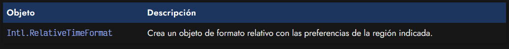
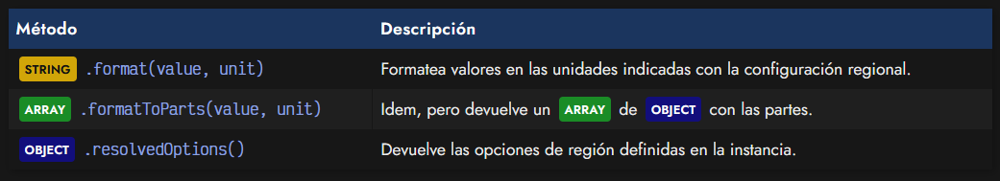
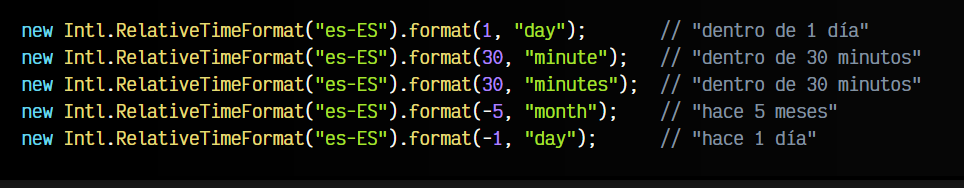
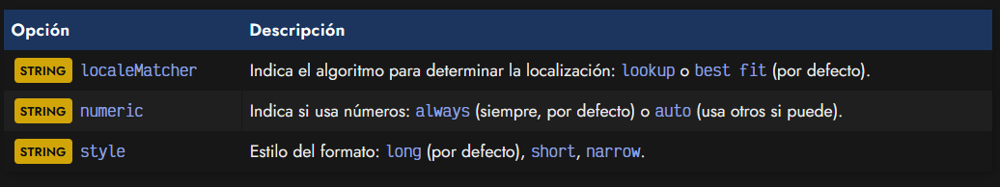
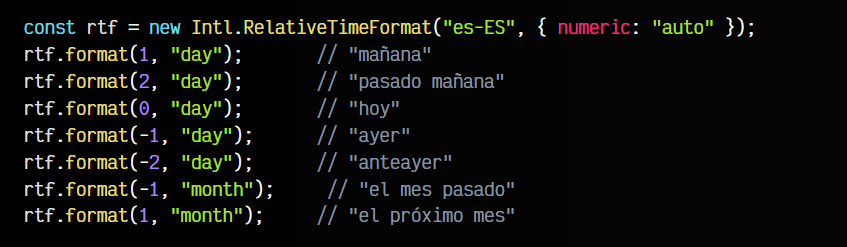
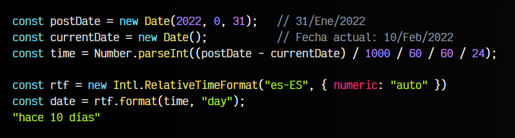
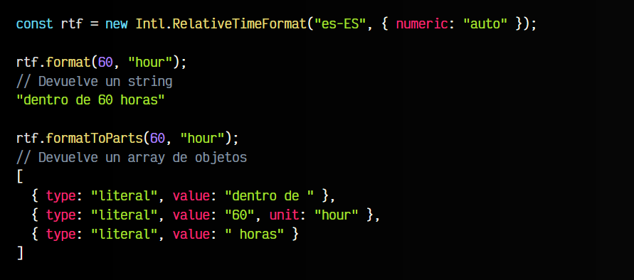

# 
Fechas relativas: RelativeTimeFormat

El objeto Intl de localización proporciona un interesante mecanismo llamado RelativeTimeFormat que permite manejar y tratar fechas relativas en Javascript de forma nativa, sin necesidad de utilizar librerías externas, incluso añadiendo capacidad de diferentes idiomas.

Una fecha relativa es el tiempo que se calcula respecto a otra fecha, habitualmente con textos como «Hace 10 minutos», «Hace 2 horas», «Dentro de 2 días», «Mañana», «Ayer», etc... Funciona de forma muy similar a [Intl.DateTimeFormat](https://lenguajejs.com/javascript/fechas/fechas-relativas-con-intl/), y podemos crear un objeto con una cierta configuración y luego utilizar los métodos .format() o .formatToParts():

Ten en cuenta que podemos utilizar el método .resolvedOptions() para obtener las opciones por defecto que se han utilizado al generar la instancia de la configuración de formato relativo.

## El objeto RelativeTimeFormat.
Comencemos viendo un ejemplo de .format(), donde formateamos varios valores teniendo en cuenta las diferentes unidades:

Observa que en el segundo y tercer caso, estamos usando tanto minute como minutes. Funciona para ambos, por lo que las unidades pueden indicarse tanto en singular como plural.

## Opciones de personalización.
En el ejemplo anterior, hemos utilizado sólo el parámetro es-ES para inicializar la instancia de RelativeTimeFormat, pero es posible indicar un segundo parámetro de opciones para personalizar la configuración regional:

Por ejemplo, utilicemos el parámetro numeric a auto, para que en lugar de utilizar siempre el formato numérico pueda cambiarlo por otra frase o palabra cuando sea posible:

## Formatear fechas relativas.
Ahora que sabemos como funciona, vamos a intentar aplicarlo a un ejemplo más parecido a la realidad, combinándolo con el [objeto Date ](https://lenguajejs.com/javascript/fechas/date-fechas-nativas/)de Javascript. Imaginemos una situación en la que tenemos la fecha de un artículo, postDate, y la fecha del día actual al cargar la página (imaginemos que estamos en el 10/Feb/2022).

Calculamos la diferencia entre ambas fechas (nos lo devuelve en milisegundos), por lo que dividimos para pasarlo a la unidad buscada, 1000 para los milisegundos, 60 para los segundos, 60 para los minutos y finalmente 24 para las horas. Nos quedamos con los días:

Con este sistema en mente, no nos costaría mucho crear una función que haga las conversiones de fechas y con RelativeTimeFormat te devuelva el texto con la localización que queramos (o indiquemos).

## Formatear partes de una fecha.
Igual que hemos trabajado con .format(), podemos hacerlo con .formatToPart(). La diferencia es que el primero nos devuelve un STRING con la fecha relativa formateada y el último nos devuelve  un ARRAY de OBJECT con las diferentes partes de la fecha formateada, por si queremos trabajar con ella. El formato sería el siguiente:

Esto hace que sea posible trabajar con estos datos para hacer personalizaciones posteriores, donde podríamos acceder o buscar campos especificos y quedarnos con los valores que necesitemos.