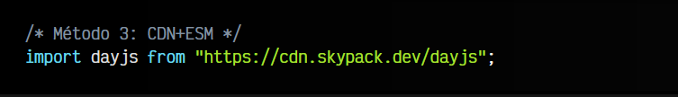

# 
Formatear fechas con dayjs

Manipular fechas con un lenguaje de programación siempre ha sido complicado, ya que tenemos múltiples formas de representarlas. [El objeto Date nativo](https://lenguajejs.com/javascript/fechas/date-fechas-nativas/) está bien, pero puede quedarse bastante corto cuando queremos trabajar a más alto nivel y no tener que implementarlo todo nosotros.

Históricamente, en el ecosistema Javascript se utilizaba frecuentemente una librería llamada [Moment.js](https://momentjs.com/). Sin embargo, esa librería se considera obsoleta desde hace tiempo y te recomiendan migrar a otras librerías más modernas, como por ejemplo [Luxon](https://moment.github.io/luxon/) o [dayjs](https://day.js.org/), de la cuál hablaremos en esta ocasión.

DayJS es una librería muy pequeña (Sólo 2KB) que puede servirnos de alternativa a Moment.js, ya que su API es muy flexible y te costará poco acostumbrarte si vienes de Moment. Entre otras cosas, la librería proporciona inmutabilidad, encadenamiento de métodos, soporte de idiomas y navegadores.

## Instalación de dayjs.
Para utilizar la librería dayjs debemos importarla en nuestro código. Esto se puede hacer de múltiples formas, como veremos a continuación. La primera, y más tradicional, es incluir la URL donde se encuentra el fichero .js de la librería dayjs. Podemos utilizar un repositorio de librerías como [CDNjs](https://cdnjs.com/) o [JSDelivr](https://www.jsdelivr.com/):

Sin embargo, en estos días es más habitual hacerlo desde los ficheros Javascript. Se puede hacer también de varias formas. La primera, y más conservadora, instalando la librería con NPM mediante el comando npm install dayjs . De esta forma, podremos hacer un [bare import](https://lenguajejs.com/javascript/modulos/import/#bare-imports) de la siguiente forma:

Esto importará la librería apropiada buscándola en la carpeta node_modules , donde la habrá instalado el NPM cuando hicimos npm install.

Por último, tendremos otra forma, un poco más moderna, que es una mezcla de las dos anteriores. Se basa en utilizar un CDN para importar la librería, pero desde un fichero Javascript en lugar desde el HTML:

Este método requiere que el fichero javascript se cargue con una etiqueta  y que la librería esté en formato [ESM](https://lenguajejs.com/automatizadores/introduccion/commonjs-vs-es-modules/). [SkyPack](https://www.skypack.dev/) es un CDN moderno de librerías preparadas para utilizar con sistema ESM. Si lo prefieres, también tienes [esm.sh](https://esm.sh/).

## Crear fechas con dayjs.
Dayjs tiene múltiples y variadas formas de crear fechas, pasando información diferente como entrada. Veamos las principales:

Como se puede ver, existen muy diversas formas de crear objetos de fechas con dayjs. Todas las formas anteriores, nos crean un objeto dayjs que contendrá una fecha y que posteriormente, veremos como representar por pantalla, también de múltiples formas. Sin embargo, vamos a centrarnos ahora sólo en la primera parte donde creamos una fecha a partir de múltiples formatos.

De estas primeras formas, podemos crear fechas que representen en el momento actual, o fechas específicas que utilizan el estándar (ISO 8601) o que utilizan fechas creadas con el [objeto Date de fechas nativas](https://lenguajejs.com/javascript/fechas/date-fechas-nativas/) de Javascript.

Si por otro lado nos interesa crear una fecha a partir de un formato muy específico (algo muy habitual), podemos utilizar un segundo parámetro donde indicamos cuál es ese formato, mientras que en el primer parámetro pasamos un STRING con la fecha representada en dicho formato:

Si quieres utilizar esta forma de crear fechas, necesitas antes importar el plugin customParseFormat y extender de él, de lo contrario obtendrás una fecha no válida. Las letras que se utilizan para determinar el formato en el segundo parámetro son las siguientes:

Además de los métodos anteriores, existen formas de crear fechas como las que veremos a continuación. El primero de ellos, crea una fecha a partir de un timestamp (UNIX Epoch), es decir, un NUMBER que representa el número de milisegundos que han pasado desde el 1-ENE-1970 a las 12:00AM (UTC):

const date = dayjs(number);

Por otro lado, también podemos crear fechas a partir de un OBJECT donde las claves son la unidad que representa. Como claves se pueden utilizar varias opciones:

   - Plural: years, months, days o dates, hours, minutes, seconds y milliseconds.
   - Singular: year, month, day o date, hour, minute, second y millisecond.
   - Abreviación: y, M, d, h, m, s y ms.

Ten en cuenta que para utilizar el método de objetos, antes hay que importar objectSupport desde la carpeta de plugins de dayjs, y posteriormente extenderlo con dayjs.extend(objectSupport). En el caso de los arrays habría que hacer lo mismo con el plugin arraySupport.

 - Mucho cuidado al indicar el mes de una fecha. Cuando lo indicamos utilizando el Date nativo, o en formatos como el de objetos o array, el 0 equivale a Enero, mientras que el 1 a Febrero, etc.

## Formatear fechas con dayjs.
Hasta ahora lo que hemos hecho es crear una fecha, más concretamente, un OBJECT de fecha de dayjs partiendo de prácticamente cualquier tipo de información de entrada (string con diferentes formatos, objeto Date nativo, objeto Javascript, array, etc...). Una vez tenemos ese objeto dayjs, lo que probablemente nos interese es mostrar esa información con otro tipo de formato (o el mismo).

Para ello, utilizaremos el método .format() sobre el objeto dayjs, al cuál le podemos pasar un STRING indicando el formato de salida que buscamos:

El STRING indicado en el método .format() es muy parecido al que hablamos anteriormente, pero con algunas diferencias, como los símbolos d / dd / ddd / dddd o h / hh:

El método .format() siempre nos devolverá los meses numéricos empezando en 1, ya que está orientado a devolver un STRING que se utilizará para mostrar en la página a los usuarios finales.

Ten en cuenta que los objetos de dayjs (al contrario que los Date nativos) son inmutables, por lo tanto una vez establecida una fecha no puedes cambiarla. Si deseas modificar una fecha, debes clonar una fecha y utilizar los setters apropiados para hacer las modificaciones correspondientes:

Tenemos una amplia cantidad de getters y setters en dayjs, entre los que podemos encontrar los siguientes:

A través de plugins se pueden utilizar otros métodos como la semana del año (weekYear), el día del año (dayOfYear), el día del mes en formato alfabético (weekday), etc...

## Fechas en diferentes idiomas.
Con dayjs es muy sencillo formatear fechas en diferentes idiomas, como por ejemplo, en español. Para ello, primero debemos importar el idioma que queremos utilizar, y luego indicar a dayjs que vamos a utilizar dicho idioma. Se puede hacer de dos formas:

De esta forma, con dayjs.locale("es") cargamos el idioma español de forma global importado en el módulo es de la linea anterior. Asi pues, todas las fechas que manipulemos después de dicha linea, aparecerán en el idioma seleccionado. Sin embargo, si lo hacemos de la siguiente forma, estaremos utilizando el idioma en la instancia concreta, por lo que solo afectará a ella:

Las siguientes lineas donde manipulemos fechas, aparecerán en el idioma principal, ya que sólo hemos utilizado el idioma español para esa fecha date concreta.

Además, también podemos utilizar algunos datos locales de apoyo como nombres de los días de la semana o nombres del mes del año, simplemente importadno el plugin localeData:

No olvides que tienes que importar la localización (es) y establecerla e importar el plugin localeData, y extender de él.
