# 
API de Audio Javascript

Javascript proporciona una serie de API nativas para trabajar con archivos multimedia directamente desde el navegador. De esta forma, podemos permitir al usuario interactuar con recursos multimedia de forma dinámica, e incluso hacer multitud de interesantes aplicaciones que utilicen tanto archivos de audio como de video.

Aunque se puede trabajar con muchos otros tipos de formatos multimedia como archivos .mp4 (video) o archivos .ogg (audio vorbis), en este artículo trataremos archivos .mp3, ya que son los más populares en cuanto a archivos multimedia de audio. Muchas veces hablaremos de recursos multimedia, ya que igual que lo hacemos con un archivo de audio, se puede hacer con un archivo de video.

## Crear Audio desde Javascript.
Un ejemplo básico para reproducir un archivo multimedia .mp3 (obsérvese que está alojado en una página de GitHub) desde nuestro navegador, podría ser el siguiente:

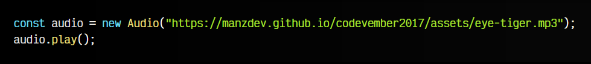

La constante audio contiene una instancia del objeto Audio, al que se le pasa por parámetro la URL del archivo .mp3 que queremos inicializar. En lugar de una URL, también podríamos indicar simplemente el nombre de un archivo .mp3, con lo que el navegador buscaría dicho archivo en la misma ruta donde tenemos nuestro archivo .js con el código Javascript.

Posteriormente, ejecutamos la función .play() de la instancia audio recién creada.

En este ejemplo, lo que hemos hecho realmente es crear una [etiqueta HTML de audio](https://lenguajehtml.com/html/multimedia/etiqueta-html-audio/), indicándole el archivo de audio a inicializar, sólo que esa etiqueta no reside «físicamente» en el documento HTML, si no que está en memoria, en la constante audio.

En el siguiente ejemplo podemos ver un ejemplo análogo al anterior:

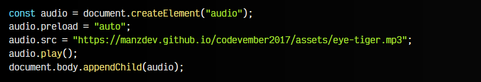

Sin embargo, en esta última línea, hemos añadido esa etiqueta audio al documento HTML en el que nos encontramos, antes de cerrar el </body>. Si quieres más información sobre esto, mira el capítulo de [trabajo en el DOM](https://lenguajejs.com/javascript/dom/que-es/).

## Propiedades básicas.
Al crear un objeto de audio mediante Javascript (que no es más que una etiqueta HTML), podemos utilizar la notación de objeto para crear propiedades que reflejarán el valor en atributos de la etiqueta HTML. De esta forma, podemos utilizar las siguientes propiedades, que son todas booleanas:

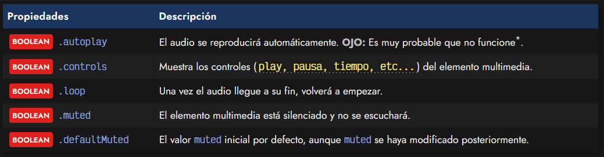

Un ejemplo de su uso sería el siguiente, donde vemos que podemos tanto obtener su valor como asignar un booleano para modificarlo:

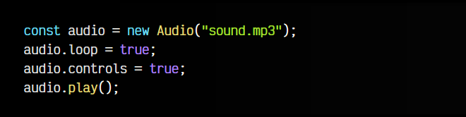

Desde 2017, Chrome, Firefox y otros navegadores establecieron un [cambio de políticas](https://developer.chrome.com/blog/autoplay?hl=es-419) con el atributo de reproducción automática autoplay. Para evitar molestos comportamientos de audio indeseado en páginas webs, por defecto la autoreproducción sólo funciona si el usuario ha interactuado antes en la página. Lo recomendable es sólo reproducir música o sonido si el usuario hace una acción específica (click de ratón o similar).

## Propiedades de reproducción.
Si quisieramos modificar nuestro objeto de Audio para indicarle un archivo multimedia diferente, sólo tendríamos que asignarle un STRING diferente a la propiedad url. De esta forma, tenemos muchas más propiedades, relacionadas con la reproducción multimedia:

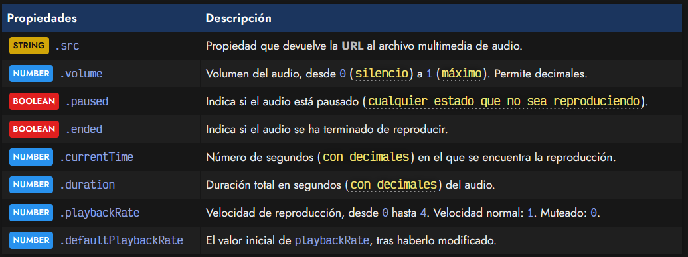

Observa en el siguiente ejemplo que, .currentTime además de usarse para obtener el momento exacto en el que se encuentra la reproducción, también se puede utilizar para modificar ese momento. Por ejemplo, .currentTime = 0 se podría utilizar para inicializar el sonido:

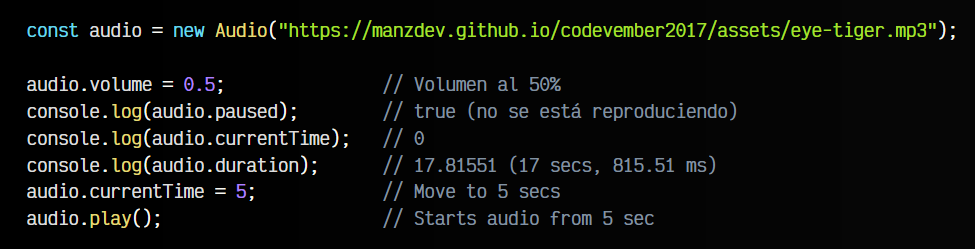

## Propiedades de precarga.
Cuando establecemos el atributo .src en un elemento de audio, el navegador automáticamente llama a la función .load() (ver más adelante) y se comienza a precargar el elemento de audio, dependiendo del valor que tenga la propiedad o atributo .preload. Veamos varias de las propiedades relacionadas con la precarga de un objeto de Audio:

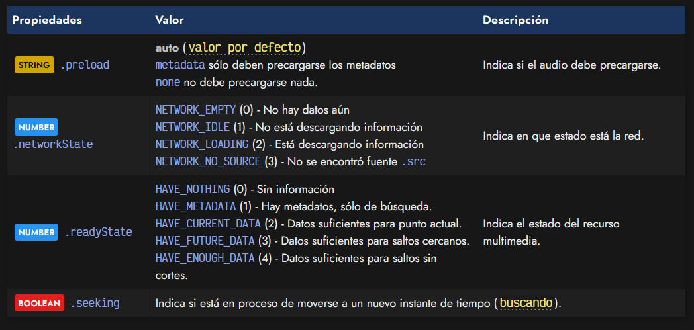

Mientras que el valor preload puede indicarse como un atributo HTML, el resto de propiedades no se pueden indicar, y son exclusivas de la API de Javascript. Generalmente suelen utilizarse para saber el estado de carga de un elemento de audio o información relacionada.

## Métodos o funciones de audio.
Los métodos que más nos pueden interesar en la API de Audio de Javascript son los de .play() y .pause(), ya que son los que comienzan a reproducir (o continuan una reproducción pausada previamente) y detienen una reproducción respectivamente.

Quizás, el método más extraño sea .canPlayType(mimetype), el cuál se puede llamar, indicando como parámetro el mimetype de un fichero de audio: por ejemplo, en el caso de un .mp3 sería audio/mp3 y en el caso de un .ogg sería audio/ogg. En el primer caso, Chrome nos devuelve el STRING probably que indica que es muy probable que esté soportado, mientras que en el segundo caso devuelve maybe, con el que indica que es menos probable, y depende de otros factores (sistema operativo, etc...).

Por otro lado, tenemos el método .load() que se encarga de inicializar un recurso y comenzar a procesarlo, dependiendo del valor actual del atributo preload que hablamos antes. El método .load() se llama automágicamente al cambiar el atributo o propiedad .src.

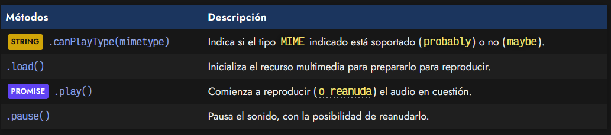

Por último, tenemos los métodos .play() (reproducir un audio) y .pause() (detener un audio), que tienen algunas puntualizaciones:

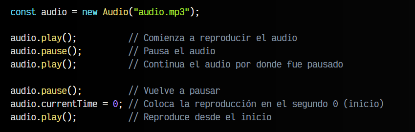

Es importante mencionar que el método .play() devuelve una promesa que se resuelve cuando el audio está descargado y ha comenzado a reproducirse. Ten en cuenta que dicho audio está alojado en una página web y puede no estar disponible en el momento de reproducir el audio, es por esto que devuelve una promesa:

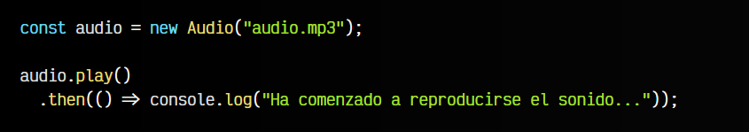

Sin embargo, el audio, al ser una acción auditiva, que no requiere visualización implícita, muchas veces no es necesario controlar la promesa y se puede ejecutar el .play() directamente.

## Eventos de audio.
Una de las partes más interesantes de la API multimedia es la posibilidad de jugar con eventos multimedia relacionados con objetos de audio. Recuerda que los eventos en Javascript son acciones muy específicas que suceden en momentos concretos de la vida de nuestra aplicación o web:

   - Cuando el usuario hace click...
   - Cuando el usuario hace scroll...
   - Cuando el usuario pausa un sonido en la barra de control...

De esta forma, tenemos múltiples tipos de eventos que podemos utilizar. En este primer bloque encontraremos los eventos que ocurren en momentos comunes de la reproducción de un recurso multimedia, como cuando comenzamos a reproducirlo, lo detenemos o vamos a un momento específico de su duración:

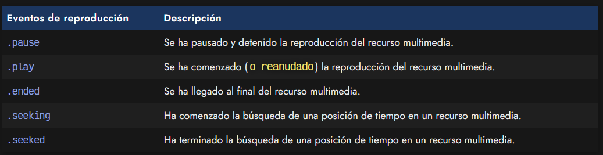

Veamos un ejemplo básico de uso de algunos de estos eventos:

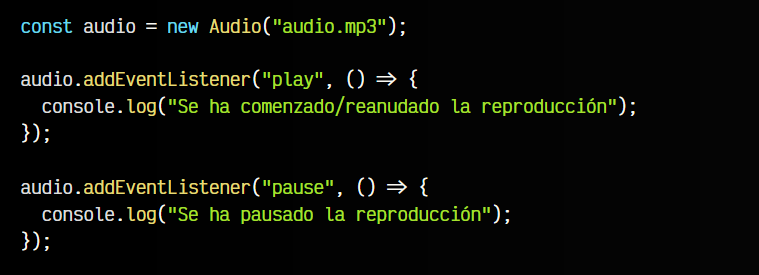

Por otro lado, también podemos ejecutar una lógica específica cuando suceden ciertos eventos relacionados con el cambio de alguno de sus parámetros iniciales, como la velocidad de reproducción o el segundo actual de reproducción:

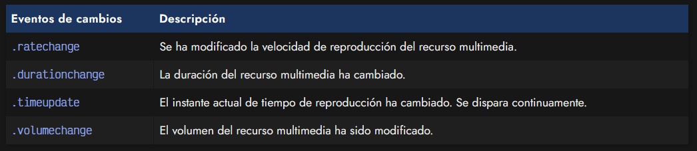

Observa en el siguiente ejemplo, que el evento timeupdate se ejecutará varias veces en el mismo segundo, no una sola vez por segundo como quizás se imagina inicialmente. Esto ocurre porque la precisión de la actualización de tiempo, afecta a milisegundos, por lo que se ejecuta varias veces en el mismo segundo:

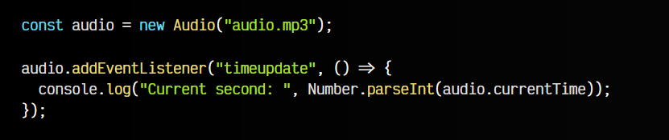

Por último, tenemos múltiples eventos relacionados con la carga o precarga de los recursos multimedia, sus metadatos o el proceso de «buffering» donde la reproducción no se puede realizar porque aún no se ha descargado la suficiente cantidad de datos para reproducir:

Muchos de estos eventos nos permiten personalizar como actuará nuestra aplicación o web respecto a lo que haya sucedido.

        Cuidado: No confundir el evento .onplay con el evento .onplaying. El segundo es el que ocurre cuando ya podemos reproducir un audio porque estaba en proceso de «buffering», mientras que el primero es el que se dispara cuando comenzamos o continuamos una reproducción multimedia.

## Librerías de terceros.
Es posible que en algunos casos, la API multimedia nativa de Javascript se nos quede corta. En ese caso, existen algunas librerías interesantes que pueden servirnos para simplificar nuestro código y realizar acciones más concretas.

Por ejemplo, Howler.js es una excelente librería para cuando la API nativa se nos queda corta o necesitamos algo un poco más potente:

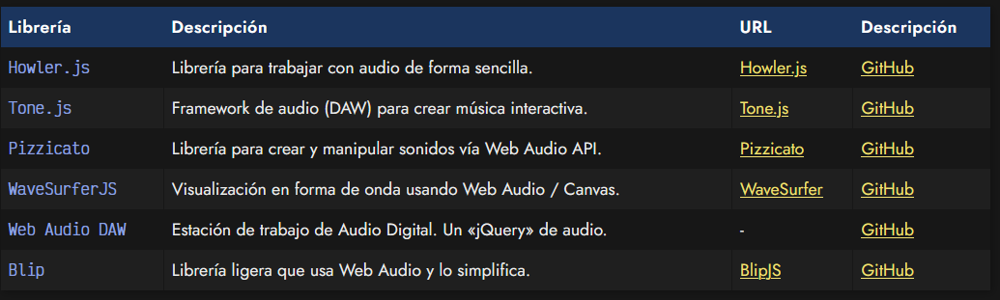

Otras librerías como Tone.js o Pizzicato nos permiten centrarnos en la generación de sonidos utilizando la API Web Audio y/o utilizando sonidos externos.

