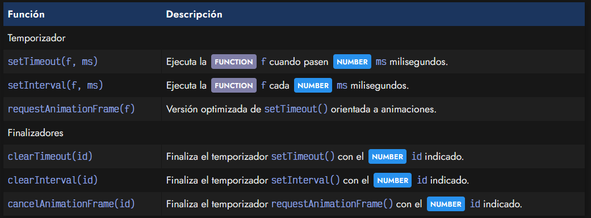
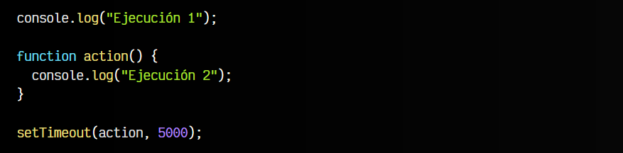
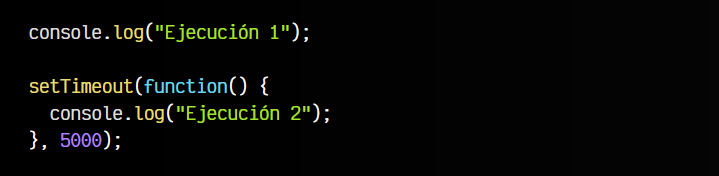
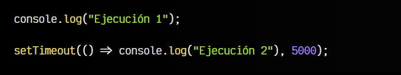
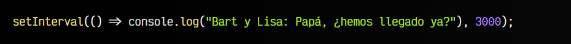
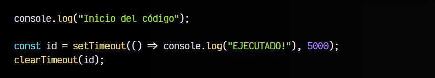
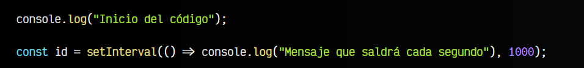
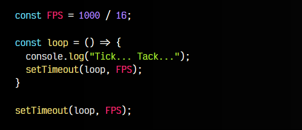
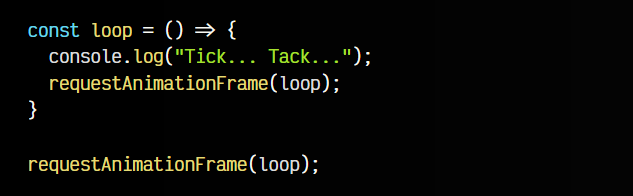

# 
Temporizadores

Los temporizadores (timers) son funciones especiales que permiten ejecutar una función que realice ciertas tareas después de un determinado tiempo. Por un lado, los temporizadores timeout ejecutan cuando pasa un cierto tiempo, mientras que los temporizadores interval se ejecutan constantemente cada cierto tiempo.

Los métodos disponibles para crear temporizadores son los siguientes:

Vamos a explicarlos detalladamente

## La función setTimeout().
La función setTimeout(f, ms) nos pide dos parámetros:FUNCTION la función f a ejecutar y el NUMBER tiempo ms que debemos esperar antes de que se ejecute (en milisegundos).

Observa el siguiente fragmento de código:

Si ejecutas este fragmento de código, comprobarás que aparece el mensaje Ejecución 1 y a los 5 segundos aparecerá Ejecución 2. Observa que hemos declarado la función action() antes de ejecutar el setTimeout(), al cuál se lo pasamos por parámetro.

Como ya sabrás, se puede pasar por parámetro a la vez que la definimos (como una función anónima):

Incluso, como una [función flecha](https://lenguajejs.com/javascript/introduccion/funciones/#arrow-functions) es mucho más cómodo a la hora de escribirla, ya que nos ahorramos líneas y se puede escribir de forma más compacta:

Recordemos, esta última sentencia ejecuta el console.log() a los 5 segundos de haberse ejecutado el setTimeout().

    Ten en cuenta que los navegadores poseen múltiples excepciones (incluso particulares, por cada navegador), por las que el temporizador podría no ser preciso en favor de no sacrificar el rendimiento del navegador.

## La función setInterval().
Como puedes ver, setTimeout() no es el único temporizador. La función setInterval() ejecuta una función cada cierto tiempo. Como vimos anteriormente, setTimeout() espera el número indicado de segundos para ejecutar la función proporcionada por parámetro, y una vez ejecutada termina el temporizador.

Por otro lado, la función setInterval() espera el número indicado de segundos y ejecuta la función proporcionada, una vez hecho, vuelve a repetir el proceso una y otra vez:

Como puedes ver, esta función se ejecutará cada 3 segundos, continuamente.

  - Ten mucho cuidado al colocar temporizadores dentro de un setInterval(). En el caso de incluir un setTimeout() podría no ser grave, pero en el caso de añadir un setInterval() dentro de otro, podrías provocar una https://es.wikipedia.org/wiki/Bomba_fork.

## Detener temporizadores.
Aunque no lo hemos mencionado anteriormente, tanto el temporizadores setTimeout() como setInterval() devuelven un NUMBER número al ejecutarse. Este número es un identificador único del temporizador. Es útil cuando queremos detener prematuramente el temporizador y cancelar inmediatamente la ejecución del mismo.

Por ejemplo, observa este ejemplo de clearTimeout() en un temporizador setTimeout():

En este caso, el console.log() de EJECUTADO! nunca será mostrado por consola, ya que al programarlo para dentro de 5 segundos, inmediatamente después es cancelado con la función clearTimeout(), a la cuál le proporcionamos el identificador que guardamos en id en la línea anterior.

Ocurre exactamente igual en el caso del setInterval():

Una vez se ejecute este fragmento de código, veremos que se muestra en consola varios mensajes por cada segundo. Una vez ejecutemos la línea de código clearInterval(id), ese temporizador se detendrá, y por lo tanto, no se verá más el mensaje.

## Usando requestAnimationFrame().
En temáticas de desarrollo de juegos, o a la hora de mostrar animaciones, muchas veces es necesario crear un bucle loop, que se vaya llamando continuamente y mostrando los cambios de la animación, personaje o elementos del videojuego, por ejemplo. Para ello, hay que llamar al bucle un número específico de veces cada cierto tiempo.

Si lo llamamos muy pocas veces, la animación será lenta o irá a golpes, si la llamamos demasiadas veces, estaremos trabajando de más y podríamos tener un problema de rendimiento.

Se suele decir que el número de frames apropiado por segundo es 60, es decir, 1000 / 60, o lo que es lo mismo, aproximadamente 16 ms. Esto hace que la animación sea fluida y se vea correctamente.

Esto traducido a setTimeout() sería lo siguiente:

Sin embargo, tenemos una alternativa a setTimeout() especialmente orientada a animaciones, denominada requestAnimationFrame(). Observa que funciona de forma muy parecida, sólo que no es necesario indicarle el número de FPS, ya que lo calcula automáticamente.

Esto es una de las ventajas de esta función respecto a setTimeout(). La cantidad de FPS no siempre debe ser constante, sino que en algunos momentos del bucle puede variar y necesitar más o menos cantidad. Por lo tanto, en el caso del setTimeout() tendríamos que estar cambiando ese valor, y no resulta práctico.

Sin embargo, requestAnimationFrame() lo calcula por si mismo, y sólo vuelve a ejecutar el bucle cuando es el momento oportuno. Esto hace que las animaciones sean muy fluidas y no se utilice tiempo extra o insuficiente, mientras que el programador no debe preocuparse de realizar los cálculos:

Una forma de comprobar la utilidad de este requestAnimationFrame() sobre el tradicional setTimeout() es si ejecutamos el bucle y cambiamos a otra pestaña. En el caso de setTimeout() el bucle se seguirá ejecutando aunque tengamos la página minimizada y no estemos viendo nada, lo que probablemente estaría desperdiciando recursos, batería, etc..

Por otro lado, en el caso de requestAnimationFrame() se podrá comprobar que el console.log() se detiene, y sólo se ejecuta cuando el usuario tiene la pestaña o ventana activa y la está mostrando.

Desde hace algunas versiones (2021), los navegadores han establecido un sistema de control para los temporizadores y pueden estar limitados si el navegador lo consideran oportuno. [ [Más info](https://developer.chrome.com/blog/timer-throttling-in-chrome-88/) ]

De la misma forma que setTimeout() y setInterval(), esta función tiene su propia función para cancelar el temporizador optimizado, que se denomina cancelAnimationFrame(). De la misma forma, también se le tiene que pasar el id que devuelve requestAnimationFrame().

