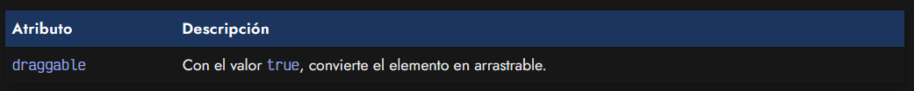

# 
Drag and Drop API

Muchas veces, nos habremos dado cuenta que aunque nuestra página realiza los objetivos que requiere, su utilización no resulta cómoda o intuitiva para los usuarios. Muchas veces, esto puede ocurrir porque la interfaz carece de un sistema de Drag and Drop.

## ¿Qué es el Drag and Drop?.
Se conoce como Drag and Drop al hecho de arrastrar (Drag) y soltar (Drop) un elemento (draggable) sobre otro elemento (drop zone) en una interfaz de usuario. Ejemplos clásicos son cuando puedes arrastrar y soltar una imagen en lugar de pulsar el botón y buscar en las carpetas de tu sistema.

Algunos elementos como el botón de subir imágenes ya tienen drag and drop integrado (sobre el propio botón), pero esta implementación depende del navegador y el sistema operativo, y no es personalizable. Si queremos hacer algo más específico y bonito, tendremos que utilizar esta API.

## El atributo draggable.
Para empezar, tenemos que saber que existe un atributo HTML draggable que debemos incluir en nuestro elemento HTML para convertirlo en un elemento que pueda arrastrar. El atributo draggable debe tener el valor true:

Por defecto, algunos elementos como las imágenes  ya son arrastrables y no requieren este atributo, sin embargo, otras como un simple 
 no lo son. Observa el siguiente ejemplo:

El elemento rojo no es arrastrable, sin embargo el elemento morado si lo es.

## Eventos Drag.
Para personalizar nuestro sistema Drag and Drop necesitamos utilizar ciertos eventos de Javascript. Podemos empezar con los eventos dragstart, dragend y drag, tres eventos centrados en el elemento que arrastramos, es decir, en la parte en la que hacemos «Drag»:

Observa este fragmento de código Javascript, donde utilizamos estos 3 eventos para encender las cajas de la derecha de la demo. Ten en cuenta que los listeners se hacen sobre dragItem, el elemento que arrastras. Al arrastrar la imagen y moverla, comprobarás que se encienden los eventos que se disparan:

El evento drag es un evento que se llama muchas veces por segundo. Intenta siempre que el código ejecutado en drag sea breve, extremandamente rápido y ligero o tenga condicionales para evitar ejecutarse múltiples veces. De lo contrario podrías experimentar lag, bloqueos o retardos.

## Eventos Drop.
Ahora, centrémonos en la parte en la que hacemos «Drop», y soltamos el elemento en otro elemento. Para ello, vamos a utilizar los eventos dragenter, dragleave, dragover y drop:

Ten muy en cuenta que estamos escuchando con los listeners en dropZone, el elemento donde sueltas. En este caso, debemos mover la imagen sobre el bloque que indica «Drop here». Estaremos detectando cuando un elemento es arrastrado hasta esa sección, cuando entras, cuando sales, etc.

Con el evento dragover ocurre lo mismo que con el evento drag. Intenta que sea muy ligero. Además, debes utilizar un .preventDefault() para evitar ocultar la activación del evento drop.

## El objeto dataTransfer.
Sin embargo, hasta ahora tenemos forma de detectar cuando ocurren los eventos, pero no la información asociada a ellos, como por ejemplo, que elemento estamos arrastrando o donde lo hemos soltado. Para ello, vamos a utilizar la propiedad ev.dataTransfer que ocurre en nuestros eventos de Drag and Drop.

En primer lugar, observa que hemos creado un 
 con clase place que es donde está ubicada la imagen original. Luego, le hemos añadido a la imagen un id para identificarlo de forma única. Ahora, vamos a mover la imagen a la zona punteada:

En este fragmento de código, en el evento dragstart, utilizamos el método setData() para pasar el id del elemento que hemos empezado a arrastrar. Luego, en el evento drop, obtenemos ese id, lo buscamos en el DOM, y como es único, obtendremos el elemento HTML que hemos soltado. Además, lo que hacemos es añadirlo a la zona drop donde lo hemos soltado, y como es una referencia al original, lo que hará el navegador es moverlo desde su posición inicial.

Observa también, que con el método setDragImage() hemos indicado una imagen para mostrar mientras se arrastra, y dar feedback visual al usuario.

## Librerías de Drag and Drop.
En algunos casos, nos puede interesar no ir a tan bajo nivel y priorizar nuestro tiempo de desarrollo sobre los inconvenientes de utilizar una librería. Una librería siempre tardará más en descargarse, parsearse y procesarse, y puede que sea más difícil de mantener en el futuro, sin embargo, a veces puede interesar por la velocidad de implementación que representa.

Algunas librerías Javascript interesantes para hacer Drag and Drop serían las siguientes:

