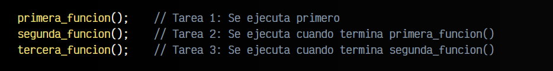
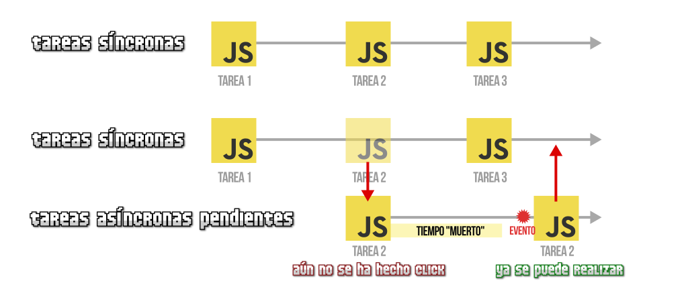
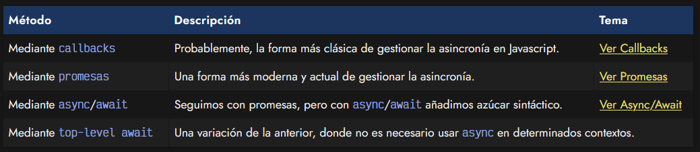
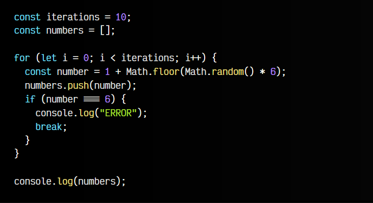

# 
¿Qué es la asincronía?

La asincronía es uno de los conceptos principales que rige el mundo de Javascript. Cuando comenzamos a programar, normalmente realizamos tareas de forma síncrona, llevando a cabo tareas secuenciales que se ejecutan una detrás de otra, de modo que el orden o flujo del programa es sencillo y fácil de observar en el código:

Sin embargo, en el mundo de la programación, tarde o temprano necesitaremos realizar operaciones asíncronas, especialmente en ciertos lenguajes como Javascript, donde tenemos que realizar tareas que tienen que esperar a que ocurra un determinado suceso que no depende de nosotros, y reaccionar realizando otra tarea sólo cuando dicho suceso ocurra.

## Lenguaje no bloqueante.
Cuando hablamos de Javascript, habitualmente nos referimos a él como un lenguaje no bloqueante. Con esto queremos decir que las tareas que realizamos no se quedan bloqueadas esperando ser finalizadas, y por consiguiente, evitando proseguir con el resto de tareas.

Imaginemos que la segunda_funcion() del ejemplo anterior realiza una tarea que depende de otro factor, como por ejemplo un click de ratón del usuario. Si hablasemos de un lenguaje bloqueante, hasta que el usuario no haga click, Javascript no seguiría ejecutando las demás funciones, sino que se quedaría bloqueado esperando a que se terminase esa segunda tarea:

Pero como Javascript es un lenguaje no bloqueante, lo que hará es mover esa tarea a una lista de tareas pendientes a las que irá «prestándole atención» a medida que lo necesite, pudiendo continuar y retomar el resto de tareas a continuación de la segunda.

## ¿Qué es la asincronía?.
Pero esto no es todo. Ten en cuenta que pueden existir múltiples tareas asíncronas, dichas tareas puede que terminen realizandose correctamente (o puede que no) y ciertas tareas pueden depender de otras, por lo que deben respetar un cierto orden. Además, es muy habitual que no sepamos previamente cuanto tiempo va a tardar en terminar una tarea, por lo que necesitamos un mecanismo para controlar todos estos factores: las promesas, las cuales veremos algunos capítulos más adelante.

## Ejemplos de tareas asíncronas.
En Javascript no todas las tareas son asíncronas, pero hay ciertas tareas que si lo son, y probablemente se entiendan mejor con ejemplos reales:

   - Un fetch() a una URL para obtener un archivo .json.
   - Un play() de un .mp3 que creamos mediante un new Audio().
   - Una tarea programada con setTimeout() que se ejecutará en el futuro.
   - Una comunicación desde Javascript a la API del sintetizador de voz del navegador.
   - Una comunicación desde Javascript a la API de un sensor del smartphone.

Todos estos ejemplos se realizan mediante tareas asíncronas, ya que realizan un procedimiento que podría bloquear la ejecución del resto del programa al tardar mucho: la descarga de un fichero grande desde un servidor lento, una conexión a internet muy lenta, un dispositivo saturado a la hora de comunicarse con el sensor del móvil, etc...

## ¿Cómo gestionar la asincronía?.
eniendo en cuenta el punto anterior, debemos aprender a buscar mecanismos para dejar claro en nuestro código Javascript, que ciertas tareas tienen que procesarse de forma asíncrona para quedarse a la espera, y otras deben ejecutarse de forma síncrona.

En Javascript existen varias formas de gestionar la asincronía, donde quizás las más populares son las siguientes (que iremos viendo y profundizando en cada artículo de este tema):

Iremos viendo la implementación de cada una de ellas en cada capítulo de este tema, utilizando de base un ejemplo sencillo donde lanzamos un dado un número concreto de veces, que explicaremos a continuación.

## Ejemplo base.
Tenemos un array numbers, en el cuál insertaremos números. Insertaremos la cantidad de números que figura en iterations. En cada iteración se insertará un number, que habrá sido generado con una simulación del lanzamiento de un dado (un número aleatorio del 1 al 6). En el caso de obtener un 6, paramos y rompemos el bucle:

Al terminar este fragmento de código, tendremos un array numbers que contendrá todos los números obtenidos en los lanzamientos de los dados, es decir, 10 números si no hemos obtenido ningún 6. Si hemos obtenido un 6 puede que tengamos menos números, debido a que se rompe el bucle tras insertarlo.

Ten en cuenta que este ejemplo es una tarea síncrona (aún no existe asincronía). Simplemente estamos explicando el ejemplo que usaremos de base en los siguientes capítulos del tema para controlar asincronía. Quizás lo ideal sería que cada lanzamiento del lado tardase un tiempo concreto en dar la respuesta, pero no se ha introducido ese retardo para simplificar los ejemplos de código.

