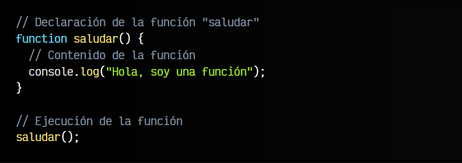
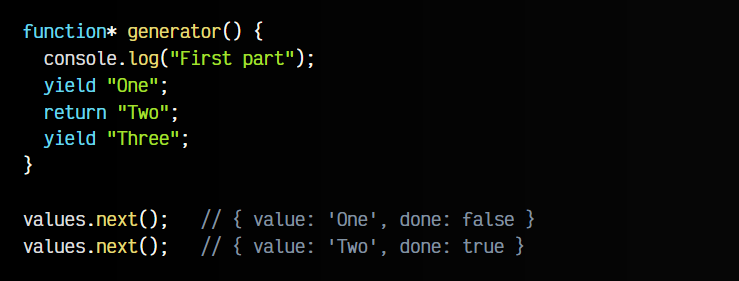

# 
FUNCIONES

## ¿Qué es una función?
Las funciones nos permiten agrupar líneas de código en tareas con un nombre, para que, posteriormente, podamos hacer referencia a ese nombre para realizar todo lo que se agrupe en dicha tarea. Para usar funciones hay que hacer 2 cosas:

  -  Declarar la función: Preparar la función, darle un nombre y        decirle las tareas que realizará.
  -  Ejecutar la función: «Llamar» a la función para que realice las tareas de su contenido.

## Declaración
En el siguiente ejemplo veremos la declaración de una función llamada saludar:

El contenido de la función es una línea que mostrará por consola un saludo. Sin embargo, si escribimos estas 4-5 líneas de código en nuestro programa, no mostrará nada por pantalla. Esto ocurre así porque solo hemos declarado la función (le hemos dicho que existe), pero aún nos falta el segundo paso, ejecutarla, que es realmente cuando se realizan las tareas de su contenido.

## Ejecución
Veamos, ahora sí, el ejemplo completo con declaración y ejecución:

En este ejemplo hemos declarado la función y además, hemos ejecutado la función (en la última línea) llamándola por su nombre y seguida de ambos paréntesis, que nos indican que es una función. En este ejemplo, si se nos mostraría en la consola Javascript el mensaje de saludo.

### Ejemplo:

Este primer ejemplo funciona perfectamente, sin embargo, no estamos aprovechando las ventajas de la programación, sino que hemos hecho todo el trabajo escribiendo 10 líneas de código.

Vamos a utilizar un bucle for para ahorrarnos tantas líneas de código:

Esto está mucho mejor. Hemos resumido 11 líneas de código en prácticamente 2 líneas utilizando un bucle for que va de 0 a 10 incrementando de 1 en 1. Incluso, recuerda que cuando las llaves sólo contienen una línea, se pueden omitir.

Pero aún no hemos utilizado funciones, así que vamos a modificar nuestro ejemplo para usar una. Imaginemos que ahora nuestro objetivo es mostrar la tabla de multiplicar del 1 varias veces (3 veces para ser exactos).

La primera aproximación para hacer eso que se nos ocurriría sería hacer lo siguiente:

Pero volvemos a tener el mismo problema del primer ejemplo. Estamos repitiendo el mismo código varias veces, complicándolo y volviéndolo más «feo». Además, si tuvieramos que hacer modificaciones en uno de los bucles habría también que repetir el trabajo 2 veces más, por cada uno de los otros bucles.

Veamos ahora como obtener el mismo resultado pero utilizando bucles y funciones, sin repetir varias veces las mismas tareas:

En este ejemplo se declara la función, que mostrará la tabla de multiplicar del uno. Posteriormente, realizamos un bucle con la variable intento de 0 a 2 (3 repeticiones) para llamar la función 3 veces, y mostrar así la tabla de multiplicar cada vez.

Pero... ¿No sería más interesante mostrar las 3 primeras tablas de multiplicar (Tabla del uno, del dos y del tres)? Para hacer eso, primero tenemos que conocer los parámetros en funciones, que veremos en el siguiente artículo.

## ¿Qué son los parámetros?
Las funciones son mucho más flexibles y potentes de lo que hemos visto hasta ahora. A las funciones se les pueden pasar parámetros, que no son más que variables que les pasamos desde fuera hacia dentro de la función. Además, también podemos hacer que la función realice sus tareas y nos devuelva un resultado hacia el exterior de la función.

Veamos el siguiente ejemplo, donde utilizamos el parámetro hasta para indicar hasta donde debe llegar:

Como podemos ver, en el interior de los paréntesis de la función se ha indicado una variable llamada hasta. Esa variable contiene el valor que se le da a la hora de ejecutar la función, que en este ejemplo, si nos fijamos bien, se ejecuta dos veces: una con valor 10 y otra con valor 5.

Analicemos este código:

   - Ejecutamos la función tablaDelUno(10).
   - En la función tablaDelUno, el parámetro hasta valdrá 10.
   - Por lo tanto, haremos un bucle for desde 0 hasta 10, incrementando de 1 en 1.
   - Se mostrará la tabla de multiplicar del uno, desde el 0 hasta el 10.

Al terminar ejecutaremos la segunda función:

   - Ejecutamos la función tablaDelUno(5).
   - En la función tablaDelUno, el parámetro hasta valdrá 5.
   - Por lo tanto, haremos un bucle for desde 0 hasta 5, incrementando de 1 en 1.
   - Se mostrará la tabla de multiplicar del uno, desde el 0 hasta el 5.

## Parámetros múltiples
Hasta ahora sólo hemos creado una función con 1 parámetro, pero una función de Javascript puede tener muchos más parámetros. Vamos a crear otro ejemplo, mucho más útil donde convertimos nuestra función en algo más práctico y útil:

En este ejemplo, hemos modificado nuestra función tablaDelUno() por esta nueva versión que hemos cambiado de nombre a tablaMultiplicar(). Esta función necesita que le pasemos dos parámetros: tabla (la tabla de multiplicar en cuestión) y hasta (el número hasta donde llegará la tabla de multiplicar).

De esta forma, las dos llamadas para ejecutar la función mostrarán por la consola la tabla de multiplicar del 1 y del 5.

## Parámetros por defecto 
Es posible que en algunos casos queramos que ciertos parámetros tengan un valor sin necesidad de escribirlos en la ejecución. Es lo que se llama un valor por defecto.

En nuestro ejemplo anterior, nos podría interesar que la tabla de multiplicar llegue siempre hasta el 10, ya que es el comportamiento por defecto. Si queremos que llegue hasta otro número, lo indicamos explicitamente, pero si lo omitimos, queremos que llegue hasta 10. Esto se haría de la siguiente forma:

De esta forma nos ahorramos tener que escribir los valores en la ejecución de la función, si en la mayoría de los casos va a tomar ese valor.

## Devolución de valores
Hasta ahora hemos utilizado funciones simples que realizan acciones o tareas (en nuestro caso, mostrar por consola), pero habitualmente, lo que buscamos es que esa función realice una tarea y nos devuelva la información al exterior de la función, para así utilizarla o guardarla en una variable, que utilizaremos posteriormente para nuestros objetivos.

Para ello, se utiliza la palabra clave return, que suele colocarse al final de la función, ya que con dicha devolución terminamos la ejecución de la función (si existe código después, nunca será ejecutado).

Veamos un ejemplo con una operación muy sencilla, para verlo claramente:

Como podemos ver, esto nos permite crear funciones más modulares y reutilizables que podremos utilizar en multitud de casos, ya que la información se puede enviar al exterior de la función y utilizarla junto a otras funciones o para otros objetivos.

## Formas de crear funciones
Hay varias formas principales de crear funciones en Javascript, aunque probablemente sólo conozcas alguna de ellas:

Vamos a explicar cada una de estas formas a continuación, para saber cómo utilizarlas y cuando es interesante utilizarlas.

## Funciones por declaración
Probablemente, la forma más popular de estas tres, y a la que estaremos acostumbrados si venimos de otros lenguajes de programación, es la primera, a la creación de funciones por declaración. Esta forma permite declarar una función que existirá a lo largo de todo el código:

De hecho, podríamos ejecutar la función saludar() incluso antes de haberla creado y funcionaría correctamente, ya que Javascript primero busca las declaraciones de funciones y luego procesa el resto del código.

## Funciones por expresión
Sin embargo, en Javascript es muy habitual encontrarse códigos donde los programadores «guardan funciones» dentro de variables, para posteriormente «ejecutar dichas variables». Se trata de un enfoque diferente, creación de funciones por expresión, que fundamentalmente, hacen exactamente lo mismo (con algunos matices diferentes):

Con este nuevo enfoque, estamos creando una función en el interior de una variable, lo que nos permitirá posteriormente ejecutar la variable (como si fuera una función, que de hecho lo es, porque es lo que contiene).

Observa también que el nombre de la función (saludar) pasa a ser inútil, ya que si intentamos ejecutar saludar() nos dirá que no existe y si intentamos ejecutar saludo() funciona correctamente. ¿Qué ha pasado? Ahora el nombre de la variable pasa a ser el «nombre de la función», mientras que el anterior nombre de la función desaparece y se omite, creando un concepto llamado funciones anónimas (o funciones lambda), que retomaremos más adelante.

## Funciones como objetos
Como curiosidad, debes saber que se pueden declarar funciones como si fueran objetos. Sin embargo, es un enfoque que no se suele utilizar en el mundo real, ya que es incómodo, poco práctico y muy verboso:

Simplemente es interesante saberlo para darse cuenta que en Javascript todo pueden ser objetos.

## Funciones anonimas.
Las funciones anónimas (o funciones lambda) son un tipo de funciones que se declaran sin definir un nombre de función, alojándolas en el interior de una variable y haciendo referencia a dicha variable cada vez que queramos utilizarla.

Sin saberlo, creamos de forma intuitiva una función anónima:

Observa que, tras definir la función, hace dos acciones:

    1️⃣ Ejecutamos la variable saludo, que como contiene una función, se ejecuta la función
    2️⃣ Mostramos el valor de la variable saludo (no indicamos paréntesis, no ejecutamos).

## Funciones autoejecutables
Ahora que tenemos claro el concepto de función anónima, vamos a ver un caso donde puede ser útil. Pueden existir casos en los que necesites crear una función y ejecutarla inmediatamente, sabiendo que no la vas a volver a necesitar. Este tipo de funciones muchas veces también se llama IIFE (Función por expresión invocada inmediatamente).

Esto se puede resolver con lo que se llama una función autoejecutables. Básicamente, sólo tenemos que envolver entre paréntesis la función anónima en cuestión (no necesitamos que tenga nombre, puesto que no la vamos a guardar) y luego, ejecutarla:

De hecho, también podemos utilizar parámetros en dichas funciones autoejecutables. Observa que sólo hay que pasar los parámetros deseados al final de la función autoejecutable:

Ten en cuenta que, si la función autoejecutable devuelve algún valor con return, a diferencia de las funciones por expresión, en este caso lo que se almacena en la variable es el valor que devuelve la función autoejecutada:

¿Qué está ocurriendo aquí? Analicemos paso por paso:

    1️⃣ Se ejecuta la función autoejecutable contenida en paréntesis.
    2️⃣ La función toma el valor Manz como parámetro name.
    3️⃣ La función devuelve el valor ¡Hola, Manz! como resultado.
    4️⃣ La variable value almacena el valor devuelto por la función autoejecutada.

## Clausuras
Las clausuras (o cierres) son un concepto relacionado con las funciones y los ámbitos que suele costar comprender cuando se empieza en Javascript. Es importante tener las bases de funciones claras hasta este punto, para poder entender las bases de una clausura.

A grandes rasgos, en Javascript, una clausura o cierre se define como una función que «encierra» variables en su propio ámbito (y que continúan existiendo aún habiendo terminado de ejecutar la función).

Por ejemplo, veamos el siguiente ejemplo:

Analicemos primero lo que tenemos en este código, y luego analicemos lo que ocurre cuando ejecutamos la función:

    1️⃣ Tenemos una función anónima que es también una función autoejecutable.
    2️⃣ Adelántate, y observa que la función autoejecutable devuelve otra función diferente.
    3️⃣ Al ejecutar la función la primera vez (autoejecutable) devolvemos esa otra función que es la que se guarda en incr para futuras ejecuciones.

La «magia» de las clausuras es que en el interior de la función autoejecutable estamos creando una variable num que se guardará en el ámbito de dicha función autoejecutable, por lo tanto seguirá existiendo, inicialmente con el valor declarado: 0.

Por lo tanto, en la variable incr guardamos una función que además conoce el valor de una variable num, que sólo existe dentro de incr.

Si nos fijamos en la función que devolvemos, lo que hace es incrementar el valor de num y devolverlo. Como la variable incr es una clausura y mantiene la variable en su propio ámbito, veremos que a medida que ejecutamos incr(), los valores de num (que estamos devolviendo) conservan su valor y se van incrementando.

## ¿Qué es una función callback?
Ahora que conocemos las funciones anónimas, podemos comprender más fácilmente lo que son los callbacks (también llamadas funciones callback o retrollamadas) y como utilizarlas.

A grandes rasgos, un callback (llamada hacia atrás) es pasar una función por parámetro a otra función, de modo que esta última función puede ejecutar la función pasada por parámetro de forma genérica desde su propio código, y nosotros podemos definirlas desde fuera de dicha función.

Esto se ve mucho más claramente con algo de código, así que observa el siguiente ejemplo:

    1️⃣ Definimos una función action que realiza una tarea.
    2️⃣ Definimos una función mainFunction, que recibe como parámetro una función callback genérica, que no sabemos que hace exactamente.
    3️⃣ Llamamos a mainFunction, pasándole como parámetro la función concreta, que en nuestro caso es action.

## ¿Qué es una función «HOF»?
Las funciones de orden superior o HOF (High Order Functions) son funciones que reciben por parámetro otra función y/o devuelven una función mediante el return.

Lo aprendido en el ejemplo que vimos en el apartado anterior nos podría permitir crear varias funciones HOF y reutilizarlas posteriormente con diferentes propósitos. De hecho, esta es una primera aproximación para controlar la asincronía en Javascript, un tema que veremos más adelante, cuando dominemos mejor Javascript.

Observa el siguiente ejemplo, en el que estamos creando un número decimal aleatorio entre 0 y 1. Hemos definido que al ejecutar doTask, exista un 50% de probabilidad de que ocurra un error (valores entre 0 y 0.5), o no ocurra error (valores entre 0.5 y 1):

Viendo este ejemplo, podemos planear ejecutar la función doTask(), que es nuestra HOF, cambiando los callbacks según nos interese, sin necesidad de crear funciones con el mismo código repetido una y otra vez.

Además, en el caso de que las funciones callbacks sean muy cortas, muchas veces utilizamos directamente la función anónima, sin necesidad de guardarla en una variable previamente:

Como se puede ver, esta forma de escribir código se suele evitar para facilitar la legibilidad del código, y sólo se utiliza en casos muy específicos donde estás seguro que no hace falta guardar las funciones previamente.

## ¿Qué son las Arrow function?
A medida que trabajamos con Javascript, nos daremos cuenta que estamos continuamente creando funciones y funciones a lo largo de nuestro código. Sería ideal si tuvieramos una forma más compacta de escribir las funciones, y esto es justo lo que son las arrow functions.

Las Arrow functions, funciones flecha o «fat arrow» son una forma corta y compacta de escribir las funciones tradicionales de Javascript. A grandes rasgos, se trata de eliminar la palabra function y añadir el texto => antes de abrir las llaves:

En principio, no hay ninguna diferencia más, y se ejecutan de la misma forma. Sin embargo, las funciones flechas tienen algunos matices y diferencias bastante interesantes:

    1️⃣ Si el cuerpo de la función sólo tiene una línea, podemos omitir las llaves ({}).
    2️⃣ En ese caso, se hace un return implícito, por lo que podemos omitir también el return.
    3️⃣ Si la función no tiene parámetros, se indica como en el ejemplo anterior: () =>.
    4️⃣ Si la función tiene un solo parámetro, opcionalmente te puedes ahorrar los paréntesis: e =>.
    5️⃣ Si la función tiene 2 ó más parámetros, se indican entre paréntesis: (a, b) =>.
    6️⃣ Si queremos devolver un objeto, que coincide con la sintaxis de las llaves, se puede englobar con paréntesis: ({name: 'Manz'}).

Por lo tanto, el ejemplo anterior se puede simplificar aún más:

Las funciones flecha hacen que el código sea mucho más legible y claro de escribir, mejorando la productividad a la hora de escribir nuestro código. Sim embargo, también hay algunas diferencias más técnicas respecto a las funciones tradicionales. Vamos a profundizar en ellas.

## Ámbito léxico de this
Aunque aún no hemos utilizado la palabra clave this, una de las principales diferencias de las arrow functions respecto a las funciones tradicionales, es el valor de la palabra clave this, que no siempre es el mismo.

Por ejemplo, si utilizamos una función de forma global en nuestro programa, no notaremos ninguna diferencia:

En ambos casos, el valor de this es el objeto global Window o globalThis, que es una referencia al objeto que representa la ventana o pestaña del navegador: si estamos en un contexto global, this hace referencia a esta ventana del navegador. Sin embargo, si utilizamos una función en el interior de un objeto, como suele ser el caso más habitual, si encontraremos diferencias.

Observa el siguiente código:

Esta es una diferencia clave que hay que tener bien en cuenta a la hora de trabajar con las arrow function de Javascript:

    1️⃣ En la función a(), una función tradicional, el this devuelve el objeto padre de la función.
    2️⃣ En la función b(), una arrow function, el this devuelve el objeto Window o globalThis.

Cuando trabajamos con funciones tradicionales, el valor de this hace referencia a su «elemento padre». Sin embargo, cuando trabajamos con arrow functions, el valor de this no se establece. Esto es un punto muy interesante que podemos utilizar a nuestro favor cuando trabajamos con varios niveles de objetos o funciones.

Sin embargo, si combinamos funciones arrow dentro de funciones tradicionales, el this que usemos en una arrow function va a apuntar realmente al this de la función tradicional que se encuentre más cerca subiendo hacia sus padres. Por esta razón, una buena práctica es utilizar funciones tradicionales como las funciones de primer nivel y, luego, en su interior o en funciones callbacks, utilizar arrow functions.

## ¿Qué es una función generadora?
Además de las funciones que hemos visto hasta ahora, entre las que se encuentran funciones anónimas, callbacks, clausuras y arrow functions, existe un tipo de función menos conocido que son los generadores o funciones generadoras.

Básicamente, una función generadora es una función que se puede pausar y reanudar, y por lo tanto, nos puede devolver múltiples valores. Puede parecer un concepto un poco extraño, pero se entiende muy facilmente con algo de código.

Observa el siguiente ejemplo. El primer detalle que encontraremos para diferenciar una función generadora de una función tradicional es que tiene un asterisco al final de function:

Luego, observa que en lugar de llamar a return para devolver un valor, utilizamos yield. Es algo muy similar, sólo que en lugar de devolver el valor y terminar la ejecución, lo pausamos.

## Pausando y reanudando la función
Sin embargo, hasta ahora, aunque lo parezca, no hemos ejecutado ninguna línea de código de nuestra función generadora, sólo la hemos preparado para empezar a ejecutar.

Observa que lo que hacemos es ejecutar un método o función llamado .next() en nuestra variable values. Esto lo que hará es ejecutar nuestra función generadora hasta que encuentre un yield, momento en el que pausará la ejecución y devolverá un objeto con el valor devuelto en la propiedad value y un valor booleano en done que indica si se ha terminado de ejecutar la función. Observa que done no es verdadero hasta devolver el último valor y volver a ejecutar .next().

En nuestro caso no hemos colocado código intermedio entre los yield, pero donde hemos colocado los comentarios existirían líneas de código. Los yield son una forma de colocar puntos de control para pausar la ejecución de nuestra función, y retomarla cuando necesitemos.

Ten en cuenta que en una función generadora también podemos utilizar return:

Sin embargo, en este caso, return devolverá el valor pero al contrario que yield finalizará la ejecución de nuestra función, dándola por terminada como en una función tradicional.

## Iteración de valores
Podemos iterar directa y facilmente los valores de nuestra función generadora utilizando el operador spread. Observa el siguiente código, con la función generadora generator():

En este caso, hemos iterado los valores devueltos por yield, guardándolos en un array, ya que estamos volviendo a estructurar en un array los valores devueltos.

Esto sería muy parecido a lo que podríamos hacer con un bucle for...of, o incluso con una función .forEach(), .map() o similar, donde se procesaría en cada iteración los valores devueltos por el yield:

Recuerda que aunque en estos ejemplos no se muestra, una de las características estrella de las funciones generadores es que podemos colocar código entre los yield. De esta forma, además de devolver un valor con yield (que puede depender de nuestro código), estamos ejecutando código adicional que puede realizar otras tareas.

