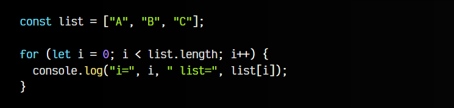
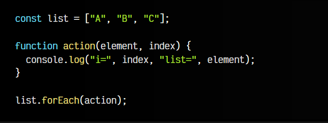
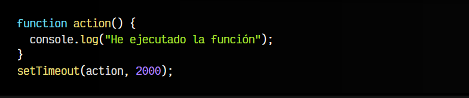
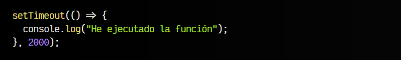
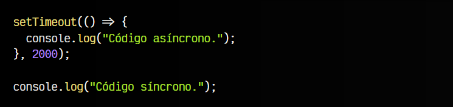
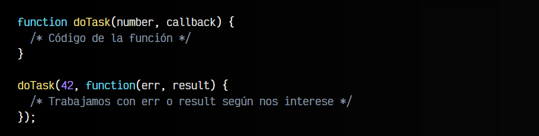
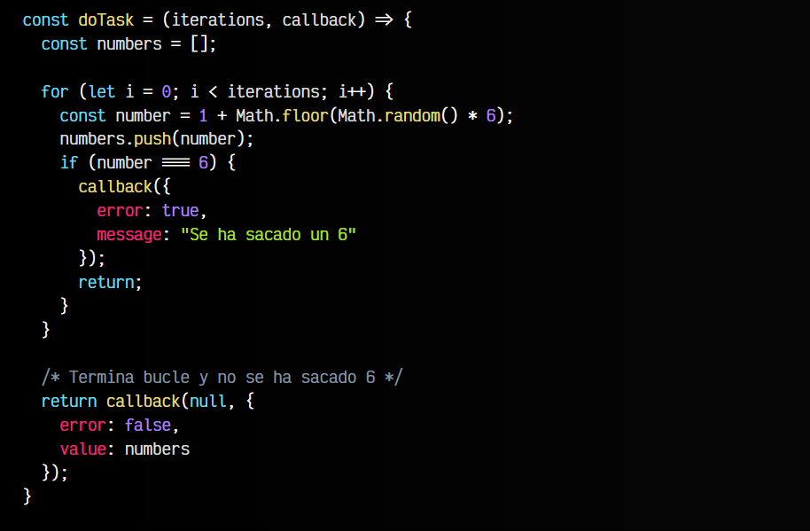
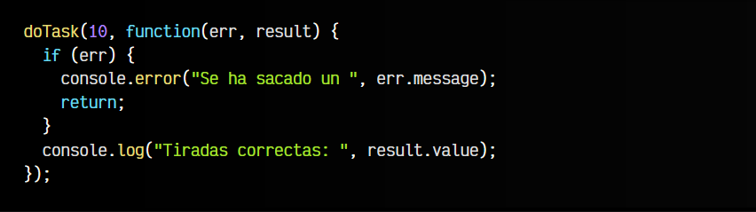
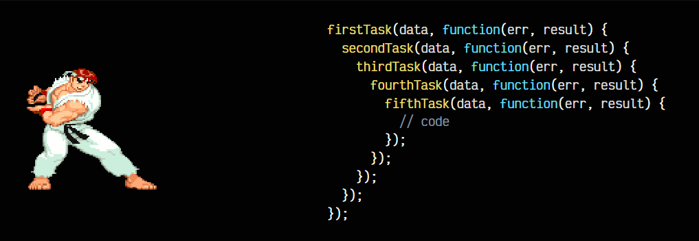

# 
Funciones callbacks

 callbacks (a veces denominados funciones de retrollamada o funciones callback) no son más que un tipo de funciones que se pasan por parámetro a otras funciones. El objetivo de esto es tener una forma más reutilizable de escribir funciones, que además entra bastante en consonancia con el concepto de asincronía de Javascript que veremos más adelante en este artículo.

 Ten en cuenta que actualmente, controlar la asincronía únicamente mediante callbacks puede ser una práctica poco recomendable. Es preferible utilizar promesas, que generalmente es más adecuado.

## ¿Qué es un callback?.
Como hemos dicho, las funciones callback no son más que un tipo de funciones que se pasan por parámetro a otras funciones. Además, los parámetros de dichas funciones toman un valor especial en el contexto del interior de la función.

Pero veamos un ejemplo. Imaginemos el siguiente bucle tradicional para recorrer un ARRAY:

En la variable i tenemos la posición del array que estamos recorriendo. Este valor irá desde 0 hasta 2, mientras que con list[i] accedemos a la posición del array para obtener el elemento, es decir, desde A hasta C.

Ahora veamos, como podemos hacer este mismo bucle utilizando el método forEach() del ARRAY al cuál le pasamos una función callback:

Esto se suele reescribir habitualmente de la siguiente forma:

Lo importante de este ejemplo es que se vea que la función callback que le hemos pasado por parámetro a forEach() se va a ejecutar por cada uno de los elementos del array, y en cada iteración de dicha función callback, los parámetros element e index van a tener un valor especial:

   - element es el elemento del array
   - index es el índice (posición) del array

## Callbacks en Javascript.
Una vez entendido esto, vamos a profundizar un poco con las funciones callbacks utilizadas para realizar tareas asíncronas. Probablemente, el caso más fácil de entender es utilizar un temporizador mediante la función setTimeout(FUNTION callback, NUMBER time).

Dicha función nos exige dos parámetros:

   - La función callback a ejecutar
   - El tiempo time que esperará antes de ejecutarse

Observa el siguiente ejemplo. Simplemente, le decimos a setTimeout() que ejecute la función callback que le hemos pasado por primer parámetro cuando transcurran 2000 milisegundos (es decir, 2 segundos):

Utilizando [arrow functions](https://lenguajejs.com/javascript/funciones/arrow-functions/) se puede simplificar el callback y hacerlo más fácil de escribir:

En cualquiera de los casos, lo importante es darse cuenta que estamos usando una función callback para pasársela a setTimeout(), que es otra función. En este caso, se trata de «programar» un suceso que ocurrirá en un momento concreto del futuro, pero muchas veces desconociendo cuando se producirá exactamente (o incluso si se llegará a producir).

Si probamos el código que verás a continuación, comprobarás que el segundo console.log() se ejecutará antes que el primero, dentro del setTimeout(), mostrando primero Código síncrono y luego Código asíncrono en la consola del navegador:

El último console.log del código se ejecuta primero (forma parte del flujo principal de ejecución del programa). El setTimeout() que figura en una línea anterior, aunque se ejecuta antes, pone en espera a la función callback, que se ejecutará cuando se cumpla una cierta condición (transcurran 2 segundos desde ese momento).

Esto puede llegar a sorprender a desarrolladores que llegan de otros lenguajes considerados bloqueantes; Javascript sin embargo se considera un lenguaje asíncrono y no bloqueante. ¿Qué significa esto? Al ejecutar la línea del setTimeout(), el programa no se queda bloqueado esperando a que terminen los 2 segundos y se ejecute la función callback, sino que continúa con el flujo general del programa para volver más adelante cuando sea necesario a ejecutar el callback, aprovechando así mejor el tiempo y realizando tareas de forma asíncrona.

## Asincronía con callbacks.
Las funciones callback pueden utilizarse como un primer intento de manejar la asincronía en un programa. De hecho, eran muy utilizadas en la época dorada de jQuery, donde muchas funciones o librerías tenían una estructura similar a esta (en jQuery se usaba algo similar):

Observa que doTask() es la función que realiza la tarea en cuestión. Puede tener los parámetros que se consideren adecuados, como cualquier otra función, la diferencia es que establecemos un callback que usaremos para controlar lo que se debe hacer.

Más adelante, llamamos a la función doTask() y en su parámetro callback pasamos una función con dos parámetros; err y result. El primero de ellos, err, utilizado para controlar un error y el segundo de ellos, result, utilizado para manejar los valores devueltos.

## Ejemplo del dado.
Vamos a utilizar el ejemplo del lanzamiento de 10 dados que explicamos en el primer capítulo de Asincronía, para adaptarlo a funciones callbacks. En primer lugar, veamos la implementación de la función doTask:

Como se puede ver, estamos utilizando [arrow functions](https://lenguajejs.com/javascript/funciones/arrow-functions/) para definir la función doTask(). Le pasamos un parámetro iterations que simplemente indica el número de iteraciones que tendrá el bucle (número de lanzamientos del dado). Por otro lado, el segundo parámetro es nuestro callback, que recordemos que es una función, por lo que podremos ejecutarla en momentos concretos de nuestro código. Lo hacemos en dos ocasiones:

   - En el if cuando number es 6 (detectamos como error cuando obtenemos un 6). Le pasamos un objeto por parámetro que contiene un error y message, el mensaje de error.

   - Tras el for, con dos parámetros. El primer parámetro: NULL, ya que en este caso no hay error. El segundo parámetro: un objeto que contiene un campo value con el array de resultados.

Teniendo claro esto, veamos la llamada a la función doTask(), donde le pasamos esa función callback e implementamos el funcionamiento, que en nuestro caso serán dos simples console.error() y console.log():

Esto es una forma clásica donde utilizamos una función callback para gestionar la asincronia y facilitar la reutilización, pudiendo reutilizar la función con la lógica, aplicando diferentes funciones callback según nos interese.

Observa que aunque en este ejemplo se ha utilizado un parámetro err y otro result en el callback para gestionar un objeto de error y un objeto de resultados, esto puede modificarse a gusto del desarrollador, aunque lo habitual suele ser este esquema.

## Desventajas de los callbacks.
A pesar de ser una forma flexible y potente de controlar la asincronía, que permite realizar múltiples posibilidades, las funciones callbacks tienen ciertas desventajas evidentes. En primer lugar, el código creado con las funciones es algo caótico y (quizás subjetivamente) algo feo. Por ejemplo, el tener que pasar un por parámetros en algunas funciones, no es demasiado elegante.

Pero sobre todo, uno de los problemas evidentes viene a la hora de tener que gestionar la asincronía varias veces en una misma función, donde al introducir varias funciones con callbacks en su interior, conseguimos una estructura anidada similar a la siguiente:

La forma triangular que produce es conocida como Callback Hell o Pyramid of Doom, debido a su forma, resultando un código muy poco elegante que se puede complicar demasiado de cara a la legibilidad. Es cuando entran en juego las promesas, que veremos en el siguiente capítulo.