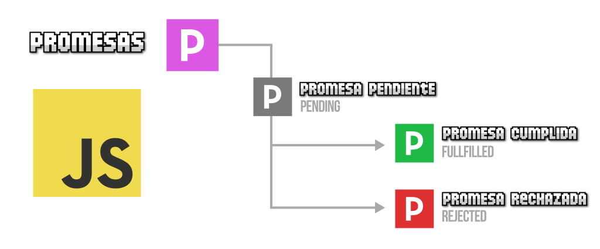
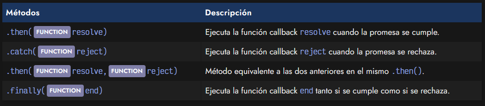
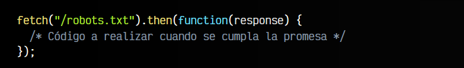
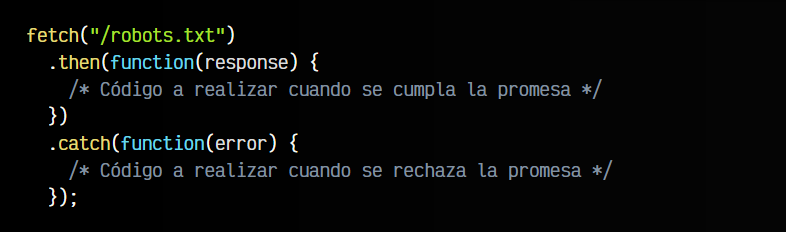
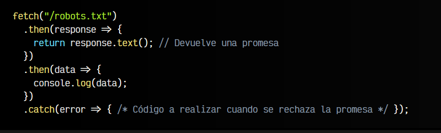
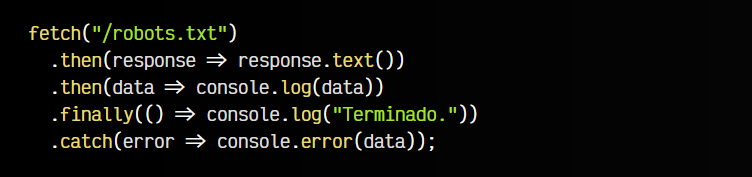
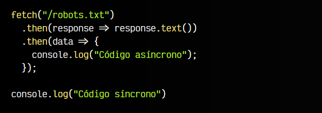
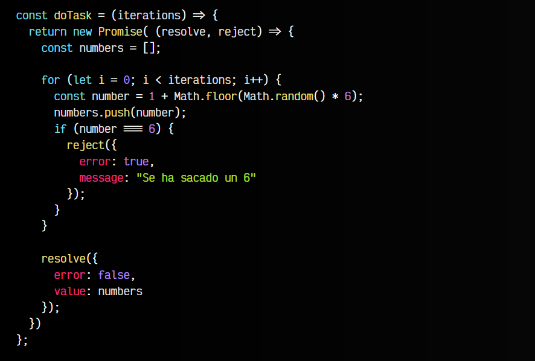
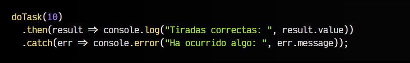

# 
¿Qué son las promesas?

Las promesas son un concepto para resolver el problema de asincronía de una forma mucho más elegante y práctica que, por ejemplo, utilizando [funciones callbacks](https://lenguajejs.com/javascript/asincronia/callbacks/) directamente.

## ¿Qué es una promesa?.
Como su propio nombre indica, una promesa es algo que, en principio pensamos que se cumplirá, pero en el futuro pueden ocurrir varias cosas:

   - La promesa se cumple (promesa resuelta)
   - La promesa no se cumple (promesa rechazada)
   - La promesa se queda en un estado incierto indefinidamente (promesa pendiente)

Con estas sencillas bases, podemos entender el funcionamiento de una promesa en Javascript. Antes de empezar, también debemos tener claro que existen dos partes importantes de las promesas: como consumirlas (utilizar promesas) y como crearlas (preparar una función para que use promesas y se puedan consumir).

## Promesas en Javascript.
Las promesas en Javascript se representan a través de un , y cada promesa estará en un estado concreto: pendiente, aceptada o rechazada. Además, cada promesa tiene los siguientes métodos:

Más adelante veremos, que a diferencia del apartado anterior donde se utilizaban solamente funciones callback, en este enfoque se tiende a no anidar promesas, evitando así el famoso Callback Hell, y haciendo el código mucho más legible.

## Consumir una promesa.
La forma general de consumir una promesa es utilizando el .then() con un sólo parámetro, puesto que muchas veces lo único que nos interesa es realizar una acción cuando la promesa se cumpla:

Lo que vemos en el ejemplo anterior es el uso de la función[ fetch()](https://lenguajejs.com/javascript/peticiones-http/fetch/), la cuál devuelve una promesa que se cumple cuando obtiene respuesta de la petición realizada. De esta forma, estaríamos preparando (de una forma legible) la forma de actuar de nuestro código a la respuesta de la petición realizada, todo ello de forma asíncrona.

Recuerda que podemos hacer uso del método .catch() para actuar cuando se rechaza una promesa:

Observa como hemos indentado los métodos .then() y .catch(), ya que se suele hacer así para que sea mucho más legible para él. Además, se pueden encadenar varios .then() si se siguen generando promesas y se devuelven con un return:

No olvides indicar el return para poder encadenar las siguientes promesas con .then(). Tras un .catch() también es posible encadenar .then() para continuar procesando promesas.

De hecho, usando arrow functions se puede mejorar aún más la legibilidad de este código, recordando que cuando sólo tenemos una sentencia en el cuerpo de la arrow function hay un return implícito:

Observese además que hemos añadido el método .finally() para añadir una función callback que se ejecutará tanto si la promesa se cumple o se rechaza, lo que nos ahorrará tener que repetir la función en el .then() como en el .catch().

## Código no bloqueante.
Algo muy importante, pero que quizás hemos pasado por alto es que el código que ejecutamos en el interior de un .then() es código asíncrono no bloqueante:

   - Asíncrono: Porque probablemente no se ejecuterá de inmediato, sino que tardará en ejecutarse.
   - No bloqueante: Porque mientras espera ser ejecutado, no bloquea el resto del programa.

¿Qué significa esto? Significa que cuando llegamos a un .then(), el sistema no se bloquea, sino que deja la función «pendiente» hasta que se cumpla la promesa, pero mientras, continua procesando el resto del programa.

Observa el siguiente ejemplo:

Aunque el console.log("Código asíncrono") figure unas líneas antes del console.log("Código síncrono"), se mostrará más tarde. Esto ocurre porque el console.log() del interior del .then() no ocurre inmediatamente, y al no ser bloqueante, se continua con el resto del programa hasta que se ejecute, que lo retomará.

Más adelante veremos que manejar promesas con async/await si que es bloqueante y funciona de forma diferente al .then(), que es no bloqueante.

## Crear promesas.
En los apartados anteriores hemos aprendido que son las promesas y hemos visto como consumirlas utilizando .then(). Ahora nos queda la cuestión opuesta, aprender a crear o implementar funciones que devuelvan promesas que puedan consumirse posteriormente.

Volvamos al ejercicio base que comentamos en el primer capítulo de este tema, ahora utilizando promesas. Observa que creamos un nuevo objeto PROMISE que «envuelve» toda la función doTask().

Al new Promise() se le pasa por parámetro una función con dos callbacks:

   - El primer callback, resolve, lo utilizaremos cuando se cumpla la promesa.
   - El segundo callback, reject, lo utilizaremos cuando se rechace la promesa.

Como ves, se trata de una implementación muy similar a los callbacks que vimos en el apartado anterior, pero observa que se devuelve una PROMISE que envuelve toda la función, permitiendo así consumirla cómodamente más tarde:

Imagina el caso de que cada lanzamiento del dado (la parte donde genera el número aleatorio) fuera un proceso más costoso que tardara un tiempo considerable, quizás de esa forma se vea más clara la necesidad de una tarea asíncrona, controlada con promesas.

En el siguiente capítulo veremos como trabajar con múltiples promesas y hacer acciones compuestas con varias de ellas.

Si el ejemplo anterior te resulta demasiado críptico por las funciones resolve y reject, es muy probable que echar un vistazo al tema previo de las [funciones callback](https://lenguajejs.com/javascript/asincronia/callbacks/) te aclare muchos detalles.

