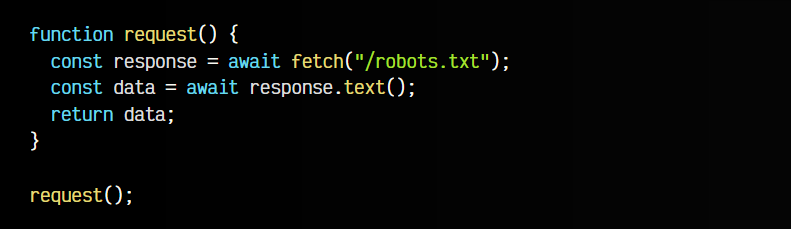
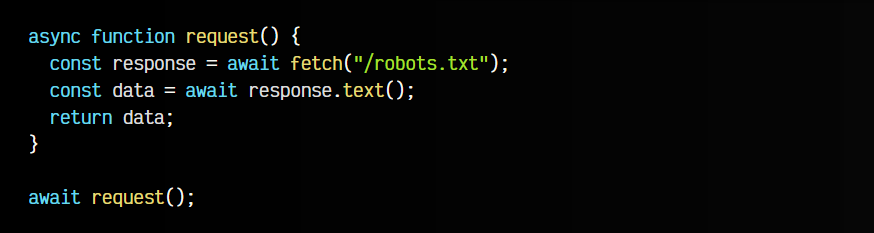
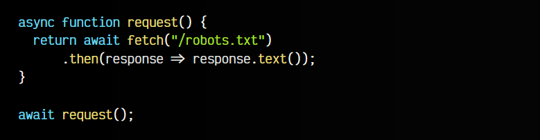
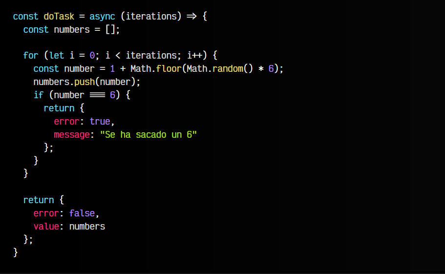

# 
Async/Await

En ES2017 se introducen las palabras clave async/await, que no son más que una forma de azúcar sintáctico para gestionar las promesas de una forma más similar a lo que solemos estar acostumbrados. Recordemos un fragmento de código donde manejamos promesas mediante .then():

Con async/await seguimos manejando promesas, sin embargo, hay ciertos cambios importantes:

   - No encadenamos mediante .then(), sino que usamos un sistema más tradicional.
   - Abandonamos el modelo no bloqueante y pasamos a uno bloqueante.

## La palabra clave await.
Vamos a modificar el fragmento de código anterior, para manejar la PROMISE que devuelve el fetch(), pero en lugar de gestionarla con .then(), lo haremos con await. Simplemente, cualquier PROMISE que tengamos, le añadimos la palabra clave await antes.

Lo que hace await es detener la ejecución y no continuar. Se espera a que se resuelva la promesa, y hasta que no lo haga, no continua. A diferencia del .then(), aquí tenemos un código bloqueante.

Ahora, vamos a introducir este fragmento de código dentro de una función llamada request(). Quedaría de la siguiente forma:

Sin embargo, aquí tenemos un problema. Estamos utilizando await (asíncrono) dentro de request() (síncrono), por lo que antes de ejecutarla, al intentarla definir, nos aparecerá el siguiente error:

Uncaught SyntaxError: await is only valid in async functions and the top level bodies of modules

## La palabra clave async.
Para resolver el problema anterior y poder utilizar el await dentro de nuestra función, sólo tenemos que definir nuestra función como función asíncrona y al llamarla utilizar nuevamente el await:

Sin embargo, vamos a pararnos un poco a pensar esto desde las bases. Definamos dos funciones básicas exactamente iguales, ambas devuelven lo mismo, pero una es síncrona y otra asíncrona:

En el caso de la función sincrona() devuelve directamente el valor, sin embargo, en el caso de la función asincrona() devuelve una promesa que se ha cumplido inmediatamente, con el valor 42.

Si queremos reescribirlas como arrow function, se definiría como vemos a continuación, colocando el async justo antes de los parámetros de la arrow function:

Recuerda que en el caso de querer controlar errores o promesas rechazadas con async/await, siempre podrás usar bloques try/catch.

## Async/await + .then().
En algunos casos, como al usar un fetch(), donde tenemos que manejar dos promesas, es posible que nos interese utilizar .then() para la primera promesa y await para la segunda. De esta forma podemos manejarlo todo directamente, sin tener que guardarlo en constantes o variables temporales que no utilizaremos sino una sola vez:

En este caso, observa que el fetch() devuelve una primera PROMISE que es manejada por el .then(). La segunda PROMISE, devuelta por el método response.text() se devuelve hacia fuera y es manejada por el await, que espera a que se cumpla, y una vez cumplida, se devuelve como valor de la función request().

## Top-level await.
En principio, el comportamiento de await solo permite que se utilice en el interior de funciones declaradas como async. Por lo que, si el ejemplo anterior lo ejecutamos en una consola de Javascript, funcionará correctamente (estamos escribiendo comandos de forma asíncrona), pero si lo escribimos en un fichero, probablemente nos aparecerá el siguiente error:

Uncaught SyntaxError: await is only valid in async function

Esto ocurre porque, como bien dice el mensaje de error, estamos ejecutando await en el contexto global de la aplicación, y debemos ejecutarlo en un contexto de función asíncrona. Muchas veces, para solucionar esto, lo que se suele hacer es lo siguiente:

Hemos incluido la función asíncrona con el await dentro de un paréntesis que la envuelve y ejecuta (función)(), por lo que tenemos una función asíncrona autoejecutable en un contexto síncrono.

Sin embargo, actualmente esto no suele ser necesario, ya que se nos permite utilizar await fuera de funciones async si se encuentran en el nivel inicial de la aplicación, es decir en el ámbito global, gracias a una feature denominada top level await.

## Asincronía con async/await.
Volvamos al ejemplo que hemos visto en los anteriores capítulos. Recordemos que la función doTask() realiza 10 lanzamientos de un dado y nos devuelve los resultados obtenidos o detiene la tarea si se obtiene un 6. La implementación de la función sufre algunos cambios, simplificándose considerablemente.

   - En primer lugar, añadimos la palabra clave async antes de los parámetros de la arrow function.
   - En segundo lugar, desaparece cualquier mención a promesas, se devuelven directamente los objetos, ya que al ser una función async se devolverá todo envuelto en una PROMISE:

Pero donde se introducen cambios considerables es a la hora de consumir las promesas con async/await. No tendríamos que utilizar .then(), sino que podemos simplemente utilizar await para esperar la resolución de la promesa, obteniendo el valor directamente:

Ciertos casos no permiten usar async/await. Por ejemplo, una función .map() de un ARRAY de PROMISE. En esos casos, se recomienda usar un for..of o una promesa en grupo.

