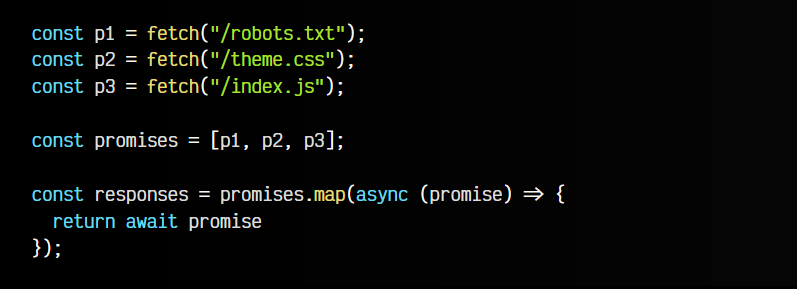
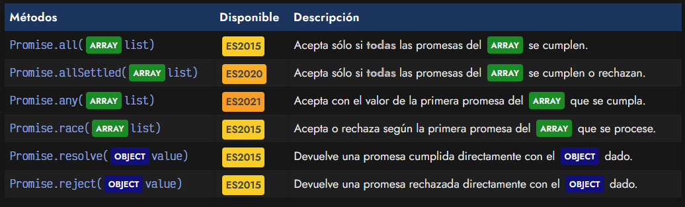
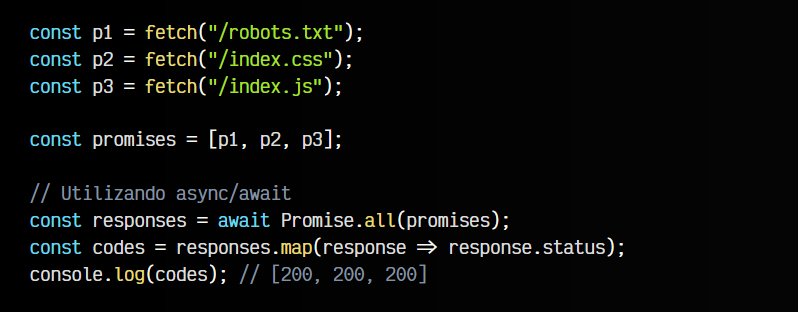
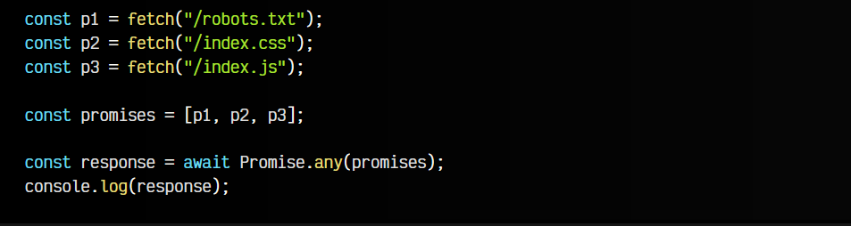
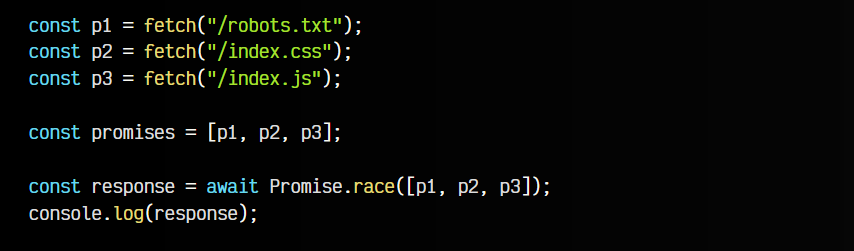
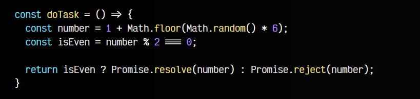

# 
Promesas en grupo (Promise API)

Ahora que sabemos [¿Qué son las promesas?](https://lenguajejs.com/javascript/asincronia/promise-api/), para qué y como se usan, podemos profundizar y aprender más sobre la API Promise nativa de Javascript, mediante la cuál podemos realizar operaciones con grupos de promesas, tanto independientes como dependientes entre sí.

Por norma general, las tareas asíncronas no sabemos cuanto tardarán en responder y/o procesarse, por lo que muchas veces el orden en que se resuelven no será el mismo. Esto en algunos casos no nos importará, pero en otros sí, por lo que hay que tenerlo en cuenta.

## Esperar varias promesas.
Imaginemos el siguiente supuesto, donde hacemos múltiples tareas asíncronas y queremos realizar una tarea cuando las tres estén resueltas, por lo que necesitamos esperar a tener las tres promesas cumplidas.

Quizás nuestra primera aproximación sería la siguiente: recorrer el array de promesas promises con un .map(), de modo que creamos un nuevo array derivado con las promesas ya resueltas, esperando por ellas con un await:

El planteamiento es correcto, sin embargo, el problema es que la función .map() u otras array functions no permiten el uso de operaciones asíncronas en su interior, ya que trabajan de forma síncrona.

Si lo hacemos, veremos como la constante responses en lugar de un array de respuestas como probablemente esperábamos, tendrá un array de promesas. Es decir, tendremos exactamente lo mismo que teníamos inicialmente en promises.

Para solucionar este problema, podemos utilizar el objeto Promise de Javascript, que incorpora varios métodos estáticos que podemos utilizar en nuestro código. Todos devuelven una promesa (son asíncronos) y son los que veremos a continuación:

En los siguientes ejemplos, vamos a utilizar la función fetch() para realizar varias peticiones y descargar varios archivos diferentes que necesitaremos para nuestras tareas.

## El método Promise.all().
El método Promise.all() funciona como un «todo o nada»: le pasas un grupo de varias promesas. El Promise.all() te devolverá una promesa que se cumplirá cuando todas las promesas del grupo se cumplan. Si alguna de ellas se rechaza, la promesa de Promise.all() también lo hará.

Observa este ejemplo:

   - 1️⃣ Realizamos 3 fetch(), donde cada uno devuelve una promesa.
   - 2️⃣ Almacenamos esas 3 promesas en un promises.
   - 3️⃣ Al hacer un Promise.all(promises) devolvemos una nueva promesa.
   - 4️⃣ Dicha promesa se cumplirá, si todas las que pasamos en el array se cumplen invidiualmente.
   - 5️⃣ En el caso de que alguna de las 3 se rechace, el Promise.all() la promesa se rechaza.

También se podría realizar utilizando .then() en lugar de async/await:

## El método Promise.allSettled().
El método Promise.allSettled() funciona como un «todas procesadas»: devuelve una promesa que se cumple cuando todas las promesas del ARRAY se hayan procesado, independientemente de que se hayan cumplido o rechazado.

Esta operación nos devuelve un ARRAY de objetos (uno por cada promesa) donde cada objeto tiene dos propiedades:

   - La propiedad status, donde nos indica si cada promesa individual ha sido cumplida o rechazada
   - La propiedad value, con los valores devueltos por la promesa si se cumple.
   - La propiedad reason, con la razón del rechazo de la promesa si no se cumple.

En este caso, obtendremos que la primera y última promesa se resuelven (fulfilled), mientras que la segunda nos da un error de CORS y se rechaza (rejected).

## El método Promise.any().
El método Promise.any() funciona como «la primera que se cumpla»: Devuelve una promesa con el valor de la primera promesa individual del ARRAY que se cumpla. Si todas las promesas se rechazan, entonces devuelve una promesa rechazada.

Como vemos, Promise.any() devolverá una respuesta de la primera promesa cumplida.

## El método Promise.race().
El método Promise.race() funciona como una «la primera que se procese»: la primera promesa del ARRAY que sea procesada, independientemente de que se haya cumplido o rechazado, determinará la devolución de la promesa del Promise.race(). Si se cumple, devuelve una promesa cumplida, en caso negativo, devuelve una rechazada.

De forma muy similar a la anterior, Promise.race() devolverá la promesa que se resuelva primero, ya sea cumpliéndose o rechazándose.

## Promesas estáticas.
Mediante los métodos estáticos Promise.resolve() y Promise.reject() podemos devolver una promesa cumplida o rechazada respectivamente sin necesidad de crear una promesa con new Promise(), algo que podría ser interesante o cómodo en algunos casos.

Observa que la siguiente función doTask() no es asíncrona:

En este caso, generamos un número aleatorio y se devuelve una promesa. Cuando el número generado es par se cumple la promesa, cuando es impar, se rechaza. Sin embargo, ten en cuenta que el problema en este caso es que la promesa no «envuelve» toda la función, por lo que si la tarea tardase algún tiempo en generar el número, no podríamos utilizar el .then() para consumir la promesa.

Estas funciones estáticas se suelen utilizar en muy pocos casos, para mantener cierta compatibilidad en funciones que se espera que devuelvan una promesa.