# 
URL en Javascript

Normalmente, cuando tenemos que trabajar con una dirección web (URL) en Javascript, lo más habitual es utilizar un tipo de dato STRING donde almacenamos dicha URL. En la mayoría de los casos, esto suele ser suficiente. Sin embargo, si necesitamos hacer ciertas operaciones con la URL donde tengamos que modificar o acceder a ciertas partes específicas de la URL, se podría complicar un poco.

## El objeto URL.
Si necesitamos acceder a partes específicas de una URL, o incluso modificarlas, tenemos un OBJECT de tipo URL especial para estos casos, que será mucho más cómodo que trabajar con el STRING (y contemplar todos los posibles casos que podrían ocurrir). Su funcionamiento es el siguiente:

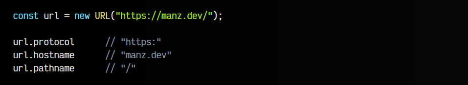

Como puedes ver, se puede ir accediendo a diferentes propiedades del objeto url que hemos generado a partir del STRING de la URL para obtener partes específicas de la dirección web.

## Partes de una URL.
Para explicar como trabajar con URL en Javascript, antes necesitamos analizar bien la estructura de una URL y examinar las diferentes partes que la componen, para tener bien claro antes de trabajar con nuestro código Javascript. Así pues, observa la siguiente imagen donde puedes ver las partes de una URL:

Partes de una URL

Vamos a generar dos objetos: url y local. Los crearemos a partir de dos STRING con dos URL específicas que pasaremos por parámetro, mediante un new URL():

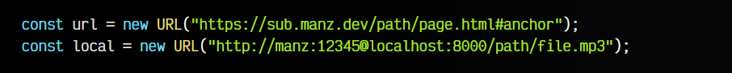

Un objeto URL contiene una serie de propiedades para identificar partes concretas de la URL generada:

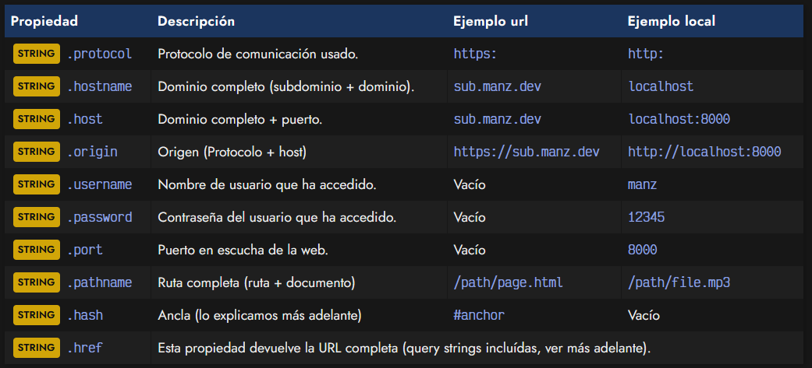

Ten en cuenta los siguientes detalles:

   - La diferencia entre .hostname y .host es que el segundo incluye el puerto (si está definido explícitamente).
   - El origen (origin) es la unión del protocolo + dominio completo + puerto (si se indica).

Teniendo claras las diferentes partes de una URL, vamos a ver ahora como podríamos trabajar con ellas y acceder a partes especificas desde nuestro código Javascript.

## Protocolo de la URL.
Normalmente, a una web se accede mediante el protocolo http://, sin embargo, hoy en día está más extendido el protocolo https://, que es el mismo pero con una capa de seguridad adicional donde los datos van cifrados (al contrario que en HTTP). Existen otros protocolos para otras comunicaciones, como el antiguo ftp:// para servidores de archivos, el protocolo whatsapp:// para comunicarnos desde una web con una aplicación de WhatsApp, etc...

## Usuario y Contraseña.
Generalmente, al acceder a una web no se suele proporcionar el usuario y contraseña, pero es posible hacerlo directamente desde la URL. De hacerlo, hay que indicar el usuario después de las // del protocolo. Si queremos añadir también un password, habría que añadirlo inmediatamente después del usuario, separándolo por : y, finalmente, después del password, añadir el símbolo @ para separarlo del dominio.

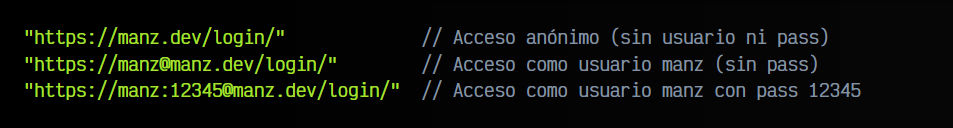

OJO: Hoy en día, los nombres de usuario y contraseñas se suelen gestionar más frecuentemente a nivel de aplicación. En este caso hemos explicado como utilizarlos a nivel de servidor.

## Dominio, subdominio y TLD.
Cuando hablamos de nombre de dominio, muchas veces solemos abarcar todo, es decir, en nuestro ejemplo, sub.manz.dev. Sin embargo, hay que tener en cuenta que tenemos tres partes:

   - Subdominio: sub, una división específica del dominio
   - Dominio: manz.dev, el dominio en cuestión
   - TLD (Top Level Domain): .dev, la terminación del dominio

## Puerto de la URL.
Cualquier página está alojada en un servidor web y dicho servidor web debe estar continuamente escuchando peticiones para que los usuarios puedan conectarse y acceder a la web. Por norma general, los servidores web escuchan en el puerto 80 (HTTP) o en el puerto 443 (HTTPS), aunque se puede configurar un puerto diferente.

El puerto es un número (del 1 al 65535) que se debe indicar precedido del símbolo :, justo al final del dominio. En el caso de que no se indique explícitamente un número de puerto, se utilizará el puerto por defecto y no mostrará en la URL, que es el caso más habitual.

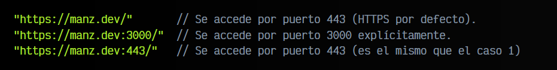

## Ruta de la URL.
La ruta de una URL es la estructura de carpetas a la que vamos a acceder para descargar la página. Por defecto, si no se le indica una página o documento explícitamente, se suele buscar la página index.html o index.htm, aunque depende de la configuración.

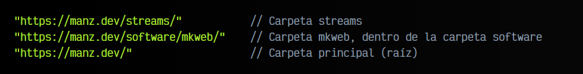

En frontend, en muchas ocasiones, no tenemos rutas reales que equivalen a carpetas, sino que trabajamos con pseudo-rutas, una especie de ruta artificial creada para simular las rutas reales.

## Trailing slash (barra final).
Observa que cuando indicamos una URL que termina en una ruta (sin indicar página o documento), muchas veces te encontrarás una / al final y otras veces no. Esta / se denomina trailing slash. Puede parecer la misma página, pero mucho cuidado, ya que en algunos casos pueden ser URL diferentes:

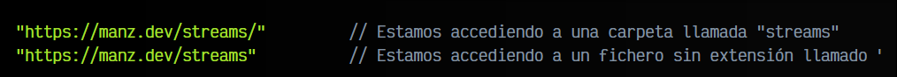

n el primer caso no hay duda, se accede a la carpeta streams/. Sin embargo, en el segundo caso, si streams es una carpeta, lo que ocurrirá es que redireccionará a streams/, lo que hará que busque streams/index.html. Pero si en lugar de una carpeta, streams es un archivo (sin extensión), estaríamos accediendo a ese documento.

## Partes opcionales de una URL.
Ya conocemos algunas de las partes que siempre suelen estar presentes en una URL. Sin embargo, hay otras partes opcionales que pueden existir en una URL, o puede que no se encuentren en ellas. Vamos a analizarlas:

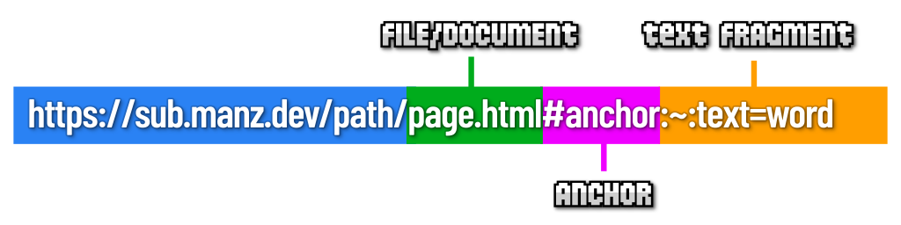

## Fichero o documento.
En el apartado de rutas anterior, explicamos que las rutas son la estructura de carpetas de la dirección web indicada. Sin embargo, esta estructura de carpetas puede terminar de forma opcional en un fichero o documento:

   - En el caso de terminar en fichero o documento, indicamos al navegador que muestre el contenido de dicho fichero (html, imágenes, video, texto...) o que lo descargue (aplicaciones ejecutables, ficheros comprimidos, etc...).

   - En el caso de no terminar en fichero o documento, el navegador buscará un archivo index.html o index.htm dentro de las carpetas de la ruta. En caso de no encontrarlo, mostrará un error 404.

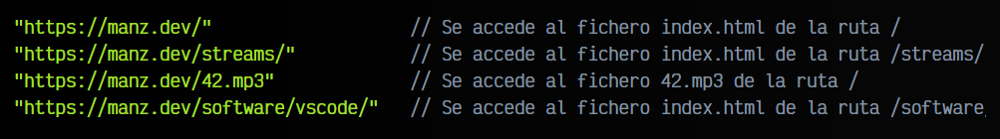

## Ancla (anchor).
Si lo que se ha cargado es un documento HTML, podemos terminar la URL con lo que se denomina un ancla HTML (anchor), que es un texto precedido del símbolo #. El navegador buscará en el documento HTML un elemento con el id mencionado, y posicionará el navegador justo en esa parte. Se suele utilizar para crear accesos directos a secciones de la página.

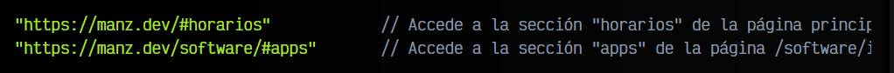

## Fragmento de texto.
Aunque es menos conocida, es posible indicar tras el ancla (o el símbolo del ancla si no existe ningún ancla) el fragmento de texto :~:text= seguido de un texto o frase a destacar de la página. El navegador lo que hará es cargar la primera parte de la página, y acto seguido, buscará el texto indicado a continuación del = del fragmento de texto y lo destacará como si estuviera seleccionado.

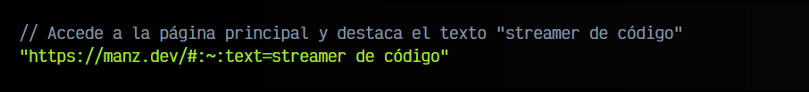

Estas serían todas las partes básicas que podría tener una URL, tanto de forma obligatoria como de forma opcional. Sin embargo, nos quedan los denominados query strings, que explicaremos en el siguiente apartado.

## Query Strings de una URL.
Al margen de todo lo que hemos explicado anteriormente, una URL puede contener variables. Son lo que se suele denominar las Query Strings (QS) y estas no son más que una lista de variables que se le pasa a una página desde la URL.

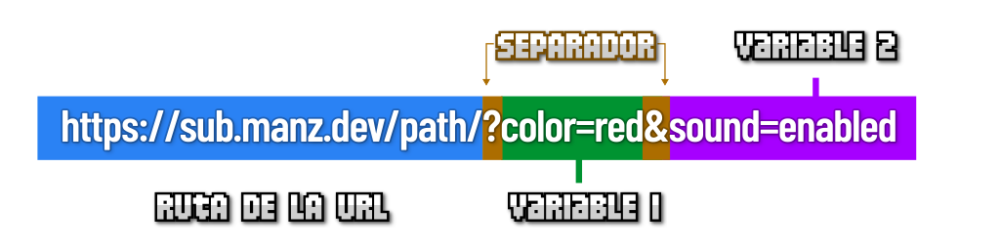

Observa que para pasar variables mediante una URL, hay que empezar indicando el símbolo ?. Este símbolo representa el inicio de las Query Strings. A continuación, escribiremos el nombre de la variable, el símbolo = y el valor de dicha variable. Una vez se ha definido el nombre y el valor, se separa con el símbolo & y podemos volver a indicar una nueva variable (y así sucesivamente).

Construir a mano estas variables en un STRING puede ser muy tedioso (hay que comprobar si es ? o &), por lo que podemos hacer uso de URLSearchParams para ello.

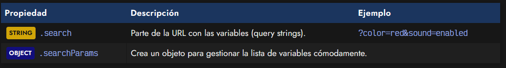

## El objeto URLSearchParams.
El objeto URLSearchParams nos permite tener a nuestra disposición una forma cómoda de gestionar las variables de la URL, y no sólo acceder a ellas, sino modificarlas de varias formas. Observa el siguiente ejemplo, donde accedemos a url.searchParams que sería equivalente a crear un nuevo objeto con new URLSearchParams():

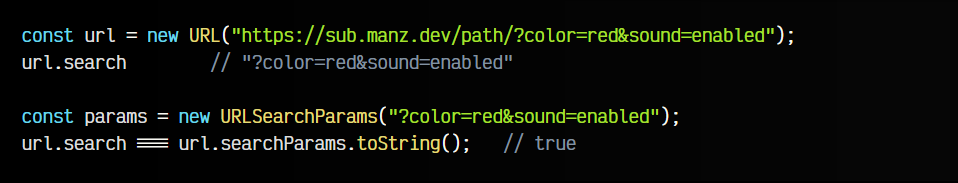

El objeto params o la propiedad url.searchParams (el mismo objeto), nos ofrece una serie de métodos para gestionar y manejar las variables de la URL, añadirlas, eliminarlas, etc...

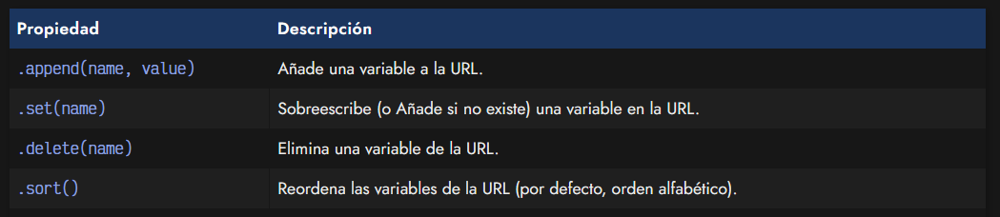
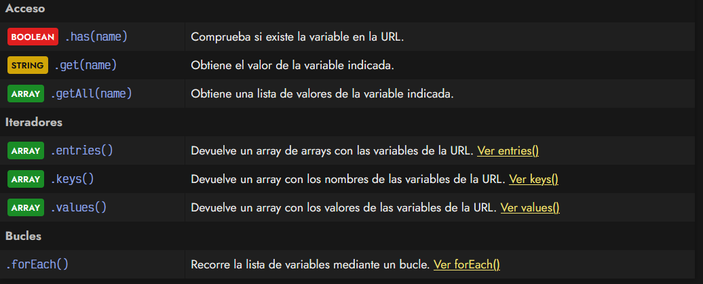

Para entender bien esta serie de métodos, veamos unos ejemplos en los que partimos con dos variables: color y sound:

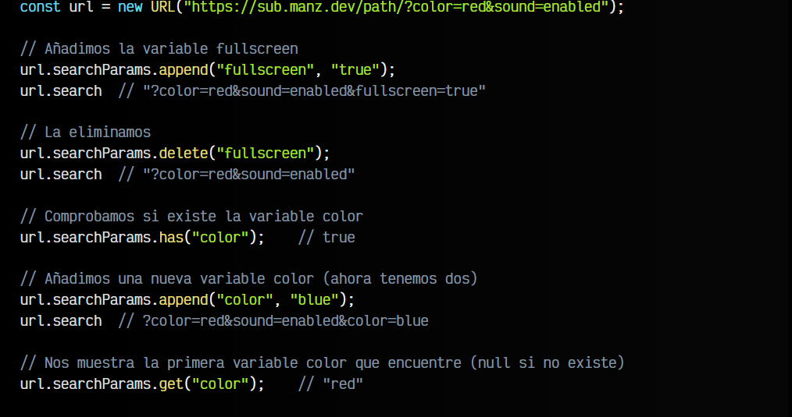
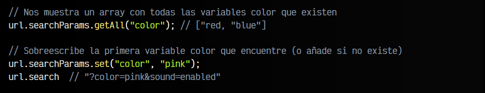

Por último, tenemos los métodos entries(), keys() y values(), que devuelven iteradores que pueden recorrer las variables de la URL, y puedes profundizar en su funcionamiento en este artículo: [Iteradores keys](https://lenguajejs.com/javascript/objetos/iteradores/),[ values y entries:](https://lenguajejs.com/javascript/objetos/iteradores/)

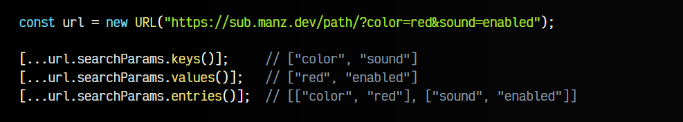

Por último, para terminar, un método .forEach() que nos permite recorrer la lista de variables de la URL:

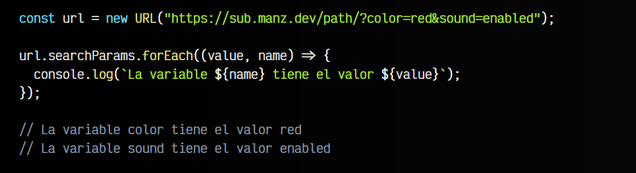