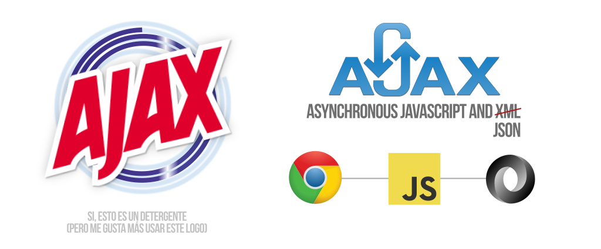
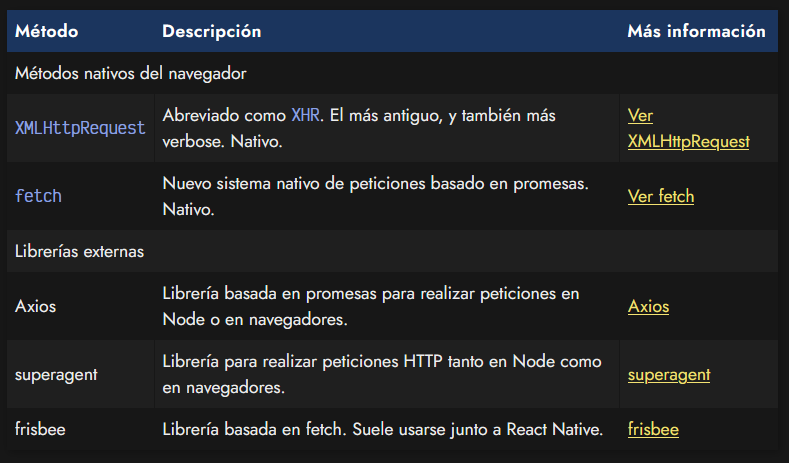
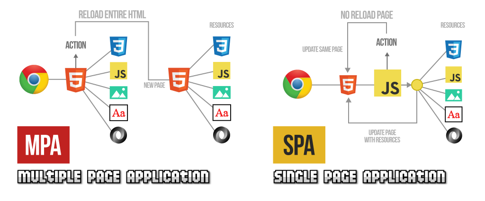

# 
AJAX: Peticiones HTTP

Un navegador, durante la carga de una página, suele realizar múltiples peticiones HTTP a un servidor para solicitar los archivos que necesita renderizar en la página. Por ejemplo, si abrimos una página, las peticiones que realizaría el navegador podrían ser las siguientes:

   - El documento .html de la página (aquí encontraremos referencias a otros archivos)
   - La hoja de estilos .css (probablemente existan aquí más referencias a otros archivos)
   - Imágenes .jpg, .png, .webp u otras
    Scripts .js (aquí nuevamente, más referencias a otros archivos)
   - Tipografías .ttf, .woff o .woff2

Por lo tanto, cuando cargamos una página (primera petición), en realidad estamos realizando múltiples peticiones posteriormente.

## ¿Qué es una petición HTTP?.
Una petición HTTP es como suele denominarse a la acción por parte del navegador de solicitar a un servidor web un documento o archivo, ya sea un fichero .html, una imagen, una tipografía, un archivo .js, etc.

Gracias a dicha petición, el navegador puede descargar ese archivo, almacenarlo en un caché temporal de archivos del navegador y, finalmente, mostrarlo en la página actual que lo ha solicitado.

Sin embargo, hay que tener en cuenta que las peticiones no tienen porque ser las que se hacen inicialmente al cargar la página, sino que pueden producirse peticiones de forma transparente al usuario, sin que visualmente se reflejen en la página actual en la que estamos.

## Peticiones HTTP mediante AJAX.
Quizás hayas escuchado hablar de un concepto denominado AJAX (Asynchronous Javascript and XML). Esta modalidad de peticiones se basa en que la petición HTTP se realiza desde Javascript, de forma transparente al usuario, descargando la información y pudiendo tratarla sin necesidad de mostrarla directamente en la página.

Esto produce un interesante cambio en el panorama que había entonces, puesto que podemos hacer actualizaciones de contenidos de forma parcial, de modo que se actualice una página «en vivo», sin necesidad de recargar toda la página, sino solamente actualizado una pequeña parte de ella, pudiendo utilizar Javascript para crear todo tipo de lógica de apoyo.

Originalmente, a este sistema de realización de peticiones HTTP se le llamó AJAX, donde la X significa XML, el formato ligero de datos que más se utilizaba en aquel entonces. Actualmente, sobre todo en el mundo Javascript, se utiliza más el formato JSON, aunque por razones fonéticas evidentes se sigue manteniendo el término AJAX en lugar del horrible correspondiente AJAJ.

Posteriormente, y debido a una evolución a mayor escala relacionada con este tema, se ha pasado de crear páginas de tipo MPA, a crear páginas de tipo SPA, mucho más frecuentes en entornos empresariales hoy en día. Hablaremos de ellas más adelante.

## Métodos de petición AJAX.
Existen varias formas de realizar peticiones HTTP mediante AJAX, pero las principales suelen ser XMLHttpRequest y fetch (nativas, incluidas en el navegador por defecto), además de liberías externas como por ejemplo axios o superagent:

En los siguientes capítulos iremos viendo como funcionan.

## MPA: Multiple Page Application.
Tradicionalmente, el sistema que se seguía para crear páginas o aplicaciones web se enmarcaba dentro de la categoría de páginas MPA (Multiple Page Application). Bajo este sistema, el navegador se descarga el fichero .html, lo lee y luego realiza las peticiones de los restantes archivos relacionados que encuentra en el documento HTML. Si el usuario pulsa en algún enlace, se descarga el .html de dicho enlace (recargando la página completa) y se repite el proceso.

Este sistema es el que se observa en páginas en las que vamos navegando mediante enlaces, y al hacer click en ellos, se recarga la página completa. Generalmente, es el que se utiliza frecuentemente en sitios web más tradicionales, los que usan mayoritariamente backend o necesitan SEO (posicionamiento en buscadores).

## SPA: Single Page Application.
En el lado opuesto se encuentran las páginas de tipo SPA (Single Page Application). Se trata de un enfoque posterior, donde el navegador se descarga una versión básica .html junto a un .js que se encargará de controlar toda la web. Realizará peticiones de los archivos relacionados junto a peticiones a archivos .json o .js con más información o nuevos contenidos, que mostrará en el navegador parcial o completamente, pero sin la necesidad obligatoria de recargar la página completamente, conservando el contenido descargado previamente.

Este sistema se utiliza mayoritariamente para construir aplicaciones web como dashboards o sitios de gestión en los que no necesitamos «navegar» a través de una serie de páginas. Ejemplos de este tipo de páginas podrían ser la versión web de WhatsApp, Twitter o Google Drive podrían ser ejemplos de SPA, que van más enfocados en la funcionalidad y acciones, que en el contenido.

Las páginas de tipo SPA son las que utilizan en la mayoría de los frameworks de Javascript, como por ejemplo, React, Vue, Angular o Svelte.

