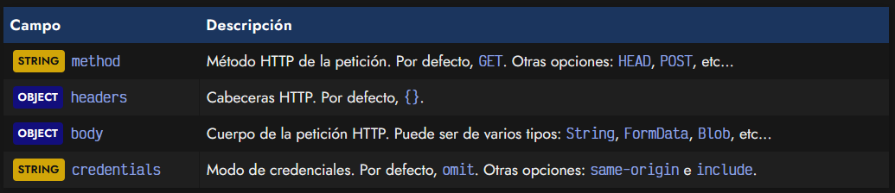
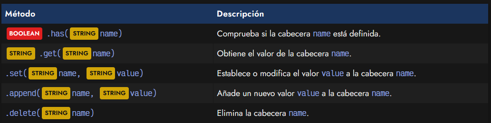
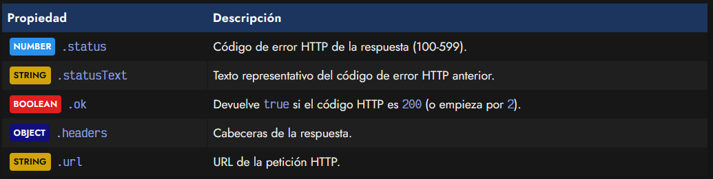
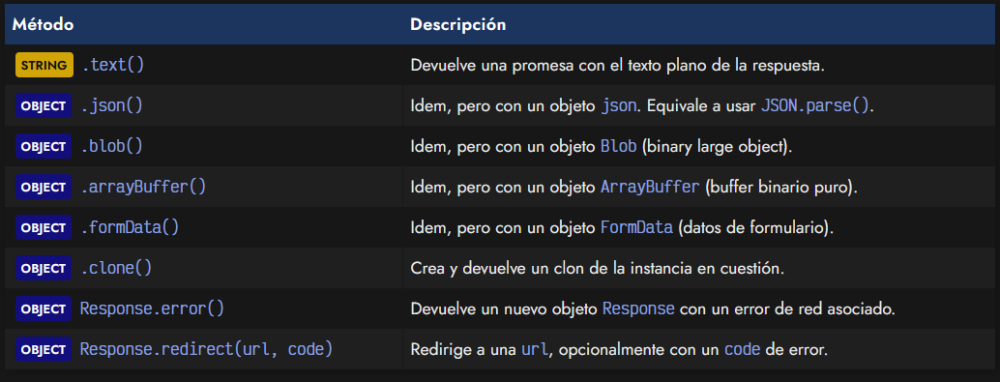
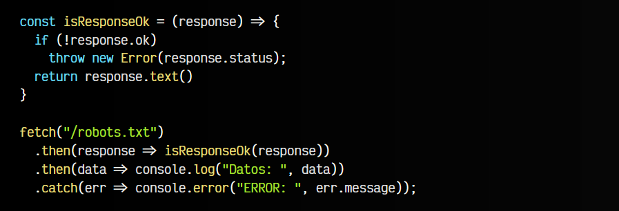
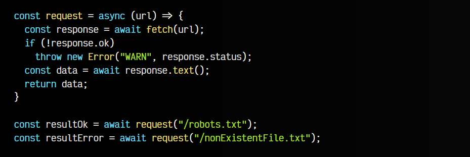

# 
Fetch: Peticiones Asíncronas

Una vez que aprendemos a realizar [peticiones HTTP mediante XHR](https://lenguajejs.com/javascript/peticiones-http/xhr/) nos damos cuenta que es un mecanismo muy interesante y útil, y que nos abre un mundo de posibilidades trabajando con Javascript. Sin embargo, con el tiempo nos vamos dando cuenta también, que la forma de trabajar con objetos XMLHttpRequest, aunque es muy potente requiere mucho trabajo que hace que el código no sea tan legible y práctico como quizás debería.

Entonces es cuando surge fetch, un sistema más moderno, basado en promesas de Javascript, para realizar peticiones HTTP asíncronas de una forma más legible y cómoda.

## Peticiones con el método fetch().
Fetch es el nombre de una nueva API para Javascript con la cuál podemos realizar peticiones HTTP asíncronas utilizando promesas y de forma que el código sea un poco más sencillo y menos verbose. La forma de realizar una petición es muy sencilla, básicamente se trata de llamar a fetch y pasarle por parámetro la URL de la petición a realizar:

El fetch() devolverá una PROMISE que será aceptada cuando reciba una respuesta y sólo será rechazada si hay un fallo de red o si por alguna razón no se pudo completar la petición.

El modo más habitual de manejar las promesas es utilizando [.then()](https://lenguajejs.com/javascript/asincronia/promesas/), aunque también se puede utilizar [async/await](https://lenguajejs.com/javascript/asincronia/async-await/). Esto se suele reescribir de la siguiente forma, que queda mucho más simple y evitamos constantes o variables temporales de un solo uso:

Al método .then() se le pasa una función callback donde su parámetro response es el objeto de respuesta de la petición que hemos realizado. En su interior realizaremos la lógica que queramos hacer con la respuesta a nuestra petición.

## Opciones de fetch().
A la función fetch(), al margen de la url a la que hacemos petición, se le puede pasar un segundo parámetro de opciones de forma opcional, un OBJECT con opciones de la petición HTTP:

Un poco más adelante, veremos como trabajar con la respuesta response, pero vamos a centrarnos ahora en el parámetro opcional options de la petición HTTP. En este objeto podemos definir varios detalles:

Lo primero, y más habitual, suele ser indicar el método HTTP a realizar en la petición. Por defecto, se realizará un GET, pero podemos cambiarlos a HEAD, POST, PUT o cualquier otro tipo de método. En segundo lugar, podemos indicar objetos para enviar en el body de la petición, así como modificar las cabeceras en el campo headers:

En este ejemplo, estamos enviando una petición POST, indicando en la cabecera que se envía contenido JSON y en el cuerpo de los datos, enviando el objeto jsonData, codificado como texto mediante stringify().

Por último, el campo credentials permite modificar el modo en el que se realiza la petición. Por defecto, el valor omit hace que no se incluyan credenciales en la petición, pero es posible indicar los valores same-origin, que incluye las credenciales si estamos sobre el mismo dominio, o include que incluye las credenciales incluso en peticiones a otros dominios.

Recuerda que estamos realizando peticiones relativas al mismo dominio. En el caso de realizar peticiones a dominios diferentes obtendríamos un problema de CORS (Cross-Origin Resource Sharing) similar al siguiente:

Access to fetch at 'https://otherdomain.com/file.json' from origin 'https://domain.com/' has been blocked by CORS policy: No 'Access-Control-Allow-Origin' header is present on the requested resource. If an opaque response serves your needs, set the request's mode to 'no-cors' to fetch the resource with CORS disabled.

Más adelante hablaremos de [CORS](https://lenguajejs.com/javascript/peticiones-http/cors/) y de como solucionar estos problemas si necesitamos realizar peticiones a otros dominios.

## Las cabeceras Headers.
que en el ejemplo anterior hemos creado las cabeceras como un genérico de Javascript, es posible crear un objeto Headers con el que trabajar:

Para ello, aparte del método .set() podemos utilizar varios otros para trabajar con cabeceras, comprobar su existencia, obtener o cambiar los valores o incluso eliminarlos:

Como muchos otros [objetos iterables](https://lenguajejs.com/javascript/objetos/iteradores/), podemos utilizar los métodos .entries(), .keys() y/o .values() para recorrerlos:

Para peticiones con pocas cabeceras no hay mayor problema, pero en peticiones más complejas utilizar Headers es una buena práctica.

## La respuesta Response.
Si volvemos a nuestro ejemplo de la petición con fetch, observaremos que en el primer .then() tenemos un objeto response. Se trata de la respuesta que nos llega del servidor web al momento de recibir nuestra petición:

Aunque en este ejemplo, simplemente estamos utilizando una arrow function que hace un return implícito de la promesa que devuelve el método .text(), dicho objeto response tiene una serie de propiedades y métodos que pueden resultarnos útiles al implementar nuestro código.

Por el lado de las propiedades, tenemos las siguientes:

Si venimos de XMLHttpRequest, esto no nos resultará nada extraño. Las propiedades .status y statusText nos devuelven el código de error HTTP de la respuesta en formato numérico y cadena de texto respectivamente.

Sin embargo, existe una novedad respecto a XHR, y es que tenemos una propiedad .ok que nos devuelve true si el código de error de la respuesta es un valor del rango 2xx, es decir, que todo ha ido correctamente. Así pues, tenemos una forma práctica y sencilla de comprobar si todo ha ido bien al realizar la petición:

Por último, tenemos la propiedad .headers que nos devuelve las cabeceras de la respuesta y la propiedad .url que nos devuelve la URL completa de la petición que hemos realizado.

## Procesando la respuesta.
Por otra parte, la instancia response también tiene algunos métodos interesantes, la mayoría de ellos para procesar mediante una promesa los datos recibidos y facilitar el trabajo con ellos:

Observa que en los ejemplos anteriores hemos utilizado response.text(). Este método indica que queremos procesar la respuesta como datos textuales, por lo que dicho método devolverá una con los datos en texto plano, facilitando trabajar con ellos de forma manual:

Observa que en este fragmento de código, tras procesar la respuesta con response.text(), devolvemos una PROMISE con el contenido en texto plano. Esta PROMISE se procesa en el segundo .then(), donde gestionamos dicho contenido almacenado en data.

Ten en cuenta que tenemos varios métodos similares para procesar las respuestas. Por ejemplo, el caso anterior utilizando el método response.json() en lugar de response.text() sería equivalente al siguiente fragmento:

Como se puede ver, con response.json() nos ahorraríamos tener que hacer el JSON.parse() de forma manual, por lo que el código es algo más directo.

## Promesas usando .then().
Lo que vemos a continuación sería un ejemplo un poco más completo de todo lo que hemos visto hasta ahora:

   - Comprobamos que la petición es correcta con response.ok
   - Utilizamos response.text() para procesarla
   - En el caso de producirse algún error, lanzamos excepción con el código de error
   - Procesamos los datos y los mostramos en la consola
   - En el caso de que la PROMISE sea rechazada, capturamos el error con el catch
   - Si ocurre un error 404, 500 o similar, lanzamos error con throw para capturarlo en el catch

Podemos refactorizar un poco este ejemplo para hacerlo más legible. Creamos la función isResponseOk() para procesar la respuesta (invirtiendo el condicional para hacerlo más directo). Luego, los .then() y .catch() los utilizamos con una arrow function para simplificarlos:

Sin embargo, aunque es bastante común trabajar con promesas utilizando .then(), también podemos hacer uso de async/await para manejar promesas, de una forma un poco más directa. La única diferencia es que con .then() el código no es bloqueante, mientras que con async/await si es bloqueante.

► Más información: Promesas con .then() (thenables, no bloqueantes)
https://lenguajejs.com/javascript/asincronia/promesas/

## Promesas usando async/await.
Utilizar async/await no es más que lo que se denomina azúcar sintáctico, es decir, utilizar algo visualmente más agradable, pero que por debajo realiza la misma tarea. Para ello, lo que debemos tener siempre presente es que un await sólo se puede ejecutar si esta dentro de una función definida como async.

En este caso, lo que hacemos es lo siguiente:

   - Creamos una función request(url) que definimos con async
   - Llamamos a fetch utilizando await para esperar y resolver la promesa
   - Comprobamos si todo ha ido bien usando response.ok
   - Llamamos a response.text() utilizando await y devolvemos el resultado

Una vez hecho esto, podemos llamar a nuestra función request y almacenar el resultado, usando nuevamente await.

► Más información: [Promesas con async/await](https://lenguajejs.com/javascript/asincronia/async-await/) (bloqueantes)

