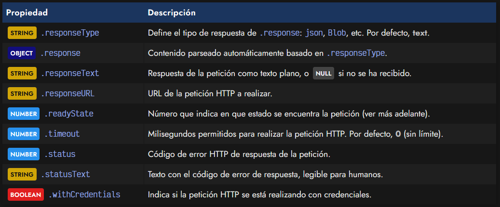

# 
XHR: XMLHttpRequest

XMLHttpRequest (XHR) es un objeto especial de Javascript que permite realizar [peticiones HTTP asíncronas (AJAX)](https://lenguajejs.com/javascript/peticiones-http/ajax/) de forma nativa desde Javascript. Se trata de la primera implementación que existió, disponible en ECMAScript antes de que surgiera fetch, el estándar recomendado actual.

## ¿Qué es XMLHttpRequest?.
El objeto XMLHttpRequest se creó originalmente para realizar peticiones HTTP a ficheros .xml externos desde Javascript. Actualmente, se realizan las mismas operaciones pero con ficheros JSON, ya que son mucho más habituales en el ecosistema Javascript como almacenamiento ligero de datos.

El mecanismo principal de peticiones HTTP mediante XMLHttpRequest es muy sencillo, aunque se vuelve un poco más complejo a medida que vamos realizando comprobaciones y detalles relacionados, ya que se realiza todo más a bajo nivel que su equivalente moderno fetch.

El primer paso es crear un objeto XMLHttpRequest (XHR):

Mediante esta instancia que acabamos de crear, podremos definir el tipo de petición utilizando el método open(method, url), indicando el método HTTP y la URL a la que queremos hacer la petición:

Con el método .open() solo preparamos la petición, pero la haremos finalmente efectiva con el método .send(), el cuál lanzará la petición al servidor. Poco después, si consultamos el contenido de la propiedad .responseText (texto de respuesta) de nuestra instancia, comprobaremos que debería estar el contenido del fichero que hemos pedido:

Este sería el funcionamiento base de las peticiones XHR, que como puedes ver, es muy sencillo. Sin embargo, esto es sólo la teoría. A la hora de la práctica hay más detalles que hay que tener en cuenta.

Por ejemplo, si has ejecutado línea por línea en una consola del navegador, habrás comprobado que este código funciona perfectamente. Sin embargo, si intentamos ejecutar todo el código de golpe, no funcionará; el valor de client.responseText nos aparecerá vacío.

Esto ocurre debido a que no estamos dando tiempo suficiente al navegador para realizar la petición del fichero /robots.txt al servidor, y por lo tanto, consultamos el resultado antes de tenerlo. Para solucionar esto, hay que esperar un tiempo para comprobar el valor, o mejor aún, hacerlo de forma asíncrona, como veremos más adelante.

El fichero /robots.txt es un fichero de texto que suele existir en prácticamente todas las páginas webs. Se trata de un fichero de texto plano que indica las URL a las que los robots o crawlers (como el de Google) no deberían acceder ni indexar su contenido.

## Política CORS.
Habrás observado que estamos realizando peticiones relativas, es decir, al mismo dominio. Por defecto, en Javascript, las peticiones al mismo dominio de la web donde nos encontramos se pueden realizar sin ninguna restricción. Sin embargo, si intentamos realizarlas a otro dominio diferente, probablemente nos aparezca un error de CORS (Cross-Origin Resource Sharing) similar al siguiente:

probablemente nos aparezca un error de CORS (Cross-Origin Resource Sharing) similar al siguiente:

   - Access to XMLHttpRequest at 'https://domain.com/robots.txt' from origin 'https://currentdomain.com/' has been blocked by CORS policy: No 'Access-Control-Allow-Origin' header is present on the requested resource.

Más adelante, en el capítulo [CORS](https://lenguajejs.com/javascript/peticiones-http/cors/), abordaremos este tema y comentaremos los detalles que hay que cumplir para poder hacer peticiones a dominios externos, pero de momento nos limitaremos a realizarlos al propio dominio donde nos encontramos.

## El objeto XMLHttpRequest.
Al crear un objeto XMLHttpRequest tenemos acceso a una serie de propiedades que forman parte de nuestra instancia. Entre ellas, se encuentran las siguientes:

En primer lugar, las propiedades .responseType y .response se usan conjuntamente, debido a que si establecemos un valor en .responseType antes de hacer la petición, se procesará automáticamente la respuesta en .response. Por ejemplo, si establecemos el valor "json" en la propiedad .responseType, en .response obtendremos el [objeto JSON](https://lenguajejs.com/javascript/objetos/json/) parseado.

Por otro lado, en la propiedad .responseText siempre obtendremos el valor de texto puro, por si ese proceso de parseo queremos hacerlo manualmente. En la propiedad .responseURL tendremos la ruta completa de la petición HTTP.

También tenemos la propiedad .readyState, en la cuál profundizaremos más adelante. Básicamente nos devuelve un valor que determina en que punto se encuentra la petición (iniciada, enviada, procesándose, finalizada). Es muy útil para saber cuando realizar ciertas acciones.

La propiedad .timeout indica el número de milisegundos máximo que permitiremos para realizar la petición. De ser superior a este tiempo, la petición se descartará. Por defecto viene establecido a 0, que significa que no hay límite de tiempo para la petición.

Las propiedades .status y .statusText nos muestran el código de error HTTP devuelto por la petición. La propiedad .status de vuelve el número en cuestión (200 = OK, 404 = Not Found, etc...) y la propiedad .statusText nos devuelve un texto un poco más legible donde nos da algo más de información.

Por último, el booleano .withCredentials nos indica si la petición se ha realizado enviando un usuario y contraseña o simplemente se trata de una petición sin indicar credenciales.

## Métodos de XMLHttpRequest.
Lo que vemos a continuación es una lista de los métodos que podemos utilizar en nuestra instancia de XMLHttpRequest, donde tenemos algunos otros métodos aparte de los mencionados .open() y .send():

Los cuatro primeros se utilizan para temas relacionados con las cabeceras de la petición HTTP. El primero para la petición que enviamos (permite añadir cabeceras) y los dos siguientes para la petición de respuesta que recibimos, tanto obtener todas las cabeceras con .getAllResponseHeaders(), como obtener una específica .getResponseHeader(name).

El método .overrideMimeType() nos permite modificar (sobreescribir) el MIME de la petición recibido desde el servidor, muy útil cuando queremos forzarlo a uno diferente.

Por último, tenemos los métodos .open(), .send() y .abort() utilizados para iniciar, enviar y cancelar la petición respectivamente. En el caso de .send() es posible indicar un parámetro opcional que sea un objeto para enviar junto a la petición.

## Eventos de XMLHttpRequest.
Durante el manejo de objetos XMLHttpRequest pueden suceder determinados eventos que podemos controlar desde nuestro código. Dichos eventos son los siguientes:

Los eventos del objeto XMLHttpRequest son bastante autodescriptivos. Quizás, el más complejo sea el evento readystatechange, el cuál tiene relación directa con la propiedad .readyState, que explicaremos detalladamente en el siguiente apartado.

## El ciclo readyState.
La propiedad .readyState de nuestra instancia client es un valor numérico (representado por una constante) que indica en el punto de progreso en que se encuentra la petición HTTP.

Esto es muy fácil de entender si pensamos en los clásicos spinners que se suelen utilizar para indicar que se está procediendo a obtener y descargar información. Habitualmente, estos spinners aparecen si la propiedad .readyState se encuentra entre 1 y 3:

Para verlo más claramente, podemos observar el siguiente código, donde a través de la escucha del evento readystatechange de la instancia en cuestión, podemos estar pendientes de cuando obtenemos la información (readyState igual a 4 y status 200 OK):

Una vez hemos entendido todos estos apartados, estamos preparados para realizar peticiones HTTP utilizando XHR. Sin embargo, es altamente recomendable echar un vistazo a los siguientes capítulos, donde abordamos sistemas más modernos como fetch, que permiten realizar peticiones de una forma mucho más cómoda, utilizando promesas.