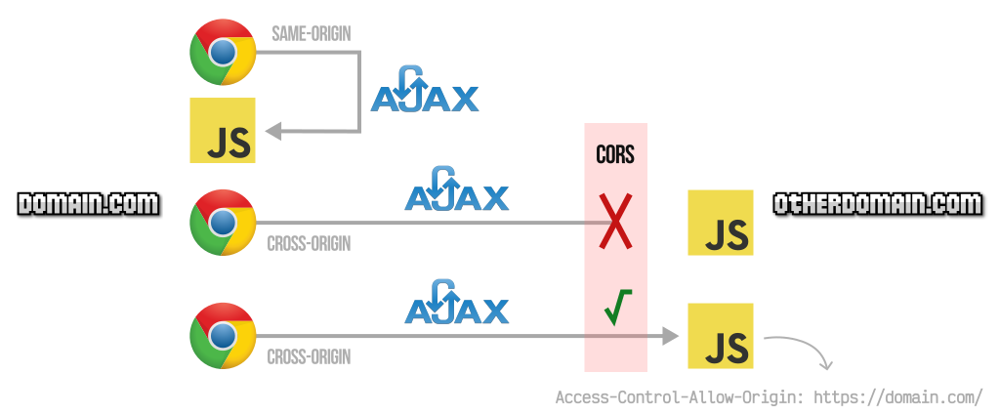
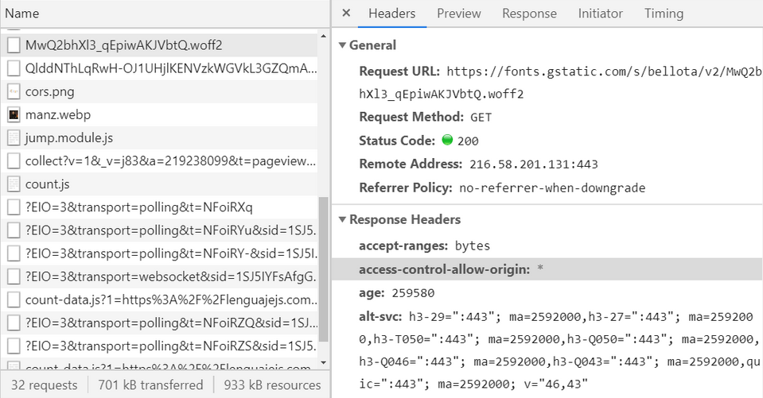

# 
Política CORS

Cross Origin (origen cruzado) es la palabra que se utiliza para denominar el tipo de peticiones que se realizan a un dominio diferente del dominio de origen desde donde se realiza la petición. De esta forma, por una parte tenemos las peticiones de origen cruzado (cross-origin) y las peticiones del mismo origen (same-origin).

## ¿Qué es CORS?.
CORS (Cross-Origin Resource Sharing) es un mecanismo o política de seguridad que permite controlar las peticiones HTTP asíncronas que se pueden realizar desde un navegador a un servidor con un dominio diferente de la página cargada originalmente. Este tipo de peticiones se llaman peticiones de origen cruzado (cross-origin).

Por defecto, los navegadores permiten enlazar hacia documentos situados en todo tipo de dominios si lo hacemos desde el HTML o desde Javascript utilizando la API DOM (que a su vez está construyendo un HTML). Sin embargo, no ocurre lo mismo cuando se trata de peticiones HTTP asíncronas mediante Javascript (AJAX), sea a través de XMLHttpRequest, de fetch o de librerías similares para el mismo propósito.

Utilizando este tipo de peticiones asíncronas, los recursos situados en dominios diferentes al de la página actual no están permitidos por defecto. Es lo que se suele denominar protección de CORS. Su finalidad es dificultar la posibilidad de añadir recursos ajenos en un sitio determinado.

Si intentamos realizar una petición asíncrona hacia otro dominio diferente, probablemente obtendremos un error de CORS similar al siguiente:

 - Access to fetch at 'https://otherdomain.com/file.json' from origin 'https://domain.com/' has been blocked by CORS policy: No 'Access-Control-Allow-Origin' header is present on the requested resource. If an opaque response serves your needs, set the request's mode to 'no-cors' to fetch the resource with CORS disabled.

## Access-Control-Allow-Origin.
Como hemos comentado, las peticiones HTTP asíncronas de origen cruzado no están permitidas, pero existen formas de permitirlas. La más básica, probablemente, sea la de incluir una cabecera Access-Control-Allow-Origin en la respuesta de la petición, donde debe indicarse el dominio al que se le quiere dar permiso:

De esta forma, el navegador comprobará dichas cabeceras y si coinciden con el dominio de origen que realizó la petición, esta se permitirá. En el ejemplo anterior, la cabecera tiene el valor https://domain.com/, pero en algunos casos puede interesar indicar el valor *.

 - El asterisco * indica que se permiten peticiones de origen cruzado a cualquier dominio, algo que puede ser interesante cuando se tienen API públicas a las que quieres permitir el acceso al público en general, casos como los de [Google Fonts](https://fonts.google.com/) o [JSDelivr](https://www.jsdelivr.com/), por citar un ejemplo.

Estas cabeceras puedes verlas facilmente accediendo a la pestaña Network del Developer Tools del navegador. En esta sección te aparecerá una lista de peticiones realizadas por el navegador en la página actual. Si seleccionamos una petición y accedemos al apartado de cabeceras (Headers), podremos examinar si existe la cabecera Access-Control-Allow-Origin:

## CORS en entornos de desarrollo.
Otra opción sencilla y rápida para no tener que lidiar con CORS temporalmente es la de instalar la extensión Allow CORS, disponible tanto [Allow CORS para Chrome](https://chromewebstore.google.com/detail/allow-cors-access-control/lhobafahddgcelffkeicbaginigeejlf) como [Allow CORS para Firefox](https://addons.mozilla.org/es/firefox/addon/access-control-allow-origin/). Esta extensión deshabilita la política CORS mientras está instalada y activada.

Esta elección es equivalente a que todas las respuestas a las peticiones asíncronas realizadas tengan la mencionada cabecera con el valor *. Obviamente, es importante recalcar que es una opción que sólo nos funcionará en nuestro equipo y navegador, pero puede ser muy práctica para simplificar el trabajo en desarrollo.

