# 
Array functions

Así como tenemos un conjunto de métodos para realizar sobre variables que sean STRING u otro conjunto de métodos para variables que sean NUMBER, existe una serie de métodos que podemos utilizar sobre variables que sean de tipo ARRAY. Son las llamadas array functions que veremos a continuación.

## ¿Qué son las Array functions?.
Básicamente, son métodos que tiene cualquier variable que sea de tipo ARRAY, y que permite realizar una operación con todos los elementos de dicho array (o parte de ellos) para conseguir un objetivo concreto, dependiendo del método. En general, a dichos métodos se les pasa por parámetro una función callback y unos parámetros opcionales.

Estas son las Array functions que podemos encontrarnos en Javascript:

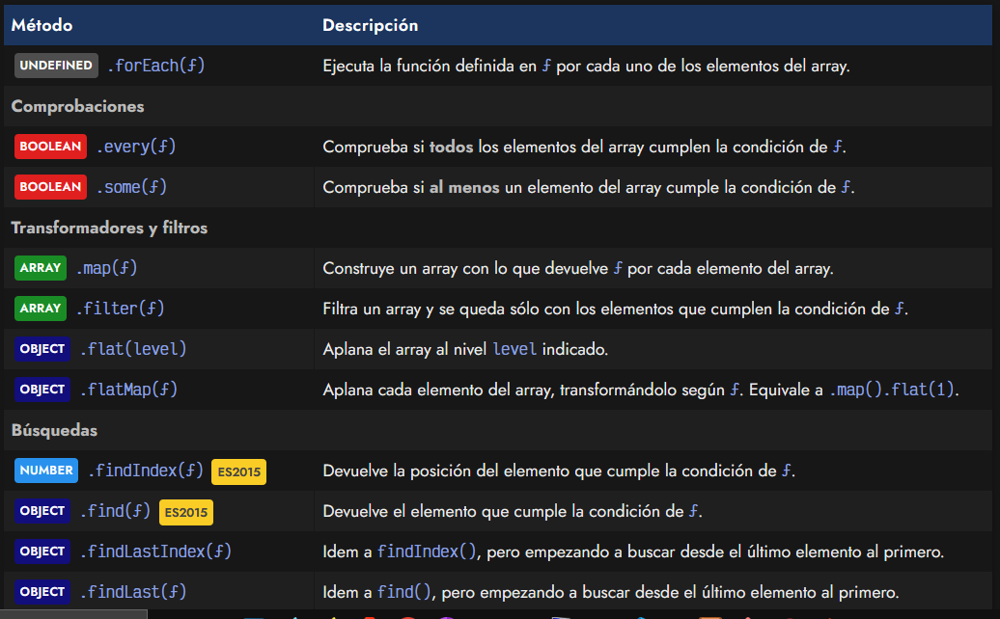
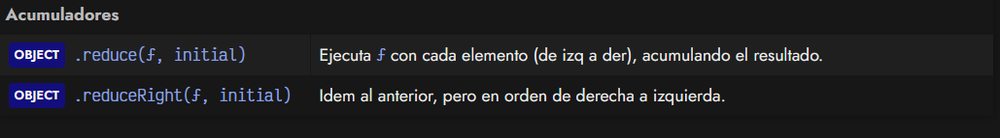

A grandes rasgos, a cada uno de estos métodos se les pasa una función callback que se ejecutará por cada uno de los elementos que contiene el array. Empecemos por forEach(), que es quizás el más sencillo de todos.

## Bucles .forEach().
Como se puede ver, el método forEach() no devuelve nada y espera que se le pase por parámetro una FUNCTION que se ejecutará por cada elemento del array. Esa función, puede ser pasada en cualquiera de los formatos que hemos visto: como función tradicional o como función flecha:

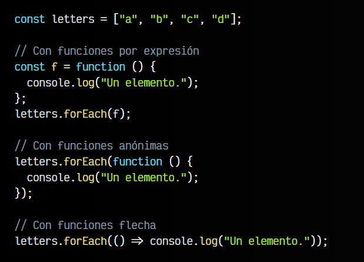

Sin embargo, este ejemplo no tiene demasiada utilidad. A la FUNCTION callback se le pueden pasar varios parámetros opcionales:

   - Si se le pasa un primer parámetro, este será el elemento del array.
   - Si se le pasa un segundo parámetro, este será la posición en el array.
   - Si se le pasa un tercer parámetro, este será el array en cuestión.

Veamos un ejemplo:

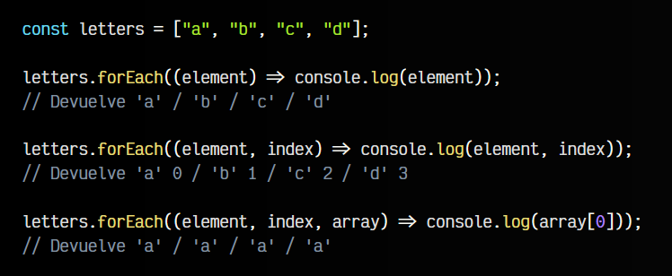

En este ejemplo, he nombrado element al parámetro que hará referencia al elemento, index al parámetro que hará referencia al índice (posición del array) y array al parámetro que hará referencia al propio array en cuestión. En algunos ejemplos los abreviaré como (e, i, a), por su inicial. Aún así, el usuario puede ponerle a estos parámetros el nombre que prefiera.

Por ejemplo, una buena estrategia sería utilizar letters (plural) para el array y letter (singular) en lugar de element para el elemento que se va recorriendo. Como se puede ver, realmente forEach() es otra forma de hacer un bucle (sobre un array), sin tener que recurrir a bucles tradicionales como for o while.

   - Aunque no aparece en la tabla anterior, al método forEach() se le puede pasar un segundo parámetro arg, que representa el valor que sobreescribiría a la palabra clave this en el código dentro de la función callback. De necesitar esta funcionalidad, no podrías utilizar las funciones flecha, ya que el this no tiene efecto en ellas.

## Comprobaciones.
Existen dos métodos para realizar comprobaciones: el método .every() y el método .some(). Ambos métodos evaluan los elementos del array y devuelven siempre un BOOLEAN, que representa si se cumple o no. Los explicamos a continuación.

## El método .every() (Todos).
El método every() permite comprobar si todos y cada uno de los elementos de un array cumplen la condición que se especifique en la FUNCTION callback:

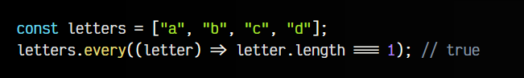

En este caso, la magia está en el callback. La condición es que la longitud de cada elemento STRING del array sea 1. Si dicha función devuelve true, significa que cumple la condición, si devuelve false, no la cumple. Por lo tanto, si todos los elementos del array devuelven true, entonces every() devolverá true.

Si expandimos el ejemplo anterior a un código más detallado, tendríamos el siguiente ejemplo equivalente, que quizás sea más comprensible para entenderlo:

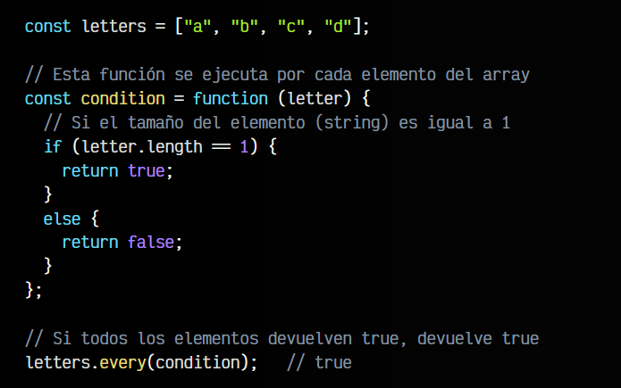

## El método .some() (Al menos uno).
De la misma forma que el método anterior sirve para comprobar si todos los elementos del array cumplen una determinada condición, con some() podemos comprobar si al menos uno de los elementos del array, cumplen dicha condición definida por el callback.

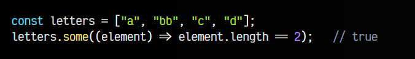

Observa que en este ejemplo, el método some() devuelve true porque existe al menos un elemento del array con una longitud de 2 caracteres.

## Transformadores y filtros.
En esta categoría encontraremos varios métodos que realizan operaciones de transformación o de filtrado, es decir, nos creamos una variación de los elementos de un array (transformación) o filtramos y nos quedamos con una pequeña parte de un array (filtros). Vamos a explicar cada uno de ellos.

## El método .map().
El método map() es un método muy potente y útil para trabajar con arrays, puesto que su objetivo es devolver un nuevo array donde cada uno de sus elementos será lo que devuelva la función callback por cada uno de los elementos del array original:

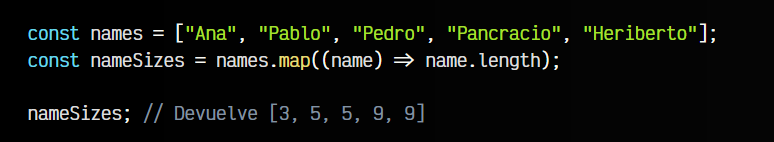

Observa que el array devuelto por map() es nameSizes, y cada uno de los elementos que lo componen, es el número devuelto por el callback (name.length), que no es otra cosa sino el tamaño de cada STRING.

Este método nos permite hacer multitud de operaciones, ya que donde devolvemos name.length podriamos devolver el propio STRING modificado o cualquier otra cosa.

## El método .filter().
El método filter() nos permite filtrar los elementos de un array y devolver un nuevo array con sólo los elementos que queramos. Para ello, utilizaremos la función callback para establecer una condición que devuelve true sólo en los elementos que nos interesen:

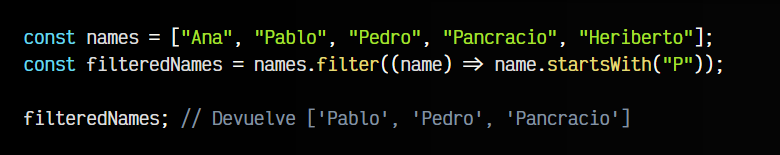

En este ejemplo, filtramos sólo los elementos en los que su primera letra sea P. Por lo tanto, la variable filteredNames será un array con sólo esos elementos.

Ten en cuenta que si ningún elemento cumple la condición, filter() devuelve un ARRAY vacío.

## El método .flatMap().
Un método que puede resultar interesante es .flat(level) . Se trata de un método que revisa todos los elementos del array en busca de arrays anidados, y los aplana hasta el nivel level indicado por parámetro.

Por ejemplo, considera el siguiente array:

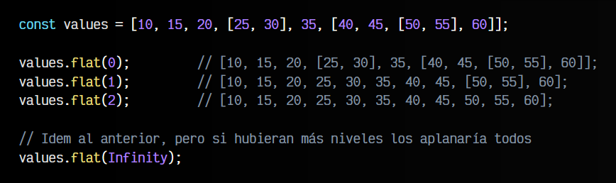

Observa que el array values tiene 6 elementos, donde el cuarto elemento y el sexto elemento son arrays anidados. En el array del cuarto elemento hay dos números, pero en el array del sexto elemento hay a su vez un array con cuatro elementos donde su tercer elemento es nuevamente otro array. Estaríamos hablando de que el array values tiene arrays hasta un nivel  3.

Con .flat() podemos indicar hasta que nivel queremos «aplanarlo».

Sin embargo, este método .flat() no pertenece a los métodos que estamos repasando. Sin embargo, es la base del método .flatMap(ƒ), que si tiene la misma filosofía que el resto de métodos. Funciona de forma muy parecida al método .map(ƒ), aplanando un nivel y transformando cada elemento del array, según la función pasada por parámetro. Es decir, el método .flatMap(ƒ) es el equivalente a realizar la operación .map(ƒ).flat(1):

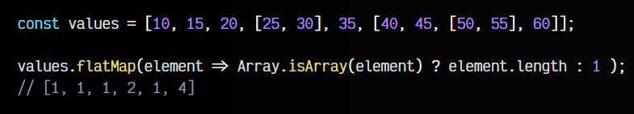

El ejemplo anterior, realiza una .flatMap() por la estructura values. En primer lugar, recorre cada uno de los elementos mediante un map() para transformarlos: si son un array, devuelve su cantidad de elementos, si no es un array, devuelve 1. Finalmente, si el array resultante tuviera algún array entre sus elementos (que en este caso es imposible), le aplicaría un flat(1).

## Búsquedas.
Otra tarea habitual y necesaria es la de realizar búsquedas de elementos en un array. Mediante los siguientes métodos podemos realizar búsquedas de elementos concretos, ya sea buscando desde el principio o desde el final, así como queriendo quedarnos con el elemento buscado o la posición en el array del elemento buscado.

## El método .find() y .findIndex().
Dentro de las Array functions, existen dos métodos interesantes: find() ES2015 y findIndex() ES2015. Ambos se utilizan para buscar elementos de un array mediante una condición, la diferencia es que el primero devuelve el elemento mientras que el segundo devuelve su posición en el array original. Veamos como funcionan:

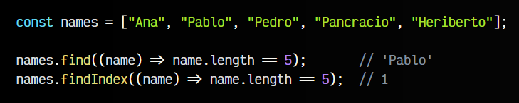

La condición que hemos utilizado en este ejemplo es buscar el elemento que tiene 5 carácteres de longitud. Al buscarlo en el array original, el primero que encontramos es Pablo, puesto que find() devolverá 'Pablo' y findIndex() devolverá 1, que es la segunda posición del array donde se encuentra.

En el caso de no encontrar ningún elemento que cumpla la condición, find() devolverá , mientras que findIndex(), que debe devolver un NUMBER, devolverá -1.

## El método .findLast() y .findLastIndex().
De la misma forma, tenemos findLastIndex() y findLast(), que son las funciones equivalentes a findIndex() y find(), pero buscando elementos desde derecha a izquierda, en lugar de izquierda a derecha:

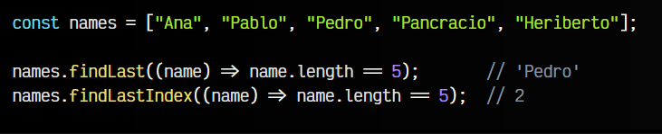

En este caso, en lugar de encontrarnos a Pablo (posición 1), el primer elemento que tiene 5 carácteres, como va buscando de derecha a izquierda, el primero que encuentra es Pedro (posición 2).

## Acumuladores.
Por último, los acumuladores nos permiten realizar tareas por cada elemento del array, acumulando valores para hacerles una modificación en cada iteración. Los explicamos más detalladamente a continuación.

## El método .reduce().
Por último, nos encontramos con una pareja de métodos denominados reduce() y reduceRight(). Ambos métodos se encargan de recorrer todos los elementos del array, e ir acumulando sus valores (o alguna operación diferente) y sumarlo todo, para devolver su resultado final.

En este par de métodos, encontraremos una primera diferencia en su función callback, puesto que en lugar de tener los clásicos parámetros opcionales (element, index, array) que hemos utilizado hasta ahora, tiene (first, second, iteration, array), que funciona de forma muy similar, pero adaptado a este tipo de acumuladores.

En la primera iteración, first contiene el valor del primer elemento del array y second del segundo. En siguientes iteraciones, first es el acumulador que contiene lo que devolvió el callback en la iteración anterior, mientras que second es el siguiente elemento del array, y así sucesivamente. Veamos un ejemplo para entenderlo:

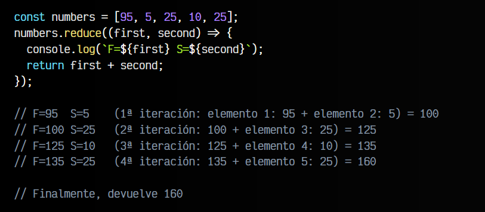

## El método .reduceRight().
Gracias a esto, podemos utilizar el método reduce() como acumulador de elementos de izquierda a derecha y reduceRight() como acumulador de elementos de derecha a izquierda. Veamos un ejemplo de cada uno, realizando una resta en lugar de una suma:

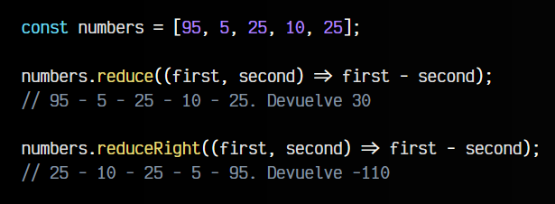

## Parámetro inicial.
Es posible indicar un segundo parámetro opcional en el .reduce(). Este parámetro es el valor inicial que quieres tomar en el reduce, lo que puede facilitar bastante la implementación. Observa que en el primer ejemplo anterior, se realizan 4 iteraciones. Sin embargo, al indicar este valor inicial de cero se realizan 5 iteraciones:

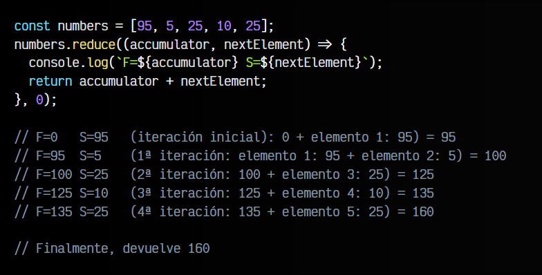

Como se puede ver, hay una iteración 0 extra que es la que toma el valor inicial indicado, junto al primer elemento del array. Luego, sigue iterando con el resto de elementos.