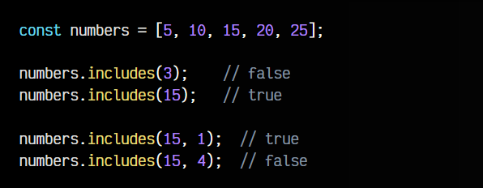

# 
Buscar elementos en un array.

En muchas ocasiones nos interesará buscar elementos en un ARRAY para, o bien, encontrar el elemento y trabajar con él, o para saber la posición del elemento en el ARRAY. Para ello, existen una serie de métodos mediante los cuales podemos realizar estas acciones. Son los siguientes:

Vamos a ver como funciona cada uno de ellos.

## ¿El elemento existe? (includes).
El método .includes() comprueba si el elemento indicado está incluido en el ARRAY. Es posible indicar un segundo parámetro donde indicaremos la posición NUMBER from desde donde empezamos a buscar:

Esto puede ser realmente útil para comprobar rápidamente si un elemento está incluido en una estructura de tipo ARRAY. Recuerda que el tipo de dato STRING también tiene un método similar para comprobar si una subcadena de texto está incluida en un STRING.

## Buscar la posición (indexOf).
El método .indexOf() (el índice de..., la posición de...) hace algo similar a .includes(), pero en lugar de devolver un BOOLEAN, devuelve la posición del elemento buscado. En el caso de no encontrarlo, devuelve un valor negativo -1.

De la misma forma que en el anterior, a .indexOf() se le puede pasar un segundo parámetro para indicarle la posición desde la que queremos empezar a buscar, permitiendo encontrar elementos repetidos que estén después de ocurrencias anteriores.

## Buscar al final (lastIndexOf).
Por su parte, el método .lastIndexOf() hace exactamente lo mismo que .indexOf(), con la única diferencia que empezará a buscar desde el final, en lugar desde el principio del ARRAY.

Veamos el método en acción:

De esta forma, puedes buscar rápidamente elementos que se encuentren al final del array y recuperar su posición.

## Buscar un elemento en un array.
Ahora que conocemos los métodos anteriores, podemos aprovecharlos para buscar un elemento en un array. Cuando se trata de estructuras muy simples, no tiene sentido buscar el mismo elemento que ya conocemos y tenemos previamente, pero en estructuras más complejas si puede ser interesante.

Observa el siguiente ejemplo donde partimos de una estructura ARRAY de OBJECT, que tienen el nombre y la edad de una persona. Vamos a implementar una función findElement() para buscar la primera persona con una cierta edad:

La función findElement() permite buscar en el array indicado, la edad indicada en searchedAge. Sin embargo, esta función tiene una implementación imperativa (indicas los pasos que quieres hacer). También es posible realizar una implementación declarativa (indicas lo que quieres obtener), que suele ser mucho más clara y legible en estos casos.

Para ello, usaremos la función .find() que veremos más adelante. Vamos a crear un ejemplo que haga exactamente lo mismo que lo anterior:

De la misma forma que tenemos .find() también tenemos .findIndex() que devuelve la posición en lugar del propio elemento. Veremos estas funciones .find() y .findIndex() en el tema de las Array functions.