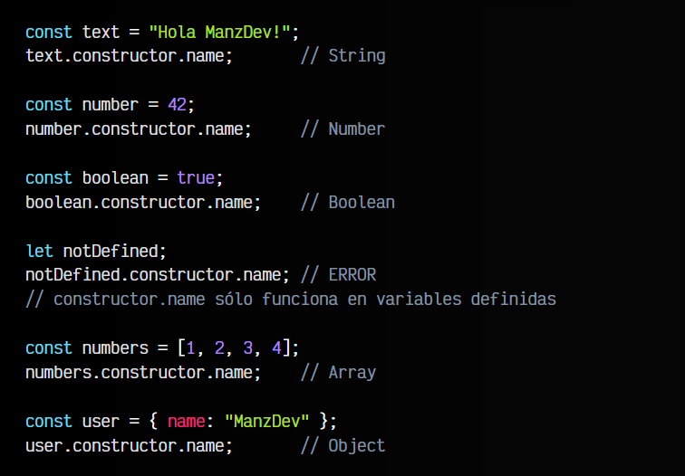
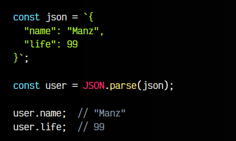

# Coerción en Javascript 👨🏻‍🎓
 
 La coerción de tipos hace referencia a la conversión automática de tipos de datos que se produce en JavaScript cuando se utilizan juntos diferentes tipos de datos en una operación. Por ejemplo, si se suman un número y una cadena, JavaScript convertirá automáticamente el número en una cadena para realizar la operación.

# Casting 👨🏻‍🎓

Por otro lado, la conversión de tipos se refiere a la conversión explícita de tipos de datos. Esto se hace usando funciones de conversión como Number() , String() , Boolean() y Symbol()

` const str = '5';`

`const num = Number(str);`
 
 `console.log(num);`//output: 5

* parseInt() : La función parseInt se usa para convertir un valor en un número entero. Es diferente de Number() y parseFloat() ya que ignora cualquier valor después del decimal. Por ejemplo:

`const intValue = parseInt("3.14");` // Output: 3

`console.log(floatValue);` 

* String() : la función String() se usa para convertir un valor que no es una cadena en un valor de cadena. Los siguientes ejemplos muestran cómo puede usar la función String() para convertir diferentes tipos de valores en cadenas:

 
`const num = 10; console.log(String(num)); //
 "10"`
  `const bool = true; console.log(String(bool)); // "true" const obj = {name: "John"}; console.log(String(obj)); // "[object Object]" const arr = [1, 2, 3]; console.log(String(arr)); // "1,2,3" const date = new Date(); console.log(String(date)); // "Sun Jan 29 2023 18:52:01 GMT+0000 (Coordinated Universal Time)"`

 * Boolean() : la función Boolean se utiliza para convertir un valor no booleano en un valor booleano. Por ejemplo, si desea convertir un valor numérico de 0 en un booleano, usaría Boolean() de esta manera:

  
`let value = 0; console.log(Boolean(value)); // false value = "hello"; console.log(Boolean(value)); // true value = undefined; console.log(Boolean(value)); // false value = {}; console.log(Boolean(value)); // true value = -1; console.log(Boolean(value)); // true`

 # Consejo profesional: 👨🏻‍🎓

Utilice la comparación de igualdad estricta === en lugar de la comparación de igualdad abstracta == . Evite confiar en la coerción de tipos implícita de JavaScript, especialmente en operaciones aritméticas, y siempre use la conversión de tipos cuando sea necesario.

-----------

# Hoisting 👨🏻‍🎓

Hoisting es un término que no encontrará utilizado en ninguna  especificación previa a la Especificación del Lenguaje ECMAScript® 2015. El concepto de Hoisting fue pensado como una manera general de referirse a cómo funcionan los contextos de ejecución en JavaScript (específicamente las fases de creación y ejecución). Sin embargo, el concepto puede ser un poco confuso al principio.

Conceptualmente, por ejemplo, una estricta definición de hoisting sugiere que las declaraciones de variables y funciones son físicamente movidas al comienzo del código, pero esto no es lo que ocurre en realidad. Lo que sucede es que las declaraciones de variables y funciones son asignadas en memoria durante la fase de compilación, pero quedan exactamente en dónde las has escrito en el código.

En JavaScript, la elevación es un comportamiento donde las declaraciones de variables y funciones se trasladan a la parte superior de su alcance que contiene durante la fase de compilación antes de ejecutar el código. Es importante señalar que sólo las declaraciones se izan, no las inicializaciones. Esto significa que puede utilizar variables y funciones antes de que se declaren en el código, lo que puede llevar a resultados inesperados si no se entiende correctamente.

# Operador de coalescencia nula (??) 👨🏻‍🎓  

El operador nullish coalescing (??) (de coalescencia nula) es un operador lógico que retorna el operando de lado derecho cuando el operando de lado izquierdo es null o undefined, y en caso contrario retorna el operando de lado izquierdo. 

Introducido en ES2020, el operador de coalescencia nula (??) se presenta como un salvador para manejar valores null y undefined de manera elegante y concisa. Su funcionamiento es bastante sencillo:

    Si el operando de la izquierda no es null ni undefined, devuelve dicho operando sin evaluar el de la derecha.
    En caso de que el operando de la izquierda sea null o undefined, cede el paso al operando de la derecha, asignándolo como valor final.

Un aspecto fundamental a destacar es que este operador no considera otros valores falsy como false, 0 o cadenas vacías. Se concentra únicamente en los valores null y undefined, ofreciendo un enfoque preciso para situaciones específicas.

# Valores truthy y falsy 👨🏻‍🎓
En contextos donde un boolean es requerido, suele ser común utilizar valores no booleanos. En este post te muestro cuáles son los valores equivalentes a false (falsy) y cuáles a true (truthy).

En los contextos en que un valor booleano es lo esperado, y se utiliza en su lugar un valor de diferente tipo, JavaScript lo fuerza de manera implícita a comportarse como booleano.

Los valores convertibles a false se conocen como falsy o falsey, y son aquellos que cuando se encuentran en un contexto de booleano, JavaScript los convierte a false:

   * 0 (cero)
   * -0 (cero negativo)
   * 0n (cero de tipo BigInt)
   * "" (comillas dobles vacías)
   * '' (comillas simples vacías)
   * `` (tildes invertidas vacías)
   * null
   * undefined
   * NaN

   Entonces, si utilizaramos cualquiera de estos valores en un contexto de condicional, la condición resultara falsa.

var resultado = Math.round("cero");
// → NaN

// por lo tanto resultado es falsy
if (resultado) {
  console.log("Esto nunca se mostrará");
}

Por consiguiente, el resto de los valores en JavaScript son convertibles a true, y se consideran truthy.

Esto es posible gracias al mecanismo de coerción. Básicamente, cuando lo que se espera es un booleano, JavaScript fuerza el valor al tipo boolean, en una operación equivalente a llamar la función global Boolean sobre él.

# Prototypes en JavaScript 👨🏻‍🎓

Los objetos en JavaScript pueden tener asociado un Prototype o Prototipo, que actúa como una plantilla desde la que el objeto hereda propiedades y métodos.

El prototipo es una propiedad de nombre prototype, que es en sí un objeto, denominado objeto prototipo, y que reside en la función constructor del objeto. A través de esta propiedad prototype es que podemos agregarle al objeto nuevas propiedades y métodos.

Un objeto prototipo puede tener a su vez otro objeto prototipo del cual hereda, lo que se conoce como cadena de prototipos. Esto permite que los objetos puedan tener propiedades y métodos que no han sido declarados por ellos mismos.

La herencia de prototipos funciona de la siguiente manera:

  *  Los objetos Date heredan de Date.prototype
  *  Los objetos Number heredan de Number.prototype
  *  Los objetos Array heredan de Array.prototype
    Etc.

A su vez, todos los objetos heredan de Object.prototype, que se encuentra en lo más alto de la cadena de prototipos.

Si exploramos por ejemplo el prototipo Date.prototype podemos ver los métodos que serán accesibles a cada instancia de Date:

# Cortocircuito en operadores logicos 👨🏻‍🎓

(OR) tienen un comportamiento de "cortocircuito". Este término se refiere a la forma en que estos operadores evalúan expresiones y deciden si necesitan evaluar ambas partes de la expresión o si pueden "cortar" la evaluación después de determinar el resultado final.
Operador && (AND)

    Regla: Si la primera expresión es falsa, no se evalúa la segunda.
    Explicación: Para que una expresión combinada con && sea verdadera, ambas expresiones deben ser verdaderas. Si la primera es falsa, no importa lo que sea la segunda, el resultado será falso, por lo que JavaScript no evalúa la segunda expresión.

let a = false;
let b = true;
let result = a && b; // Aquí `b` nunca se evalúa porque `a` es falseconsole.log(result); // Output: false

En el ejemplo anterior, dado que a es false, el operador && sabe que la expresión completa no puede ser verdadera, por lo que ni siquiera evalúa b.
Operador || (OR)

    Regla: Si la primera expresión es verdadera, no se evalúa la segunda.
    Explicación: Para que una expresión combinada con || sea verdadera, al menos una de las expresiones debe ser verdadera. Si la primera es verdadera, no importa lo que sea la segunda, el resultado será verdadero, por lo que JavaScript no evalúa la segunda expresión.

    let a = true;
    let b = false;
    let result = a || b; // Aquí `b` nunca se evalúa porque `a` es trueconsole.log(result); // Output: true

    En el ejemplo anterior, dado que a es true, el operador || sabe que la expresión completa será verdadera, por lo que ni siquiera evalúa b.
    Ejemplos prácticos del cortocircuito

    Asignación de valores por defecto:

    let name = null;
    let defaultName = "John Doe";
    let finalName = name || defaultName;
    console.log(finalName); // Output: "John Doe"

    En este caso, finalName toma el valor de defaultName porque name es null (que es un valor falsy), y debido al cortocircuito, el operador || no evalúa defaultName si name tiene un valor truthy.

    Ejecución condicional de funciones:

    let user = {
    isAdmin: true
    };
    user.isAdmin && alert("Bienvenido, administrador!");

    En este ejemplo, la función alert solo se ejecutará si user.isAdmin es true. Si isAdmin es false, el operador && detiene la evaluación y no ejecuta alert.

    Resumen

    El cortocircuito de los operadores lógicos permite a JavaScript optimizar la evaluación de expresiones, evitando el trabajo innecesario y permitiendo patrones útiles, como la asignación de valores por defecto o la ejecución condicional de código.

## La propiedad constructor.name 👨🏻‍🎓
En muchos casos, nos encontraremos que typeof resulta insuficiente porque en tipos de datos más avanzados simplemente nos indica que son objetos, pero no sabes que clase de objeto específico. Con constructor.name, que es una parte de la Orientación a objetos podemos obtener el tipo de constructor que se utiliza, un concepto que veremos más adelante dentro del tema de clases.

De momento, si lo necesitamos, podemos comprobarlo así:

Observa que en tipo de datos no primitivos, que veremos más adelante, como los arrays, no nos dice object como hacía el typeof, sino que nos devuelve específicamente Array.

## Parsear 👨🏻‍🎓 

La acción de convertir JSON a objeto Javascript se le suele denominar parsear. Es una acción que analiza un STRING que contiene un JSON válido y devuelve un objeto Javascript con dicha información correctamente estructurada. Para ello, utilizaremos el mencionado método JSON.parse():

Como se puede ver, OBJECT user es un objeto generado a partir del JSON almacenado en la variable json y podemos consultar sus propiedades y trabajar con ellas sin problemas.

