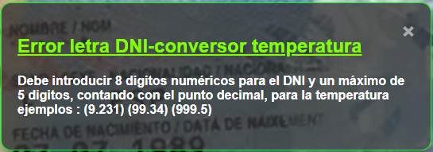

## 📌 Página SPA cálculo letra DNI conversor temperatura C/F

Esta es la barra de navegación del HOME que es el archivo index.html de la aplicación.

En esta página podemos calcular la letra correspondiente a
un DNI en España introduciendo 8 dígitos numéricos (0-9).
La aplicación rechazará toda entrada que no tenga 8 dígitos
o contenga cualquier digito que no sea numerico y le mostrará
el siguiente mensage de error tanto para DNI-error como C/F-error

Para la conversión de temperatura de grados celsius a grados
farenheit debe introducir valor numerico de máximo 5 dígitos contando con el punto decimal silo hay.
Utilizando el algoritmo:
    gradosFarhengeis = (9 / 5) * gradosConversion + 32;
Con la tecla ESCAPE podemos limpiar todos los valores escritos en los inputs.

## 📌 Página SPA cálculo indice de masa corporal IMC.

Esta es la barra de navegación del  cálculo IMC que es el archivo calculoIMC.html de la aplicación. Con la tecla ESCAPE podemos limpiar todos los valores escritos en los inputs, y con las teclas (Ctrl+z) volveremos a la página home.
Para el cálculo del indice de masa corporal IMC empleamos el siguiente algorritmo:
   imc = peso kg./altura2 en metros.
debe introducir el peso en kgrs. y la altura en cmts. ejemplo:(1.72m = 172cm).

## LISTA de archivos app DNI-IMC

## CARPETA hojas de estilo:
- index.css
- calculoIMC.css
- link.css
- template.css

## CARPETA images:
- IMC.png
- IMG_6141.jpg
- logo.svg
- logo2.svg
- logo3.svg
- salva.jpg
- salva2.jpg
- image.png
- image2.png
- image3.png
- image4.png

## CARPETA JACASCRIPT:
- 78 Carpetas delcurso (1-78)
- Carpeta glosario javascript

## CARPETA src:
- index.js
- notificacionError.js
- notificacionError.js
- notificacionErrorValidacion.js
- calculoIMC.js
- validacionCard.js

## ROOT:
- caculoIMC.html
- index.html
- link.html
- template.html
- notificacionError.html
- notificacionErrorIMC.html
- notificacionErrorValidacion.html
- readme.md

