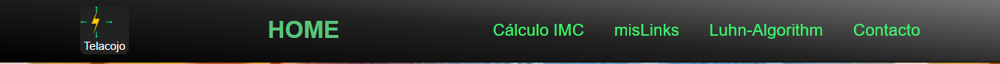
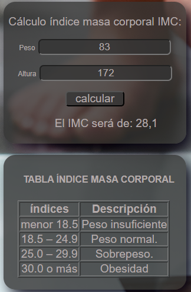
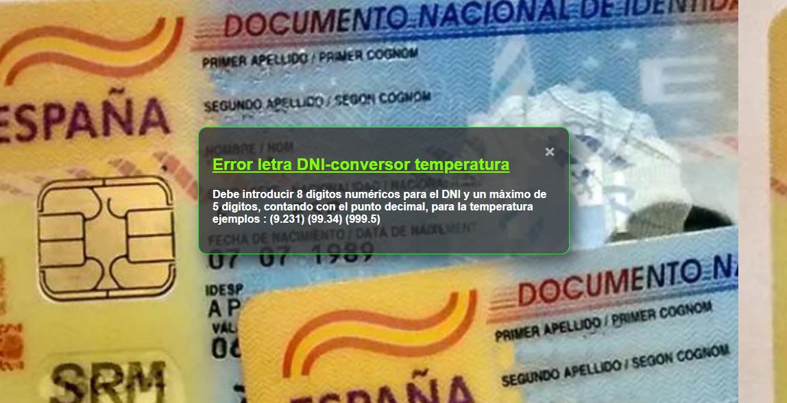
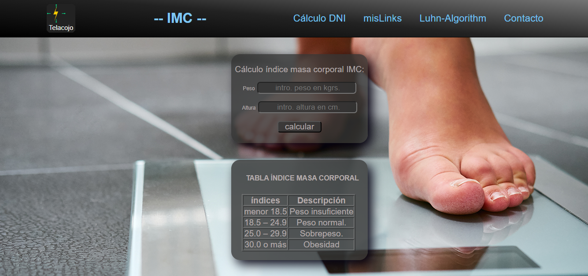
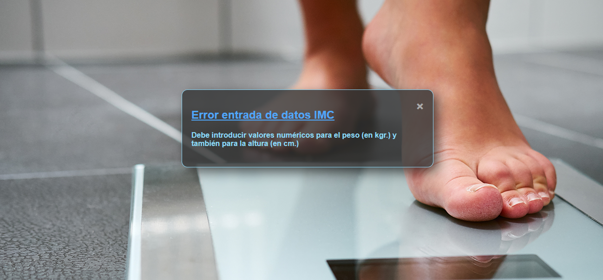
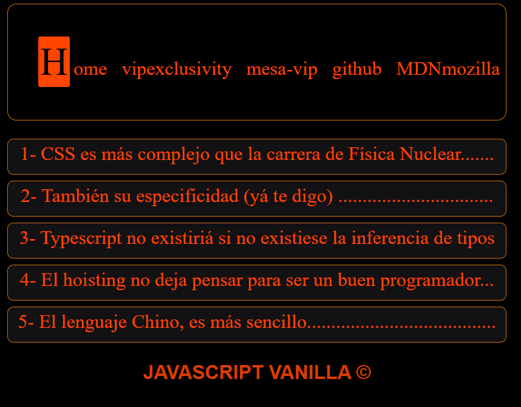

## 🍕 Cálculo letra DNI, conversor temperatura C/F, Links y validación BIN
Esta es la barra de navegación del HOME que es el archivo index.html de la aplicación.

En esta página podemos calcular la letra correspondiente a
un DNI en España introduciendo 8 dígitos numéricos (0-9) para
el cálculo de la letra del DNI. Para su cálculo empleamos el 
siguiente algoritmo: 

👌
 y maximo de 5 digitos para la
conversion de la temperatura (contando el punto cecimal)
La aplicación rechazará toda entrada que no tenga 8 dígitos
o contenga cualquier digito que no sea numerico y le mostrará
el siguiente mensage de error tanto para DNI-error como C/F-error

Para la conversión de temperatura de grados celsius a grados farenheit debe introducir valor numerico de máximo 5 dígitos contando con el punto decimal si lo hay. Utilizando el algoritmo: 
   gradosFarhengeis = (9 / 5) * gradosConversion + 32  
Con la tecla ESCAPE podemos limpiar todos los valores escritos en los inputs.
Y con las teclas Ctrl+z volveremos al home.

Si no ha introducido correctamente los datos, le mostrará el  siguiente mensaje
de error:

## 🍕
 Página cálculo indice de masa corporal IMC.

Esta es la barra de navegación del  cálculo IMC que es el archivo calculoIMC.html de la aplicación. Con la tecla ESCAPE podemos limpiar todos los valores escritos en los inputs, y con las teclas (Ctrl+z) volveremos a la página HOME. Para el cálculo del indice de masa corporal IMC empleamos el siguiente algorritmo: 
   imc = peso kg./altura2 en metros.
debe introducir el peso en kgrs. y la altura en cmts. ejemplo:(1.72m = 172cm).

En el caso de no introducir los datos correctamente, le aparecerá el siguiente mensaje de error :

con las teclas (Ctrl+z) volveremos a la página home.

## página Links de la app 
Esta página muestra una serie de enlaces de interes con algo de humor
es sus títulos. 
En la barra de menú contamos con los sguientes enlaces: 
- Home
- vipexclusivity
- mesa-vip (youtube)
- github (salvador437)
- MDNmozilla

- El enlace Home, oviamente, nos lleva al home de la  aplicación.
- El enlace vipexclusivity, nos lleva a la web de un producto imnovador para el sector del ócio.
- El enlace mesa-vip le llevará a un video comercial de la mesa vip.

- El enlace github le llevará a mis repositorios en github.
- El enlace MDNmozilla irá a la documentacion MDN de mozilla.

para salir de la página haciendo click en Home o bien con la combinación de teclas Ctrl+z

## LISTA de archivos de la app 

### CARPETA hojas de estilo:
- calculoIMC.css
- error404.css
- formulario.css
- index.css
- link.css
- template.css

## CARPETA images:
- car-credito.jpg
- contacto.jpg
- dni2.jpg
- IMC.jpg
- IMC.png
- IMG_6141.jpg
- logo-template.svg
- logo-template2.svg
- logo.svg
- logo2.svg
- logo3.svg
- salva.jpg
- salva2.jpg
- temperatura-alta.png

## CARPETA JACASCRIPT:
- 78 Carpetas delcurso (1-78)
- Carpeta glosario javascript

## CARPETA src:
- calculoIMC.js
- formulario.js
- index.js
- notificacionError.js
- notificacionErrorIMC.js
- notificacionErrorValidacion.js
- validacionCard.js

## ROOT:
- caculoIMC.html
- formulario.html
- index.html
- link.html
- notificacionError.html
- notificacionErrorIMC.html
- notificacionErrorValidacion.html
- readme.md
- template.html

